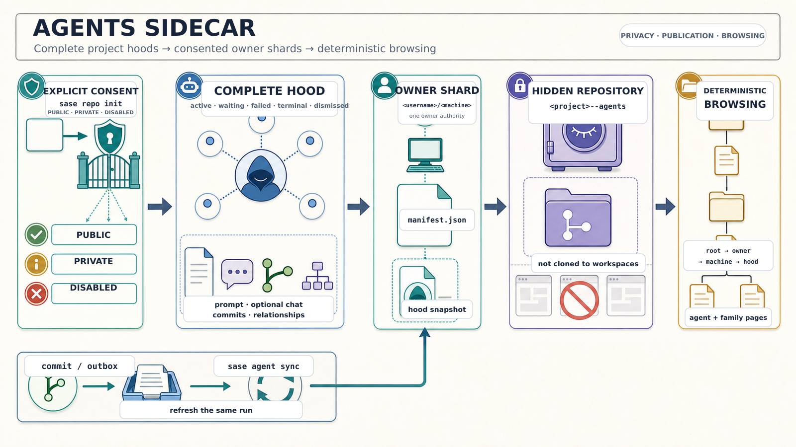

# SASE Agent Hoods

Deterministic, owner-sharded snapshots and canonical prompt archives published by SASE.

**Owners:** 1 · **Machines:** 1 · **Hoods:** 1633 · **Runs:** 6745

## Prompt And Artifact Archive

`prompts/<YYYYMM>/<name>.md` stores committed run prompts. Prompt documents link back to their plan when one exists, link to the published agent page, and keep authored `@...` references readable while making staged artifacts clickable.

`artifacts/<YYYYMM>/<sha12>-<basename>` stores copied prompt-linked artifact bytes. The `sha12` prefix is the first twelve hexadecimal characters of the file's SHA-256 digest. Version-control-backed references link to hosted repository blobs instead of duplicating bytes here.

## Users

| User | Machines | Hoods | Runs |
|---|---:|---:|---:|
| [bbugyi200](users/bbugyi200/README.md) | 1 | 1633 | 6745 |
