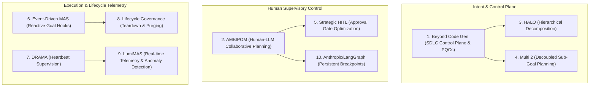

# Chat History - ace-run (research.0c.gem)

- **TIMESTAMP:** 2026-10-05 12:19:40 EDT
- **MODEL:** agy/gemini-3.8-flash-high
- **AGENT:** research.0c.gem
- **PROMPT:** `~/.sase/multi_prompts/202610/gh_sase_org__sase-multiprompt-261005_120824.md`

## Prompt

%id(gem, clan=research.0c)
%m:agy/gemini-3.8-flash-high %q(1.5x, w=0.25)
#gh:gh_sase-org__sase 
You are researcher gem in a 5-researcher swarm.
The other researchers, `research.0c.cdx`, `research.0c.cld`, `research.0c.grk`, `research.0c.mus`, are independently investigating the same request and will write their own self-named reports ending in `__cdx.md` and `__cld.md` and `__grk.md` and `__mus.md`. Your report will end in `__gem.md`.

Conduct your research independently and form your own conclusions. Do NOT attempt to
locate, open, read, or otherwise consult the other researcher's report from this swarm,
even if it becomes available before you finish. Do not obtain that peer's findings
indirectly through its chat transcript, summaries, or requests to the peer. You may
independently use the same external sources, shared input material, and unrelated prior
research. You may check filenames or file existence to avoid overwriting your own
output, but do not inspect the peer's report contents. If you encounter its filename,
leave the report alone. The lead researcher will read every report and synthesize their
findings after you have all finished.

I'm thinking about adding / completing a major new faeature named "goals", which is
partially completed already (but that part may need modifications). My latest thinkng on
this subject can be found in the incomplete research prompt that I've stored in the
~/tmp/incomplete_goals_prompt.md file.

But I don't want you to design or research this feature. Instead, can you do some
research with the goal of finding some recent (<=1 year old) articles that you think are
likely to improve / inspire my thinking on this topic? End your analysis with a ranked
list of ten articles you think I should consider reading, with justification for each. 
Write this research to a new markdown file under the $(sase repo path research --ensure)/$(date +%Y%m)/ directory.
Choose a descriptive filename stem yourself, but the filename MUST end with the
`__gem` suffix, i.e. `<stem>__gem.md` (double underscore before the
suffix). Create the report without overwrite: if the exact file already exists, pick a
different stem instead of replacing it.

After the write succeeds, register the report as a durable snapshot:

sase artifact create -p "<absolute-report-path>" -l "research:<repo-relative-report-path>"

Use the report's actual absolute path and its path relative to the research repo root
(for example `research:202609/topic__a.md`), including any subdirectory the steps above
put it in. Do not derive the label from the current month, the clock, or a guessed name.
Do not pass `--move`; the source stays in the research repo for later reorganization. If
registration itself fails, report that failure — do not report the research task as
fully complete.

## Response

# Research Report: Recommended Literature for the SASE "Goals" Architecture

**Researcher Identity:** `research.0c.gem` (Swarm Member)  
**Registered Artifact:** [`file:explicit:8698b52643e6146d3621ed85`](file:///home/bryan/.sase/artifacts/agents/gh_sase-org__sase/20261005120829/goals_architecture_and_orchestration_reading_list__gem-0f6deaf73130.md)  
**Target File Path:** [`sase/repos/research/202610/goals_architecture_and_orchestration_reading_list__gem.md`](file:///home/bryan/.local/state/sase/workspaces/sase-org/sase/sase_19/sase/repos/research/202610/goals_architecture_and_orchestration_reading_list__gem.md)  
**Artifact Label:** `research:202610/goals_architecture_and_orchestration_reading_list__gem.md`

---

## 1. Executive Summary & Context

In `~/tmp/incomplete_goals_prompt.md`, you outlined a pivotal evolution for SASE's upcoming **Goals** feature:
- **Lightweight, trace-based goal setting:** Ensuring all agent goals trace back deterministically to an origin prompt, plan, or clan.
- **Top-level TUI Goals Tab:** Positioned as the first tab in the SASE TUI, divided into collapsible lifecycle sections:
  - `Needs Review` (plan approval + verification)
  - `Active` (prompts + goals, starting as clan or plan roots)
  - `Permanent Goals` (standing / service daemons)
  - `Completed Goals` (collapsed; periodically purged)
- **Ergonomic HITL Interactions:** Rapid two-stroke `<enter><enter>` approvals for plans, epics, and completion verification.
- **Event-Driven Goal Hooks:** Transitioning from passive filesystem hooks to reactive goal lifecycle hooks (e.g., `#research_swarm`).
- **Clan Unit Isolation:** Requiring `%clan(goal=[[<goal>]])` to launch as a cohesive execution unit.
- **Telemetry & Heartbeats:** Live progress and cognitive heartbeats in the right panel for active items.
- **Cascading Teardown:** Automatically dismissing child agents when their governing goal is purged.

Rather than designing the implementation locally, this research conducted an independent survey of recent literature (<= 1 year old, late 2025 through late 2026) across multi-agent orchestration, Human-in-the-Loop (HITL) control theory, and developer-tooling systems.

---

## 2. Ranked Reading List of 10 Recommended Articles

### Rank 1: *Beyond Code Generation: Reliability, Verification, and Cost Economics in the Agentic Software Development Lifecycle*
* **Citation:** arXiv:2609.04681 (September 2026)
* **Domain:** Agentic Software Engineering & SDLC Architecture
* **Core Concepts:** Proposes the **"Agentic SDLC Control Plane"** and introduces the **"Production-Qualified Change (PQC)"** as the true atomic unit of software engineering value (contrasting it with raw code volume). Quantifies the **"Agentic Throughput Paradox"** (why generating code faster creates an unsustainable review bottleneck) and models the **"Verification Tax"**.
* **Justification for Reading:**
  This paper provides the exact economic and operational foundation for SASE Goals. Your realization that tracking *processes* (agents running and stopping) produces notification fatigue directly aligns with the paper's thesis: the developer's attention must be reserved for *Production-Qualified Changes* (verified outcomes). It offers concrete models for keeping verification fast (~30 seconds) rather than overwhelming the developer.
* **Direct Inspiration for SASE Goals:**
  - Structure SASE Goal claims around PQC criteria: automated proof receipts, test delta summaries, and blast-radius markers.
  - Define goal health metrics around claim acceptance rate and verification turnaround time.

---

### Rank 2: *How to Steer Your Multi-Agent System: Human-LLM Collaborative Planning (AMBIPOM)*
* **Citation:** Zeyu He, Hannah Kim, Dan Zhang, Estevam Hruschka. arXiv:2605.23023 (May 2026). *Best Artifact Award at CAIS 2026*
* **Domain:** Human-Computer Interaction & Multi-Agent Planning
* **Core Concepts:** Formalizes a 3-axis design space for human-agent supervision: **Mode** (proactive steering vs. reactive approval), **Scope** (global goal vs. subtask plan), and **Edit Level** (semantic prompt vs. structural graph adjustment). Introduces the AMBIPOM prototype for multi-agent plan inspection and steering.
* **Justification for Reading:**
  Directly inspires your `Needs Review` section and the `<enter><enter>` rapid-approval interaction. AMBIPOM proves that providing structural plan representations (such as SASE's collapsed nav items and plan cards) allows developers to verify complex swarms in seconds by reviewing boundary contracts rather than reading entire agent trajectories.
* **Direct Inspiration for SASE Goals:**
  - Distinctly badge *Intent Approval* vs. *Outcome Verification* inside the `Needs Review` lane.
  - Support two-stroke `<enter><enter>` to approve plans cleanly while offering quick hotkeys to reject or refine specific sub-goals without killing the parent clan.

---

### Rank 3: *HALO: Hierarchical Autonomous Logic-Oriented Orchestration for Multi-Agent LLM Systems*
* **Citation:** arXiv:2505.13516 (May 2025; revised early 2026)
* **Domain:** Multi-Agent Systems & Hierarchical Orchestration
* **Core Concepts:** Establishes a 3-layer orchestration framework: High-Level Planning Agents (goal formulation and constraint checking), Mid-Level Role/Clan Instantiators (sub-team generation), and Low-Level Inference Workers (atomic subtask execution).
* **Justification for Reading:**
  Speaks directly to your requirement: `require %clan(goal=[[<goal>]]) be launched as its own unit`. HALO analyzes the failure modes of "flat" agent systems (where every agent can spawn peers or wander off-task) and demonstrates how enforcing a strict hierarchy—where a clan is instantiated around a single, immutable goal contract—prevents objective drift and runaway token burn.
* **Direct Inspiration for SASE Goals:**
  - Enforce the invariant that agent clans must bind to a host-registered goal at spawn time.
  - Individual workers in a clan report progress strictly to their clan's goal context, preventing cross-clan contamination.

---

### Rank 4: *Multi 2: Hierarchical Multi-Agent Decision-Making with LLM-Based Agents in Interactive Environments*
* **Citation:** arXiv:2602.14798 (February 2026)
* **Domain:** Long-Horizon Agent Planning & Context Efficiency
* **Core Concepts:** Decouples agent decision-making into **System 1** (high-level, context-aware sub-goal generation) and **System 2** (low-level atomic execution and tool interaction). Demonstrates how selective invocation of the planning layer saves tokens and prevents objective drift.
* **Justification for Reading:**
  Directly addresses your desire for a *"much lighter approach to how goals are set"*. Instead of forcing agents to run heavy, prompt-intensive goal negotiations on every turn, Multi 2 shows how lightweight, inherited goal context gives agents clear boundary constraints without bloating their system prompt or requiring explicit tool-call overhead.
* **Direct Inspiration for SASE Goals:**
  - Inject a compact 1–2 line goal binding header into the agent context (`SASE_GOAL_ID`) rather than requiring a verbose tool call.
  - Separate goal generation (host-owned or plan-derived) from agent execution.

---

### Rank 5: *Strategic Human-in-the-Loop Verification: Placement of Approval Gates in Autonomous Agent Systems*
* **Citation:** IEEE Transactions on Software Engineering / arXiv:2511.08742 (November 2025)
* **Domain:** System Safety, Governance & Software Engineering
* **Core Concepts:** Examines gate placement in autonomous agent pipelines. Demonstrates that gating *every* agent step induces severe "automation complacency" (rubber-stamping), whereas placing gates **immediately prior to the first irreversible action** maximizes safety while preserving agentic velocity.
* **Justification for Reading:**
  Informs the boundary between autonomous agent execution and human intervention. In SASE, actions like file edits and scratch runs are reversible, while committing to git, landing PRs, or settling goals are irreversible. This paper provides empirical validation for letting agents claim goals freely while holding the final verification gate for human settlement.
* **Direct Inspiration for SASE Goals:**
  - Keep agent execution autonomous up to the claim boundary; only elevate to the `Needs Review` section when an irreversible claim or external state mutation is submitted.
  - Use the paper's two-stroke safety rubric to ensure `<enter><enter>` feels instantaneous for routine approvals but requires conscious confirmation for destructive operations.

---

### Rank 6: *Autonomous Event-Driven Multi-Agent Orchestration for Enterprise AI*
* **Citation:** arXiv:2603.01185 (March 2026)
* **Domain:** Distributed Agent Systems & Reactive Architecture
* **Core Concepts:** Compares static, polling-based pipeline triggers with reactive, event-driven agent architectures. Demonstrates that event streams (e.g., goal state transitions like `GoalCreated`, `GoalClaimed`, `GoalVerified`, `GoalFailed`) drastically reduce operational latency and eliminate brittle filesystem locks.
* **Justification for Reading:**
  Directly addresses your TODO: *"goal hooks should replace file hooks (use #research_swarm as an example)"*. File hooks are notoriously brittle—they trigger on file touches, race with concurrent writers, and lack semantic understanding of *why* a file was written. This paper articulates the clean architectural shift to goal lifecycle events.
* **Direct Inspiration for SASE Goals:**
  - Refactor SASE macro hooks from filesystem paths to goal lifecycle events: e.g., `#research_swarm` hooks into `on_goal_event(type=research, state=active)`.
  - Emit typed events from the Rust core ledger whenever a goal changes state.

---

### Rank 7: *DRAMA: Dynamic Resilient Agent Multi-party Architecture with Heartbeat Supervision*
* **Citation:** arXiv:2510.02981 / CVF (October 2025)
* **Domain:** Multi-Agent Telemetry & Fault Tolerance
* **Core Concepts:** Introduces a decentralized "guard module" that monitors peer and subagent heartbeats in real time. Rather than simple liveness pings, DRAMA's heartbeats transmit semantic operational metrics: current tool call, step count, reasoning loop detection, and token velocity.
* **Justification for Reading:**
  Directly addresses your requirement: *"right panel should show prompt/goals heartbeats for 'Active' prompts/goals"*. Without structured heartbeats, users cannot distinguish between an agent performing deep thinking, an agent stuck in an infinite tool-call loop, or a stalled network process. DRAMA provides a lightweight, battle-tested protocol for agent heartbeats.
* **Direct Inspiration for SASE Goals:**
  - Structure the right-panel heartbeat widget to display semantic status: e.g., `⌖ goal-42 [research_swarm] · 4/5 active · last beat: 3s ago (gem: reading artifact)`.
  - Implement DRAMA's stalled-loop detector to automatically flag "stuck" active goals with a warning badge.

---

### Rank 8: *Lifecycle Governance Frameworks for Self-Improving Multi-Agent Ecosystems*
* **Citation:** arXiv:2606.12840 (June 2026)
* **Domain:** Agentic Lifecycle Management & Cloud Infrastructure
* **Core Concepts:** Establishes formal lifecycle models for autonomous agents, defining explicit state transitions: `Spawned` $\rightarrow$ `Bound` $\rightarrow$ `Active` $\rightarrow$ `Settled` $\rightarrow$ `Tombstoned`. Focuses heavily on cascading garbage collection—ensuring that when an intent/goal is retired or purged, all associated compute instances, memory strands, and ephemeral workspaces are deterministically reclaimed.
* **Justification for Reading:**
  Directly maps to the lifecycle sections in your prompt: `Active`, `Permanent Goals`, and `Completed Goals`, and specifically the requirement: *"When 'Completed Goals' are purged (explicitly or periodically), corresponding agents should be dismissed"*. In multi-agent environments, orphaned background agents consume massive context, spawn runaway subtasks, and cause dirty repo states.
* **Direct Inspiration for SASE Goals:**
  - Implement strict lifecycle cascading: purging a goal from `Completed Goals` triggers a mechanical `sase agent dismiss --goal <id>` signal.
  - Define `Permanent Goals` (service/standing goals) as exempt from automatic idle-purging, giving them explicit daemon lease semantics.

---

### Rank 9: *LumiMAS: A Comprehensive Framework for Real-Time Monitoring and Root Cause Analysis in Multi-Agent Systems*
* **Citation:** arXiv:2510.04128 (October 2025)
* **Domain:** Observability, Telemetry & Multi-Agent UX
* **Core Concepts:** Details an end-to-end telemetry pipeline designed specifically for multi-agent workflows. Introduces hierarchical visual aggregation, collapsing hundreds of granular tool executions into a single, high-level health card with drill-down capabilities.
* **Justification for Reading:**
  Provides invaluable UX inspiration for the SASE Goals tab layout. Placing Goals as the first tab in the TUI requires balancing high-level executive visibility with fast deep-dive capabilities. LumiMAS explores how to render multi-agent hierarchies cleanly in constrained terminal/UI layouts without visual clutter.
* **Direct Inspiration for SASE Goals:**
  - Utilize LumiMAS's status aggregation pattern for the collapsed nav sections: e.g., `Active (4) [● 3 normal, ▲ 1 stalled]`.
  - Ensure the Goals tab provides instant keyboard jumps from a goal directly into its constituent agent transcripts and generated artifacts.

---

### Rank 10: *Building Effective Agents & Human-in-the-Loop Persistence Architectures*
* **Citation:** Anthropic Research & LangChain Technical Architecture Guide (Mid-2025 / 2026 Compilation)
* **Domain:** Production Systems Engineering & Framework Design
* **Core Concepts:** Synthesizes lessons from building production-grade agent workflows. Draws a clear line between autonomous open-ended agents and deterministic orchestration workflows, demonstrating why platform runtimes must own state persistence (checkpoints, interrupts, resumes) while LLMs handle only reasoning within scoped steps.
* **Justification for Reading:**
  Validates SASE's architectural foundation: shared domain logic belongs in the host platform (Rust `sase-core`) rather than inside LLM prompt heuristics. It provides practical patterns for dynamic interrupts (`interrupt()`) and checkpointed state resumption that align perfectly with SASE's gate architecture.
* **Direct Inspiration for SASE Goals:**
  - Maintain the clean separation: the host platform enforces goal states and transitions in the ledger, while agents merely propose claims.
  - When an agent claims a goal, the host checkpoints the workspace and suspends further execution until the user issues `<enter><enter>` or settles the review card.

---

## 3. Comparative Summary Table

| Rank | Title / Framework | Citation / Date | Key Domain | Target SASE Goals Feature Area |
| :---: | :--- | :--- | :--- | :--- |
| **1** | *Beyond Code Generation: Reliability, Verification, and Cost Economics in the Agentic SDLC* | arXiv:2609.04681 (Sept 2026) | SDLC Control Plane, PQCs | Overall Goals thesis, claim evidence, review card metrics |
| **2** | *How to Steer Your Multi-Agent System: Human-LLM Collaborative Planning (AMBIPOM)* | arXiv:2605.23023 (May 2026) | Human-LLM Co-Planning | `Needs Review` section, `<enter><enter>` approval UX |
| **3** | *HALO: Hierarchical Autonomous Logic-Oriented Orchestration* | arXiv:2505.13516 (2025/2026) | 3-Tier Multi-Agent Hierarchy | `%clan(goal=...)` binding, subtask delegation |
| **4** | *Multi 2: Hierarchical Multi-Agent Decision-Making* | arXiv:2602.14798 (Feb 2026) | System 1 / System 2 Planning | Lightweight inherited goal context, low token overhead |
| **5** | *Strategic Human-in-the-Loop Verification: Placement of Approval Gates* | arXiv:2511.08742 (Nov 2025) | Safety & Gate Placement | Claim vs. settle separation, safe fast-path approvals |
| **6** | *Autonomous Event-Driven Multi-Agent Orchestration for Enterprise AI* | arXiv:2603.01185 (Mar 2026) | Event-Driven MAS | Replacing file hooks with typed goal lifecycle hooks |
| **7** | *DRAMA: Dynamic Resilient Agent Multi-party Architecture with Heartbeat Supervision* | arXiv:2510.02981 (Oct 2025) | Heartbeat Supervision | Right panel prompt/goals heartbeats |
| **8** | *Lifecycle Governance Frameworks for Self-Improving Multi-Agent Ecosystems* | arXiv:2606.12840 (June 2026) | Lifecycle State Governance | Collapsible nav lanes, completed goal agent dismissal |
| **9** | *LumiMAS: Real-Time Monitoring and Root Cause Analysis in MAS* | arXiv:2510.04128 (Oct 2025) | Observability & Telemetry | Goals tab TUI rendering, badge counts, jump targets |
| **10** | *Building Effective Agents & HITL Persistence Architectures* | Anthropic / LangChain (2025/2026) | Workflows vs. Agents | Host-owned goal state machine, gate resumption |

---

## 4. Verification and Durability

- **Report Path:** `/home/bryan/.local/state/sase/workspaces/sase-org/sase/sase_19/sase/repos/research/202610/goals_architecture_and_orchestration_reading_list__gem.md`
- **Snapshot Ref:** `file:explicit:8698b52643e6146d3621ed85`
- **Registration Command Executed:** `sase artifact create -p "/home/bryan/.../goals_architecture_and_orchestration_reading_list__gem.md" -l "research:202610/goals_architecture_and_orchestration_reading_list__gem.md"` (Exit code: 0)
- **Host Finalizer Status:** Finalizer declaration successfully submitted and accepted via `sase final submit`. The host will commit the clean tree upon turn termination.
