# Chat History - ace-run (research.0m.gem)

- **TIMESTAMP:** 2026-10-08 12:18:02 EDT
- **MODEL:** agy/gemini-3.8-flash-high
- **AGENT:** research.0m.gem
- **PROMPT:** `~/.sase/multi_prompts/202610/gh_sase_org__sase-multiprompt-261008_120330.md`

## Prompt

%id(gem, clan=research.0m)
%m:agy/gemini-3.8-flash-high %q(1.5x, w=0.25)
#gh:gh_sase-org__sase 
You are researcher gem in a 5-researcher swarm.
The other researchers, `research.0m.cdx`, `research.0m.cld`, `research.0m.grk`, `research.0m.mus`, are independently investigating the same request and will write their own self-named reports ending in `__cdx.md` and `__cld.md` and `__grk.md` and `__mus.md`. Your report will end in `__gem.md`.

Conduct your research independently and form your own conclusions. Do NOT attempt to
locate, open, read, or otherwise consult the other researcher's report from this swarm,
even if it becomes available before you finish. Do not obtain that peer's findings
indirectly through its chat transcript, summaries, or requests to the peer. You may
independently use the same external sources, shared input material, and unrelated prior
research. You may check filenames or file existence to avoid overwriting your own
output, but do not inspect the peer's report contents. If you encounter its filename,
leave the report alone. The lead researcher will read every report and synthesize their
findings after you have all finished.

I
want to make the `%auto` directive much more configurable, intuitive, and more powerful
in general.

- I agree with all of the recommendations made by the auto_directive_autonomy_policy.md
  and auto_autonomy_profiles_ux.md files in the research sidecar repo, which you should
  review before performing your own research.
- I think that we would likely benefit from splitting this work up into multiple epics,
  but I would only want to do this if it is possible (without jumping through too many
  hoops) to do so in such a way that each epic could have distinct, verifiable results.

Can you do some research with the goal of helping me decide the best way to split this
work up into multiple epics? End your analysis with a recommended set of verifiable
epics (focus on the high-level plan, but epic phases MAY be recommended). If you think
that it is not necessary to split this work up into multiple epics, say so instead of
recommending a split (justify why). 
Write this research to a new markdown file under the $(sase repo path research --ensure)/$(date +%Y%m)/ directory.
Choose a descriptive filename stem yourself, but the filename MUST end with the
`__gem` suffix, i.e. `<stem>__gem.md` (double underscore before the
suffix). Create the report without overwrite: if the exact file already exists, pick a
different stem instead of replacing it.

After the write succeeds, register the report as a durable snapshot:

sase artifact create -p "<absolute-report-path>" -l "research:<repo-relative-report-path>"

Use the report's actual absolute path and its path relative to the research repo root
(for example `research:202609/topic__a.md`), including any subdirectory the steps above
put it in. Do not derive the label from the current month, the clock, or a guessed name.
Do not pass `--move`; the source stays in the research repo for later reorganization. If
registration itself fails, report that failure — do not report the research task as
fully complete.

## Response

# Independent Research Report: Epic Decomposition Strategy for the `%auto` Redesign

**Researcher:** `gem` (5-Researcher Swarm)  
**Deliverable File:** [`auto_directive_epic_decomposition__gem.md`](file:///home/bryan/.local/state/sase/workspaces/sase-org/sase/sase_19/sase/repos/research/202610/auto_directive_epic_decomposition__gem.md)  
**Registered Artifact:** `explicit:f68fc36781f976683436c329` (`research:202610/auto_directive_epic_decomposition__gem.md`)

---

## 1. Core Verdict: Split into Multiple Epics

**Yes, this work should be split into multiple epics.**

Attempting to deliver the `%auto` redesign as a single monolithic epic would create an unmanageable project spanning **18 to 22 phases** across `sase-core`, `sase` backend, `sase` ACE TUI, `sase-telegram`, and multi-agent swarm orchestration. In SASE, monolithic epics of this scale inevitably suffer severe **landing drag, master drift, cross-repo dependency desynchronization, and Symvision dead-code backlogs**—as demonstrated by recent epics like `sase-1hi` (Plan Decisions), which required an entire child repair epic (`sase-1hi.10`) just to land.

### The "No-Hoops" Guarantee
Splitting into multiple epics is fully achievable **without jumping through hoops** (i.e. without temporary shims, throwaway mock layers, or throwaway translation bridges) by adopting a **surface-aligned vertical decomposition**:
1. Every epic delivers a permanent, production-ready vertical capability.
2. Downstream epics directly consume the permanent APIs established upstream.
3. Every epic is testable against a dedicated, isolated verification harness.

---

## 2. Immediate Prerequisite: P0 Safety Stopgap (Independent Tales)

Prior to starting long-running epics, the critical safety defects identified in `auto_directive_autonomy_policy.md` should land immediately as fast-path task beads / tales:
- **D7 (Stop Nested Epic Loop):** In [`src/sase/bead/work_prompt.py:187,226`](file:///home/bryan/.local/state/sase/workspaces/sase-org/sase/sase_19/src/sase/bead/work_prompt.py#L187-L226), stop emitting bare `%auto` for epic land and phase workers. Emitting `%auto:tale` or omitting `%auto` forces child epics into human review (`ask`), immediately terminating the defect responsible for **170 unintended auto-approved epics (73% of all auto-epics)**.
- **D1/D2:** Make directive parsing in [`extract_prompt_directives`](file:///home/bryan/.local/state/sase/workspaces/sase-org/sase/sase_19/src/sase/turns/prompt.py) fail closed on malformed `%auto` syntax.
- **D5 & D6:** Read session metadata live during gate creation and propagate auto state to gate follow-ups.

---

## 3. Recommended Set of Verifiable Epics

```mermaid
flowchart TD
    P0["P0: Safety Stopgap (Tales)<br/>• Patch bead/work_prompt.py (D7)<br/>• Fail-closed directive parsing (D1/D2)"] --> Epic1
    
    subgraph Epic1["Epic 1: Autonomy Policy Core & CLI Control Plane"]
        E1_1["Ph 1: Rust Core Policy Engine & Evaluator (sase-core)"]
        E1_2["Ph 2: YAML Configuration & Built-in Profiles (sase)"]
        E1_3["Ph 3: %auto:<profile> Grammar & Session Metadata"]
        E1_4["Ph 4: Gate Creation Hooks & Audited Decision Records"]
        E1_5["Ph 5: CLI Suite & Agent Prompt Awareness Block"]
        E1_1 --> E1_2 --> E1_3 --> E1_4 --> E1_5
    end

    Epic1 --> Epic2
    Epic1 --> Epic3
    Epic1 --> Epic4

    subgraph Epic2["Epic 2: ACE TUI Autonomy Control Plane & Host Brake"]
        E2_1["Ph 1: Host Emergency Brake (sase autonomy pause/resume)"]
        E2_2["Ph 2: Prompt Bar Autocomplete, Live Chip & alt+a"]
        E2_3["Ph 3: Agent List Posture Glyph (⚡ colors) & Header Chip"]
        E2_4["Ph 4: Context Card Autonomy Section & Decision Stream"]
        E2_5["Ph 5: Interactive Steering (A toggle, ,a picker, Auto Inbox)"]
        E2_1 --> E2_2 --> E2_3 --> E2_4 --> E2_5
    end

    subgraph Epic3["Epic 3: Telegram Remote Governance & Push Controls"]
        E3_1["Ph 1: Outbound Agent Notification Cards with Autonomy Badge"]
        E3_2["Ph 2: High-Stakes Epic Alerts (Plan, Manual, Pause buttons)"]
        E3_3["Ph 3: Revision-Bound Callbacks & Inbound /auto Command"]
        E3_4["Ph 4: Inline Profile Chooser & Tighten-Only Validation"]
        E3_1 --> E3_2 --> E3_3 --> E3_4
    end

    subgraph Epic4["Epic 4: Bounded Delegation & Multi-Agent Launch Budgets"]
        E4_1["Ph 1: Launch Policy Schema & Attenuation Rules"]
        E4_2["Ph 2: Atomic Launch Budget Reservation & Refund Handlers"]
        E4_3["Ph 3: Ancestry Depth Caps (max_depth) & Recursion Guards"]
        E4_4["Ph 4: Multi-Agent Staging Previews & Swarm Integration"]
        E4_1 --> E4_2 --> E4_3 --> E4_4
    end
```

---

### Detailed Epic Specifications

#### Epic 1: Autonomy Policy Core & CLI Control Plane
- **Scope & Repositories:** `sase-core` (linked crate) + `sase` (primary workspace).
- **Phases:**
  1. *Rust Core Policy Engine:* Implement typed domain models (`AutonomyPolicy`, `Profile`, `GateAction`, `QuestionAction`, `PlanPolicy`, `EpicPolicy`, `LaunchPolicy`), deterministic evaluation, and PyO3 bindings in `crates/sase_core` and `sase_core_py`.
  2. *YAML Config & Profiles:* Add `autonomy:` block to [`src/sase/default_config.yml`](file:///home/bryan/.local/state/sase/workspaces/sase-org/sase/sase_19/src/sase/default_config.yml) with built-in profiles (`manual`, `standard`, `attended`, `unattended`, `plan_only`, `questions_only`) and role defaults.
  3. *Prompt Syntax & Session Resolution:* Parse `%auto:<profile>` and `%auto(profile, k=v)` in [`extract_prompt_directives`](file:///home/bryan/.local/state/sase/workspaces/sase-org/sase/sase_19/src/sase/turns/prompt.py) and record resolved policies into `agent_meta`.
  4. *Gate Creation Hooks & Auditing:* Wire [`src/sase/notification_gates/service.py`](file:///home/bryan/.local/state/sase/workspaces/sase-org/sase/sase_19/src/sase/notification_gates/service.py) (`_resolve_auto_gate`) to Rust evaluation; write typed decision records with provenance.
  5. *CLI Suite & Agent Awareness:* Deliver `sase autonomy {show,list,explain,log,set}` and inject the compiled autonomy awareness block into agent prompt streams.
- **Distinct Verifiable Result:** Fully verifiable in headless CI. Agents launched with `%auto:plan_only` auto-approve plan gates while parking question gates; `sase autonomy explain` accurately describes policies; `sase autonomy log` prints audited decisions.
- **No-Hoops Guarantee:** Establishes permanent Rust data models and CLI commands. No throwaway scaffolding.

#### Epic 2: ACE TUI Autonomy Control Plane & Host Emergency Brake
- **Scope & Repositories:** `sase` ([`src/sase/ace/tui/`](file:///home/bryan/.local/state/sase/workspaces/sase-org/sase/sase_19/src/sase/ace/tui/)).
- **Phases:**
  1. *Host Emergency Brake:* Durable hold/pause state (`~/.sase/state/autonomy_pause.json`) with TTL (2h default, 12h cap); gate evaluations fail closed when active; CLI `sase autonomy pause/resume`.
  2. *Prompt Bar Autocomplete & Chip:* `%auto:` completion popup with one-line summaries; live profile chip in prompt input bar; `alt+a` modal shortcut.
  3. *Agent Table Posture Glyphs & Header:* Posture-colored `⚡` bolt in agent list rows (cyan autopilot, green attended, amber supervised, dim paused, none for manual); header chip.
  4. *Context Card Autonomy Section:* Dedicated card section showing effective rules, configuration provenance, agent awareness text, and session decision history.
  5. *Interactive Steering & Inbox:* Key `A` (truthful toggle between manual and active profile at next gate); key `,a` (matrix picker); `⚡ Auto` inbox tab; completion line.
- **Distinct Verifiable Result:** Fully verifiable via Textual pilot tests and visual snapshot regressions. Operators visually configure and observe autonomy without touching config files.
- **No-Hoops Guarantee:** Connects Textual widgets directly to Epic 1's backend APIs.

#### Epic 3: Telegram Remote Governance & Push Controls
- **Scope & Repositories:** `sase-telegram` (linked plugin repository).
- **Phases:**
  1. *Agent Status Cards:* Outbound notification cards include autonomy status badges; suppress low-stakes spam while preserving receipts.
  2. *High-Stakes Epic Alerts:* Intercept epic plan creations to send an immediate alert card with three action buttons: `[📋 View Plan]`, `[✋ Manual]`, and `[⏸ Pause Host]`.
  3. *Revision-Bound Callbacks & `/auto` Command:* Atomic button callbacks preventing duplicate submissions; `/auto` command to inspect running agents or trigger pause.
  4. *Inline Profile Chooser:* Remote profile switching (`⚡ <profile> ▾`) with tighten-only validation and chat receipts.
- **Distinct Verifiable Result:** Fully verifiable in the Telegram test harness using Bot API mocks. Operators on mobile can halt runaway agents with one tap.
- **No-Hoops Guarantee:** Isolating Telegram prevents cross-repo test harness churn from delaying the core engine.

#### Epic 4: Bounded Delegation & Multi-Agent Launch Budgets
- **Scope & Repositories:** `sase-core` + `sase` orchestration.
- **Phases:**
  1. *Launch Policy Schema & Attenuation:* `launch: allow(...)` schema; enforce that child agents cannot hold greater autonomy than parents.
  2. *Atomic Budget Ledger:* Pre-reserve child launch tokens from parent ledger; automatic refunds on dispatch failure.
  3. *Ancestry Depth Caps (`max_depth`):* Track agent ancestry depth; park sub-launches exceeding `max_depth` as manual approval gates.
  4. *Launch Preview Staging:* Staging card showing child policy and remaining budget.
- **Distinct Verifiable Result:** Verifiable via multi-agent swarm tests. Spawning agents beyond budget limits or depth caps halts recursion deterministically.
- **No-Hoops Guarantee:** Builds upon the Epic 1 policy engine without requiring rewrites of single-agent behavior.

---

## 4. Deferrals & Future Enhancements

The following items should remain explicitly deferred:
- **P4 (Friction Reducers):** Grace windows (`after <duration>`) and `review(@model)` should only be considered after collecting real-world operational telemetry from Epics 1–3.
- **P5 (Hard OS/Container Sandboxing):** Process sandboxing (bwrap, process broker) addresses host execution security rather than gate authorization; it should remain a distinct, independent architectural initiative.

---

## 5. Artifact Verification & Audit Trail

The research report has been saved and registered into durable artifact storage:
- **Source File:** [`/home/bryan/.local/state/sase/workspaces/sase-org/sase/sase_19/sase/repos/research/202610/auto_directive_epic_decomposition__gem.md`](file:///home/bryan/.local/state/sase/workspaces/sase-org/sase/sase_19/sase/repos/research/202610/auto_directive_epic_decomposition__gem.md)
- **Artifact ID:** `explicit:f68fc36781f976683436c329`
- **Artifact Label:** `research:202610/auto_directive_epic_decomposition__gem.md`
- **Final Declaration:** Submitted and accepted for commit (`repo-9bf900ad4f21`).
