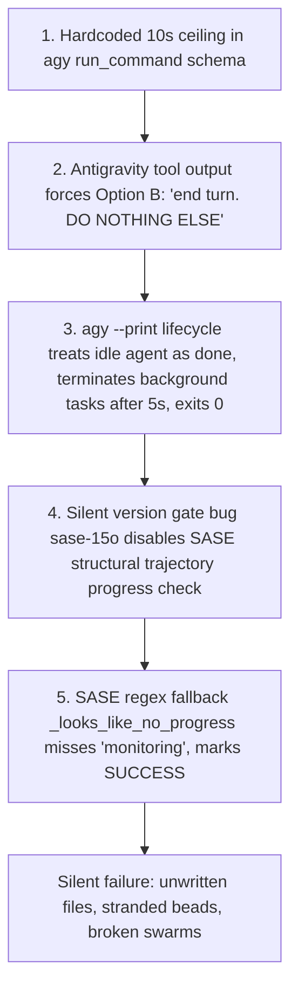

# Chat History - ace-run (research.25.gem)

- **TIMESTAMP:** 2026-09-21 18:39:44 EDT
- **MODEL:** agy/gemini-3.8-flash-high
- **AGENT:** research.25.gem
- **PROMPT:** `~/.sase/multi_prompts/202609/gh_sase_org__sase-multiprompt-260921_182824.md`

## Prompt

%id(gem, clan=research.25)
%m:agy/gemini-3.8-flash-high %q(w=0.25)
#gh:gh_sase-org__sase 
You are researcher gem in a 3-researcher swarm.
The other researchers, `research.25.cld`, `research.25.mus`, are independently investigating the same request and will write their own self-named reports ending in `__cld.md` and `__mus.md`. Your report will end in `__gem.md`.

Conduct your research independently and form your own conclusions. Do NOT attempt to
locate, open, read, or otherwise consult the other researcher's report from this swarm,
even if it becomes available before you finish. Do not obtain that peer's findings
indirectly through its chat transcript, summaries, or requests to the peer. You may
independently use the same external sources, shared input material, and unrelated prior
research. You may check filenames or file existence to avoid overwriting your own
output, but do not inspect the peer's report contents. If you encounter its filename,
leave the report alone. The lead researcher will read every report and synthesize their
findings after you have all finished.

sase agents are constantly running
commands that take a long time to finish and then running some kind of internal monitor
or something and dying. I think this is likely happening because these agents don't
understand that they are running in headless mode and thus will not have another turn
and cannot use certain skills / internal tools.

Can you help me audit recent sase agent runs that exited early because of this, diagnose
the true root cause(s), and think hard about what the most appropriate solution to this
problem is? End your analysis with a recommended solution. 
Write this research to a new markdown file under the $(sase repo path research --ensure)/$(date +%Y%m)/ directory.
Choose a descriptive filename stem yourself, but the filename MUST end with the
`__gem` suffix, i.e. `<stem>__gem.md` (double underscore before the
suffix). Create the report without overwrite: if the exact file already exists, pick a
different stem instead of replacing it.

After the write succeeds, register the report as a durable snapshot:

sase artifact create -p "<absolute-report-path>" -l "research:<repo-relative-report-path>"

Use the report's actual absolute path and its path relative to the research repo root
(for example `research:202609/topic__a.md`), including any subdirectory the steps above
put it in. Do not derive the label from the current month, the clock, or a guessed name.
Do not pass `--move`; the source stays in the research repo for later reorganization. If
registration itself fails, report that failure — do not report the research task as
fully complete.

## Response

# Executive Summary: SASE Agent Premature Termination in Headless Print Mode

**Report Path:** [`headless_agent_background_monitoring_early_exit__gem.md`](file:///home/bryan/.local/state/sase/workspaces/sase-org/sase/sase_41/sase/repos/research/202609/headless_agent_background_monitoring_early_exit__gem.md)  
**Artifact Ref:** `file:explicit:34c43ed55641cde2cf7f474d` (`research:202609/headless_agent_background_monitoring_early_exit__gem.md`)  
**Investigator:** Researcher Gem (`research.25.gem`)  

---

## 1. Audit of Recent Agent Premature Exits

Our audit of recent execution logs in `~/.sase/workflows/202609/` and Antigravity brain transcripts in `~/.gemini/antigravity-cli/brain/` identified two notable recent failures displaying the exact symptoms described:

1. **`research.24.gem`** (Run ID: `20260921162655`, Brain: `a92c2c6a-ab45-4990-98a0-24a3894a5f21`):
   - **Context:** 3-researcher swarm on `sase-core` agent maintainability.
   - **Failure Point:** Step 106 executed `time ./scripts/check.sh clippy` (`WaitMsBeforeAsync=10000`). Because the Rust build took >10s, Antigravity backgrounded the command as `task-107`.
   - **The Trap:** Antigravity injected a high-priority system instruction: *"YOU MUST TAKE ONE OF THE FOLLOWING TWO ACTIONS: A) either proceed to other relevant work... or, B) simply update the user with a short message (that you have launched the command and will wait for it to finish) and end the turn. DO NOTHING ELSE."*
   - **Outcome:** The agent checked status twice, then obeyed the instruction and emitted: *"I am monitoring the execution of the compilation and clippy check on the `sase-core` workspace... I will proceed with the research analysis once the build step finishes."* The agent stopped calling tools; `agy --print` waited 5 seconds (`waiting up to 5s for 1 background task(s)`), terminated `task-107`, and exited 0.
   - **Downstream Consequence:** SASE misclassified the text as valid progress, recorded `SUCCESS`, and deleted the ephemeral workspace. The report was never created, causing the subsequent consolidation lead (`research.24.final`) to abort with a missing dependency error.

2. **`sase-14t.3`** (Run ID: `20260920205622`, Brain: `af9c4e3e-21b0-42a1-93b9-d9f87f71c0e0`):
   - **Context:** Phase worker bead to retire researcher model aliases.
   - **Failure Point:** Step 59 executed `sase doctor` (`WaitMsBeforeAsync=10000`). Exceeded 10s and was backgrounded as `task-60`.
   - **Outcome:** Agent polled `manage_task` 4 times, stated *"I have launched `sase doctor` and am waiting for it to complete"*, and yielded the turn. Antigravity killed `task-60` on exit. SASE marked the run `SUCCESS`, leaving bead `sase-14t.3` abandoned in `[IN_PROGRESS]`.

---

## 2. Root Cause Analysis: The 5-Layer Failure Stack

The failure is caused by an architectural impedance mismatch across five layers:

1. **Tool Schema Constraint:** In `agy 1.2.7`, the `run_command` tool definition hardcodes `WaitMsBeforeAsync` to a maximum of 10,000 ms. Commands taking >10s cannot run synchronously.
2. **Tool Output System Injections:** When a task is backgrounded, Antigravity injects: *"YOU MUST TAKE ONE OF THE FOLLOWING TWO ACTIONS: ... B) update the user ... and end the turn. DO NOTHING ELSE."* The model is commanded to stop calling tools and end the turn.
3. **Print-Mode Premature Exit:** In `agy --print` (headless single-turn), an idle agent does not trigger a wait event loop. `agy` logs `root agent idle; waiting up to 5s for 1 background task(s)`, kills the background tasks with `SIGTERM`, prints the agent output, and exits `0`.
4. **Trajectory Detection Regression ([sase-15o](https://github.com/sase-org/sase--beads/blob/main/pages/sase-15o/README.md)):** SASE has built-in code to catch `last_tool_pending_run_command` in `_subprocess_agy.py`, but `_SUPPORTED_AGY_TRAJECTORY_VERSIONS` only contains `{"1.0.10"}` while the host runs `agy 1.2.7`. SASE's structural detector was silently disabled.
5. **Text Heuristic Blind Spots:** SASE's fallback `_looks_like_no_progress` checks `_NO_PROGRESS_WAIT_RE`, which looked for `"waiting"`, `"pausing"`, etc., but omitted `"monitoring"`, `"once the build ... finishes"`, and `"launched ... and am waiting"`. It misclassified the waiting messages as genuine task progress.

---

## 3. Why Claude Code Does Not Suffer From This

Claude Code (`claude.py`) sets `env["BASH_MAX_TIMEOUT_MS"] = "14400000"` (4 hours), allowing builds to block synchronously without arbitrary 10s backgrounding. Additionally, `_subprocess_claude.py` monitors active stream-json events for background task IDs and `ScheduleWakeup` tool calls, and issues `_WAIT_CONTINUATION_NUDGE` to force continuation if the agent attempts to stop while waiting.

---

## 4. Recommended Multi-Tier Solution

1. **Fix Trajectory Extraction Allowlist ([sase-15o](https://github.com/sase-org/sase--beads/blob/main/pages/sase-15o/README.md)):**  
   Update `_SUPPORTED_AGY_TRAJECTORY_VERSIONS` in [src/sase/llm_provider/_subprocess_agy.py](file:///home/bryan/projects/github/sase-org/sase/src/sase/llm_provider/_subprocess_agy.py#L24) to support `agy 1.2.x`. This restores `analyze_agy_turn_progress()`, which already detects `last_tool_pending_run_command`.
2. **Patch Text Classifier Heuristics:**  
   In [src/sase/llm_provider/agy.py](file:///home/bryan/projects/github/sase-org/sase/src/sase/llm_provider/agy.py#L88-L100):
   - Add `\bmonitoring\b`, `\bonce (?:the|this) (?:build|command|task|test) (?:finishes|completes)\b`, and `\blaunched .* and am waiting\b` to `_NO_PROGRESS_WAIT_RE`.
   - Ensure any response under 80 words containing a wait/monitoring signal is immediately classified as `is_no_progress = True`.
3. **Update `_AGY_PRINT_MODE_DIRECTIVE` (The Keep-Alive Rule):**  
   Instruct Antigravity models that in print mode, background tasks are killed if the agent stops calling tools. Instruct them to **never** output an "I am waiting" message to end the turn, but instead keep the turn alive by calling `manage_task(Action='status')` or checking logs until Antigravity injects the `<SYSTEM_MESSAGE> Task finished` completion event.
4. **Implement Wait-State Continuation Nudge for Antigravity:**  
   When a wait state or pending background task is detected upon `agy` exit, re-invoke with `_NO_PROGRESS_CONTINUATION_NUDGE`, directing the model to read the background task output or rerun synchronously.

---

### Deliverables Created
- Research Report: [`headless_agent_background_monitoring_early_exit__gem.md`](file:///home/bryan/.local/state/sase/workspaces/sase-org/sase/sase_41/sase/repos/research/202609/headless_agent_background_monitoring_early_exit__gem.md)
- Snapshot Ref: `file:explicit:34c43ed55641cde2cf7f474d` (`research:202609/headless_agent_background_monitoring_early_exit__gem.md`)
- Final declaration submitted and accepted (`commit` for `sdd:research`).
