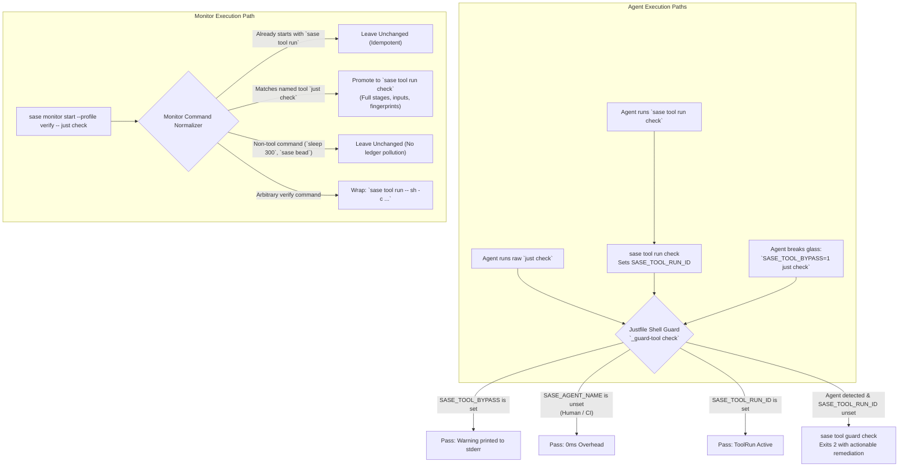

# Chat History - ace-run (research.28.gem)

- **TIMESTAMP:** 2026-09-22 11:02:44 EDT
- **MODEL:** agy/gemini-3.8-flash-high
- **AGENT:** research.28.gem
- **PROMPT:** `~/.sase/multi_prompts/202609/gh_sase_org__sase-multiprompt-260922_105129.md`

## Prompt

%id(gem, clan=research.28)
%m:agy/gemini-3.8-flash-high %q(w=0.25)
#gh:gh_sase-org__sase 
You are researcher gem in a 3-researcher swarm.
The other researchers, `research.28.cld`, `research.28.mus`, are independently investigating the same request and will write their own self-named reports ending in `__cld.md` and `__mus.md`. Your report will end in `__gem.md`.

Conduct your research independently and form your own conclusions. Do NOT attempt to
locate, open, read, or otherwise consult the other researcher's report from this swarm,
even if it becomes available before you finish. Do not obtain that peer's findings
indirectly through its chat transcript, summaries, or requests to the peer. You may
independently use the same external sources, shared input material, and unrelated prior
research. You may check filenames or file existence to avoid overwriting your own
output, but do not inspect the peer's report contents. If you encounter its filename,
leave the report alone. The lead researcher will read every report and synthesize their
findings after you have all finished.

We recently implemented the
`sase tool` command, which is just the first part of a larger plan (see the
sase_tool_epic_roadmap.md file in the research sidecar repo and the sase-135 epic bead
for context). I'm thinking about taking the next steps on this. Here's what I'm thinking
that those next steps should be:

- Add support for smoe way of enforcing that sase agents always use the `sase tool`
  command for certain commands. I want you to lead the design on this one, but one
  possible solution would be to implement a new `sase tool ensure-not-agent` command
  that commands (like the `just check` command, for example) could call at the start of
  their logic. This command could then fail if it detects a sase agent. Whatever
  solution we go with, make sure that sase agents are able to override this somehow (in
  case, for example, the `sase tool` command is broken).
- We should start making sase monitors wrap the command they run with the `sase tool`
  command. This should be possible since the `sase tool` command should be able to run
  any arbitrary command (you might need to implement this).

Can you do some research with the goal of helping me decide the best way to implement
this? Also, critique this plan in general. Is this a good idea? Would you take a
different approach? Make any adjustments to the requirements that you think are
justified but clearly call these out. End your analysis with a recommended solution. 
Write this research to a new markdown file under the $(sase repo path research --ensure)/$(date +%Y%m)/ directory.
Choose a descriptive filename stem yourself, but the filename MUST end with the
`__gem` suffix, i.e. `<stem>__gem.md` (double underscore before the
suffix). Create the report without overwrite: if the exact file already exists, pick a
different stem instead of replacing it.


After the write succeeds, register the report as a durable snapshot:

sase artifact create -p "<absolute-report-path>" -l "research:<repo-relative-report-path>"

Use the report's actual absolute path and its path relative to the research repo root
(for example `research:202609/topic__a.md`), including any subdirectory the steps above
put it in. Do not derive the label from the current month, the clock, or a guessed name.
Do not pass `--move`; the source stays in the research repo for later reorganization. If
registration itself fails, report that failure — do not report the research task as
fully complete.

## Response

# Research Report: SASE Tool Adoption via Agent Enforcement & Monitor Normalization

**Researcher:** `gem` (`research.28.gem`)  
**Report File:** `/home/bryan/.local/state/sase/workspaces/sase-org/sase/sase_34/sase/repos/research/202609/sase_tool_agent_enforcement_and_monitor_wrapping__gem.md`  
**Durable Artifact Snapshot:** `research:202609/sase_tool_agent_enforcement_and_monitor_wrapping__gem.md` (`file:explicit:8f99ec3a3b6113dcef10102c`)

---

## 1. Executive Summary & Thesis

Epic E1 (`sase-135`) successfully landed the core execution engine, foreground ToolRun SQLite ledger, stage event ingestion, process observation, and load sampling. Furthermore, **arbitrary command execution (`sase tool run -- ARGV...`) is already implemented and functional**.

However, live telemetry mined from the host reveals an acute **adoption crisis**:
- Over the last 7 days (`tools/tool_adoption_report -d 7 -j`), **only 1.96% of heavy verification runs** (10 wrapped vs. 500 raw commands, spanning 409 wall-clock hours) were executed through `sase tool run`.
- Over 98% of agent verification runs bypassed `sase tool` and executed raw `just check`, despite explicit documentation in `sase_monitor.md` and `lint_and_test.md`.
- Because downstream roadmap milestones—**E3** (failure triage), **E4** (receipts/caching), **E6** (load forecasts), and **E7** (capacity admission)—rely on a continuous, dense corpus of ToolRun records, this adoption deficit threatens the entire roadmap.

**Verdict on the User's Proposals:**
1. **Agent Enforcement Guard:** Essential. Soft prose instructions fail because LLMs default to standard shell commands like `just check`. However, the proposed design must be refined to avoid a **fatal chicken-and-egg deadlock** if `sase` itself is broken, eliminate developer startup latency, and correct the misleading `ensure-not-agent` semantics.
2. **Monitor Auto-Wrapping:** Unconditional wrapping is dangerous (it pollutes the ledger with `sleep 300`, breaks compound shell commands like `just install && just check`, and strips `just check` of its named tool catalog benefits). Instead, monitors should perform **intelligent, catalog-aware normalization** for verification profiles.

---

## 2. Critique of Proposal 1: Agent Enforcement (`sase tool ensure-not-agent`)

### 2.1 Critique of Naming & Semantics
The proposed name `sase tool ensure-not-agent` is misleading. When an agent runs `sase tool run check`, the agent *is* executing `check`. The goal is not to exclude agents from running verification, but to mandate that agent execution be **wrapped** under a ToolRun.
- **Recommended Name:** `sase tool guard <tool_name>` or `sase tool assert-wrapped <tool_name>`.

### 2.2 The "Broken Tool" Chicken-and-Egg Fragility Trap
If `just check` begins by calling `sase tool ensure-not-agent`:
- If an agent breaks `sase` during development (e.g., Python syntax error, binary ABI drift in `sase_core_rs`, or SQLite lock contention), `sase tool ensure-not-agent` will fail or crash before running.
- `just check` will immediately abort. The agent cannot run `just check` to diagnose or verify fixes, nor can it use `just fmt` or `just lint`.
- If the override mechanism relies on passing a flag to `sase tool`, the agent is deadlocked because `sase` cannot even parse CLI arguments.
- **Architectural Rule:** The break-glass override **must not depend on Python or `sase` running successfully**. It must be an environment variable (`SASE_TOOL_BYPASS=1`) evaluated at the shell layer before any Python process is spawned.

### 2.3 Eliminating Developer & CI Latency
Spawning Python (`python -m sase ...`) incurs 80–120ms of startup latency. Human developers run `just check` frequently. Calling Python on every invocation degrades developer experience.
- **Solution:** Implement a **two-tier guard**: a fast shell test in `Justfile` that evaluates in microseconds, invoking `sase tool guard` only when an unwrapped agent is actually detected.

---

## 3. Critique of Proposal 2: Monitor Auto-Wrapping

### 3.1 Clarification on Arbitrary Commands
`sase tool run` **already supports arbitrary commands** via `sase tool run -- ARGV...`. It records an `(ad-hoc)` tool run with full process tracking, load sampling, and log management.

### 3.2 The Hazards of Unconditional Wrapping
Making `sase monitor` unconditionally wrap every command in `sase tool run -- ...` creates severe issues:
1. **Ledger Pollution:** Monitored commands include `sleep 300` (waiting on CI or deployments) and `sase bead work <plan>` (epic launches). Unconditional wrapping records hundreds of sleep cycles in `runs.sqlite`, diluting statistical metrics (`TYPICAL` duration, load forecasting) and exhausting disk retention quotas.
2. **The Shell Operator & Pipeline Trap:** Monitored commands frequently include shell syntax (`just install && just check` or `cmd | tee log`). `sase tool run --` executes literal argv. Prepending `sase tool run --` causes `/bin/sh` to run `sase tool run -- just install`, while `just check` runs *outside* `sase tool`!
3. **The Double-Wrapping Trap:** Agents already instructed in `sase_monitor.md` to run `sase monitor start -- sase tool run check` would be wrapped twice, creating nested ToolRuns and conflicting process ownership.
4. **The Ad-Hoc Penalty (Loss of Named Tool Benefits):** If a monitor wraps `just check` as `sase tool run -- just check`, `sase tool` treats it as an **ad-hoc** command. It loses declared stages (`run_silent`), input tracking, toolchain fingerprinting, listing in `sase tool list`, and eligibility for E4 verification receipts!

---

## 4. Recommended Architectural Solution



### 1. Two-Tier Agent Guard (`_guard-tool` in `Justfile` + `sase tool guard`)
In `Justfile`:
```justfile
_guard-tool tool:
    @if [ -n "${SASE_TOOL_BYPASS:-}" ]; then \
        printf "[guard] WARNING: SASE_TOOL_BYPASS is active; running '%s' without ToolRun recording.\n" "{{ tool }}" >&2; \
    elif [ -n "${SASE_AGENT_NAME:-}" ] && [ -z "${SASE_TOOL_RUN_ID:-}" ]; then \
        {{ venv_bin }}/sase tool guard "{{ tool }}"; \
    fi

check: (_guard-tool "check") _setup
    ...

check-full: (_guard-tool "check-full") _setup
    ...

test *args: (_guard-tool "test") _setup
    ...
```
- **Humans & CI:** Zero Python overhead (shell test short-circuits).
- **Break-Glass:** If `sase` is broken, `SASE_TOOL_BYPASS=1 just check` works immediately without executing `sase`.
- **Enforcement:** Unwrapped agents fail at stage 0 with exit code `2` and a clear diagnostic explaining to use `sase tool run check`.

### 2. Intelligent, Catalog-Aware Monitor Normalization
In `src/sase/main/monitor/start.py`:
- Inspect incoming commands when `--profile verify` is used:
  - If the command already starts with `sase tool run`: leave untouched.
  - If the command matches a tool in `sase/sase.yml` (e.g., `just check` $\rightarrow$ `check`): normalize to `sase tool run check`.
  - If it is an arbitrary verification command: wrap safely as `sase tool run -- sh -c "<cmd>"`.
  - Non-tool commands (`sleep 300`, `sase bead work`) are untouched.

### 3. Environment Hygiene
Update `src/sase/agent/env_hygiene.py` to scrub `SASE_TOOL_RUN_ID` and `SASE_TOOL_EVENTS` when spawning agent shells, preventing child agents from falsely inheriting parent wrapper status.

---

## 5. Artifact Reference & Status
The complete research report has been written, registered as a durable artifact, and the repository finalizer declaration has been submitted:
- **Repository Path:** `sase/repos/research/202609/sase_tool_agent_enforcement_and_monitor_wrapping__gem.md`
- **Artifact Ref:** `research:202609/sase_tool_agent_enforcement_and_monitor_wrapping__gem.md` (`file:explicit:8f99ec3a3b6113dcef10102c`)
- **Finalizer Declaration:** Accepted for commit.
