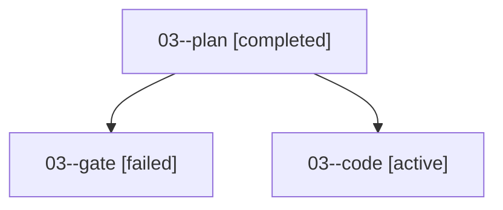

# Family: 03

[Agent Hoods](../README.md) / [bbugyi200](../users/bbugyi200/README.md) / [apollo](../users/bbugyi200/machines/apollo/README.md) / [03](../users/bbugyi200/machines/apollo/hoods/03/README.md) / 03

Owner: `bbugyi200.apollo` · Hood: `03` · Members: 3

## Lineage

The diagram is an optional enhancement; the ordered table below contains the same lineage in accessible text.

| Role | Agent | State | Model / provider | Timing | Commits | Prompt | Chat |
|---|---|---|---|---|---:|---|---|
| plan | 03--plan | completed | gpt-6-astra / codex | 2026-09-15T13:44:52.118290+00:00 → 2026-09-15T13:52:33.419431+00:00 | 0 | [Prompt](../agents/bbugyi200.apollo.03--plan/prompt.md) | [Chat](../agents/bbugyi200.apollo.03--plan/chat.md) |
| gate | 03--gate | failed | gpt-6-astra / codex | 2026-09-15T13:55:40.726881+00:00 → 2026-09-15T13:55:57.450635+00:00 | 0 | — | [Chat](../agents/bbugyi200.apollo.03--gate/chat.md) |
| code | 03--code | active | gpt-5.5 / codex | 2026-09-15T13:56:02.005107+00:00 | [1](../agents/bbugyi200.apollo.03--code/README.md#commits) | [Prompt](../agents/bbugyi200.apollo.03--code/prompt.md) | — |

## Commits

| Role | Repo | Commit | Subject | Committed |
|---|---|---|---|---|
| — | sase | [`c8fedfa`](https://github.com/sase-org/sase/commit/c8fedfa1526c6cb335ffe58cf30efbf09690e86b) | feat(demos): add ACE prompt history stash demo | 2026-07-06 23:34:42 EDT |
| code | sase | [`6122ebe`](https://github.com/sase-org/sase/commit/6122ebe4f1a456e67c6e0758627ba7676910acbd) | test(usage): cover refresh admission after limit reset | 2026-09-15 11:17:33 EDT |
