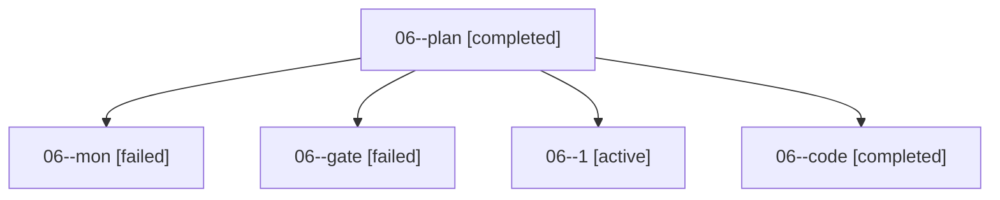

# Family: 06

[Agent Hoods](../README.md) / [bbugyi200](../users/bbugyi200/README.md) / [apollo](../users/bbugyi200/machines/apollo/README.md) / [06](../users/bbugyi200/machines/apollo/hoods/06/README.md) / 06

Owner: `bbugyi200.apollo` · Hood: `06` · Members: 5

## Lineage

The diagram is an optional enhancement; the ordered table below contains the same lineage in accessible text.

| Role | Agent | State | Model / provider | Timing | Commits | Prompt | Chat |
|---|---|---|---|---|---:|---|---|
| plan | 06--plan | completed | gpt-6-astra / codex | 2026-09-16T17:57:47.078851+00:00 → 2026-09-16T18:05:09.428303+00:00 | 0 | [Prompt](../agents/bbugyi200.apollo.06--plan/prompt.md) | [Chat](../agents/bbugyi200.apollo.06--plan/chat.md) |
| mon | 06--mon | failed | sonnet / claude | 2026-09-16T19:54:01.236602+00:00 → 2026-09-16T20:21:59.996573+00:00 | 0 | — | [Chat](../agents/bbugyi200.apollo.06--mon/chat.md) |
| gate | 06--gate | failed | gpt-6-astra / codex | 2026-09-16T18:06:47.989720+00:00 → 2026-09-16T18:07:02.436937+00:00 | 0 | — | [Chat](../agents/bbugyi200.apollo.06--gate/chat.md) |
| 1 | 06--1 | active | sonnet / claude | 2026-09-16T20:21:59.741911+00:00 | [1](../agents/bbugyi200.apollo.06--1/README.md#commits) | [Prompt](../agents/bbugyi200.apollo.06--1/prompt.md) | — |
| code | 06--code | completed | sonnet / claude | 2026-09-16T18:07:06.620439+00:00 → 2026-09-16T19:54:51.893309+00:00 | 0 | [Prompt](../agents/bbugyi200.apollo.06--code/prompt.md) | [Chat](../agents/bbugyi200.apollo.06--code/chat.md) |

## Commits

| Role | Repo | Commit | Subject | Committed |
|---|---|---|---|---|
| — | sase | [`0348a31`](https://github.com/sase-org/sase/commit/0348a311ede448dd40e509994a00bf60fd02258d) | chore: Add SDD prompt and plan for move\_research\_xprompts\_to\_chezmoi | 2026-07-05 07:05:44 EDT |
| — | sase | [`bc6a9cc`](https://github.com/sase-org/sase/commit/bc6a9cc87f2ef91166c3cd4b344f8afc3318f710) | feat!: remove packaged research xprompts | 2026-07-05 07:31:43 EDT |
| — | sase | [`f27dde7`](https://github.com/sase-org/sase/commit/f27dde7d4964dd9da70718efb1decf6a4af08ace) | chore: Add SDD prompt and plan for telegram\_launch\_buttons\_sharded\_artifacts | 2026-07-06 23:42:42 EDT |
| — | sase | [`d7e06b7`](https://github.com/sase-org/sase/commit/d7e06b77b42d89ecf4bb1538c6f89c6fe700124e) | fix: expose launch artifact directories | 2026-07-06 23:54:43 EDT |
| 1 | sase | [`00cb371`](https://github.com/sase-org/sase/commit/00cb371c7d81041c01aef09ec4b7d8d07d73e013) | feat(ace): filter Ctrl+K prompt history by project via sase-core | 2026-09-16 16:24:23 EDT |
