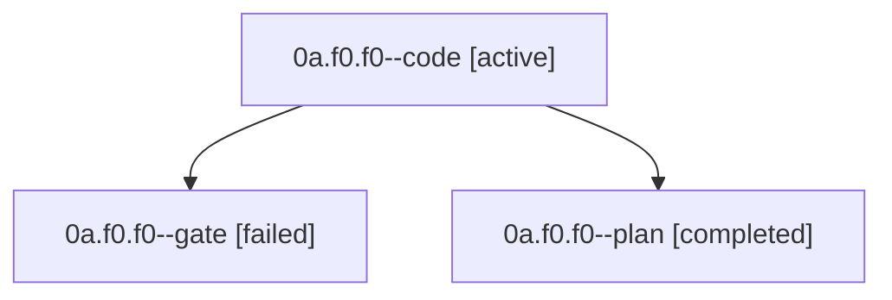

# Family: 0a.f0.f0

[Agent Hoods](../README.md) / [bbugyi200](../users/bbugyi200/README.md) / [apollo](../users/bbugyi200/machines/apollo/README.md) / [0a](../users/bbugyi200/machines/apollo/hoods/0a/README.md) / 0a.f0.f0

Owner: `bbugyi200.apollo` · Hood: `0a` · Members: 3

## Lineage

The diagram is an optional enhancement; the ordered table below contains the same lineage in accessible text.

| Role | Agent | State | Model / provider | Timing | Commits | Prompt | Chat |
|---|---|---|---|---|---:|---|---|
| code | 0a.f0.f0--code | active | gpt-5.5 / codex | 2026-09-18T07:08:07.001311+00:00 | [1](../agents/bbugyi200.apollo.0a.f0.f0--code/README.md#commits) | [Prompt](../agents/bbugyi200.apollo.0a.f0.f0--code/prompt.md) | — |
| gate | 0a.f0.f0--gate | failed | gpt-5.6-sol / codex | 2026-09-18T07:07:51.385326+00:00 → 2026-09-18T07:08:03.593915+00:00 | 0 | — | [Chat](../agents/bbugyi200.apollo.0a.f0.f0--gate/chat.md) |
| plan | 0a.f0.f0--plan | completed | gpt-5.6-sol / codex | 2026-09-17T21:03:27.733825+00:00 → 2026-09-17T21:08:18.163686+00:00 | 0 | [Prompt](../agents/bbugyi200.apollo.0a.f0.f0--plan/prompt.md) | [Chat](../agents/bbugyi200.apollo.0a.f0.f0--plan/chat.md) |

## Commits

| Role | Repo | Commit | Subject | Committed |
|---|---|---|---|---|
| code | sase | [`d76b742`](https://github.com/sase-org/sase/commit/d76b742cffc33d686f45bb085360bda8abe9e9fe) | feat(tui): hide default tribe node labels | 2026-09-18 03:59:51 EDT |

## Neighbors

| Agent | Relation | State |
|---|---|---|
| [0a.f0](bbugyi200.apollo.0a.f0.md) (family · 3) | ancestor | completed 2, failed 1 |
| [0a](../agents/bbugyi200.apollo.0a/README.md) | ancestor | completed |
