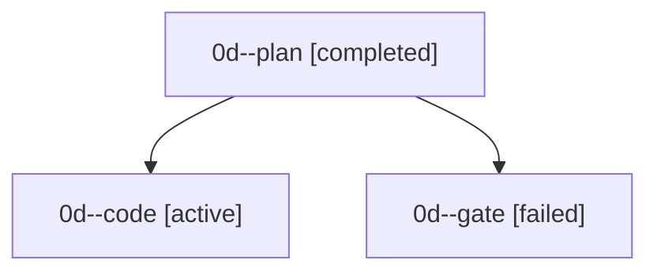

# Family: 0d

[Agent Hoods](../README.md) / [bbugyi200](../users/bbugyi200/README.md) / [apollo](../users/bbugyi200/machines/apollo/README.md) / [0d](../users/bbugyi200/machines/apollo/hoods/0d/README.md) / 0d

Owner: `bbugyi200.apollo` · Hood: `0d` · Members: 3

## Lineage

The diagram is an optional enhancement; the ordered table below contains the same lineage in accessible text.

| Role | Agent | State | Model / provider | Timing | Commits | Prompt | Chat |
|---|---|---|---|---|---:|---|---|
| plan | 0d--plan | completed | gpt-6-astra / codex | 2026-09-17T19:05:34.271742+00:00 → 2026-09-17T19:11:51.220510+00:00 | 0 | [Prompt](../agents/bbugyi200.apollo.0d--plan/prompt.md) | [Chat](../agents/bbugyi200.apollo.0d--plan/chat.md) |
| code | 0d--code | active | gpt-5.5 / codex | 2026-09-17T19:12:36.533413+00:00 | [1](../agents/bbugyi200.apollo.0d--code/README.md#commits) | [Prompt](../agents/bbugyi200.apollo.0d--code/prompt.md) | — |
| gate | 0d--gate | failed | gpt-6-astra / codex | 2026-09-17T19:12:18.235296+00:00 → 2026-09-17T19:12:32.470846+00:00 | 0 | — | [Chat](../agents/bbugyi200.apollo.0d--gate/chat.md) |

## Commits

| Role | Repo | Commit | Subject | Committed |
|---|---|---|---|---|
| — | sase | [`26767ec`](https://github.com/sase-org/sase/commit/26767ec70751d5374344a5dc4584d647cfdf7625) | chore: Add SDD prompt and plan for vim\_text\_area\_adoption | 2026-07-05 19:48:52 EDT |
| — | sase | [`085054e`](https://github.com/sase-org/sase/commit/085054e325c5c32667f677eae30a2d04cf8771e6) | feat(tui): adopt vim text areas for modal inputs | 2026-07-05 20:49:46 EDT |
| — | sase | [`5785c09`](https://github.com/sase-org/sase/commit/5785c092701161c4d272620deda1bf52a6a742c5) | chore: Add SDD prompt and plan for telegram\_project\_display\_names\_1 | 2026-07-07 02:06:33 EDT |
| — | sase | [`0654041`](https://github.com/sase-org/sase/commit/0654041e20263c8b21b2666c5749ca6406dad333) | feat: humanize safe project filename stems | 2026-07-07 02:19:02 EDT |
| code | sase | [`d618a42`](https://github.com/sase-org/sase/commit/d618a42bd172ac387c9e40de549c258decda373d) | test(sudo): cover cwd handoff and runner errors | 2026-09-17 16:19:47 EDT |
