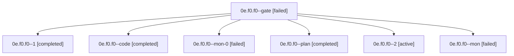

# Family: 0e.f0.f0

[Agent Hoods](../README.md) / [bbugyi200](../users/bbugyi200/README.md) / [apollo](../users/bbugyi200/machines/apollo/README.md) / [0e](../users/bbugyi200/machines/apollo/hoods/0e/README.md) / 0e.f0.f0

Owner: `bbugyi200.apollo` · Hood: `0e` · Members: 7

## Lineage

The diagram is an optional enhancement; the ordered table below contains the same lineage in accessible text.

| Role | Agent | State | Model / provider | Timing | Commits | Prompt | Chat |
|---|---|---|---|---|---:|---|---|
| gate | 0e.f0.f0--gate | failed | gpt-5.6-sol / codex | 2026-09-18T16:59:52.376714+00:00 → 2026-09-18T17:00:13.014958+00:00 | 0 | — | [Chat](../agents/bbugyi200.apollo.0e.f0.f0--gate/chat.md) |
| 1 | 0e.f0.f0--1 | completed | gpt-5.5 / codex | 2026-09-18T19:41:43.861344+00:00 → 2026-09-18T19:50:25.676058+00:00 | 0 | [Prompt](../agents/bbugyi200.apollo.0e.f0.f0--1/prompt.md) | [Chat](../agents/bbugyi200.apollo.0e.f0.f0--1/chat.md) |
| code | 0e.f0.f0--code | completed | gpt-5.5 / codex | 2026-09-18T17:00:18.378178+00:00 → 2026-09-18T18:27:41.599960+00:00 | 0 | [Prompt](../agents/bbugyi200.apollo.0e.f0.f0--code/prompt.md) | [Chat](../agents/bbugyi200.apollo.0e.f0.f0--code/chat.md) |
| mon-0 | 0e.f0.f0--mon-0 | failed | gpt-5.5 / codex | 2026-09-18T19:49:40.903509+00:00 → 2026-09-18T20:43:48.356831+00:00 | 0 | — | [Chat](../agents/bbugyi200.apollo.0e.f0.f0--mon-0/chat.md) |
| plan | 0e.f0.f0--plan | completed | gpt-5.6-sol / codex | 2026-09-18T16:21:28.356900+00:00 → 2026-09-18T16:28:00.774882+00:00 | 0 | [Prompt](../agents/bbugyi200.apollo.0e.f0.f0--plan/prompt.md) | [Chat](../agents/bbugyi200.apollo.0e.f0.f0--plan/chat.md) |
| 2 | 0e.f0.f0--2 | active | grok-4.6 / grok | 2026-09-18T20:43:48.148962+00:00 | [1](../agents/bbugyi200.apollo.0e.f0.f0--2/README.md#commits) | [Prompt](../agents/bbugyi200.apollo.0e.f0.f0--2/prompt.md) | — |
| mon | 0e.f0.f0--mon | failed | gpt-5.5 / codex | 2026-09-18T18:26:38.550404+00:00 → 2026-09-18T19:41:44.059158+00:00 | 0 | — | [Chat](../agents/bbugyi200.apollo.0e.f0.f0--mon/chat.md) |

## Commits

| Role | Repo | Commit | Subject | Committed |
|---|---|---|---|---|
| 2 | sase | [`f1723c5`](https://github.com/sase-org/sase/commit/f1723c58b5252b537318ca87fbb1fcca1a78e38f) | feat(ace): add Agents metadata-only and secondary-only layouts | 2026-09-18 16:49:16 EDT |

## Neighbors

| Agent | Relation | State |
|---|---|---|
| [0e.f0](bbugyi200.apollo.0e.f0.md) (family · 5) | ancestor | completed 3, failed 2 |
| [0e](bbugyi200.apollo.0e.md) (family · 3) | ancestor | active 1, completed 1, failed 1 |
| [0e.f0.f0.w0](../agents/bbugyi200.apollo.0e.f0.f0.w0/README.md) | descendant | waiting |
| [0e.w0](bbugyi200.apollo.0e.w0.md) (family · 3) | 0e hood | active 1, completed 1, failed 1 |
| [0e.w1](../agents/bbugyi200.apollo.0e.w1/README.md) | 0e hood | completed |
| [0e.w1.w1](../agents/bbugyi200.apollo.0e.w1.w1/README.md) | 0e hood | completed |
| [0e.w1.w1.w1](../agents/bbugyi200.apollo.0e.w1.w1.w1/README.md) | 0e hood | completed |
| [0e.w1.w1.w1.f1](../agents/bbugyi200.apollo.0e.w1.w1.w1.f1/README.md) | 0e hood | completed |
