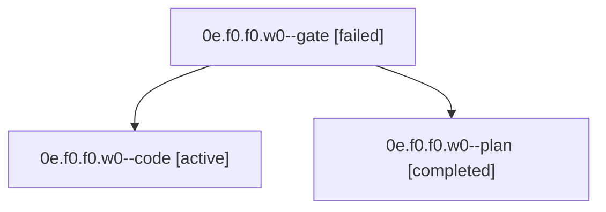

# Family: 0e.f0.f0.w0

[Agent Hoods](../README.md) / [bbugyi200](../users/bbugyi200/README.md) / [apollo](../users/bbugyi200/machines/apollo/README.md) / [0e](../users/bbugyi200/machines/apollo/hoods/0e/README.md) / 0e.f0.f0.w0

Owner: `bbugyi200.apollo` · Hood: `0e` · Members: 3

## Lineage

The diagram is an optional enhancement; the ordered table below contains the same lineage in accessible text.

| Role | Agent | State | Model / provider | Timing | Commits | Prompt | Chat |
|---|---|---|---|---|---:|---|---|
| gate | 0e.f0.f0.w0--gate | failed | gpt-5.6-sol / codex | 2026-09-18T21:29:35.695754+00:00 → 2026-09-18T21:29:54.630213+00:00 | 0 | — | [Chat](../agents/bbugyi200.apollo.0e.f0.f0.w0--gate/chat.md) |
| code | 0e.f0.f0.w0--code | active | grok-4.6 / grok | 2026-09-18T21:29:59.840299+00:00 | [1](../agents/bbugyi200.apollo.0e.f0.f0.w0--code/README.md#commits) | [Prompt](../agents/bbugyi200.apollo.0e.f0.f0.w0--code/prompt.md) | — |
| plan | 0e.f0.f0.w0--plan | completed | gpt-5.6-sol / codex | 2026-09-18T20:51:03.067588+00:00 → 2026-09-18T20:56:08.865407+00:00 | 0 | [Prompt](../agents/bbugyi200.apollo.0e.f0.f0.w0--plan/prompt.md) | [Chat](../agents/bbugyi200.apollo.0e.f0.f0.w0--plan/chat.md) |

## Commits

| Role | Repo | Commit | Subject | Committed |
|---|---|---|---|---|
| code | sase | [`5d158ad`](https://github.com/sase-org/sase/commit/5d158ad65ba99293e4cad22d013abbc0e064ad76) | feat(tui): default Agents detail view to metadata-only | 2026-09-18 19:07:42 EDT |

## Neighbors

| Agent | Relation | State |
|---|---|---|
| [0e.f0.f0](bbugyi200.apollo.0e.f0.f0.md) (family · 7) | ancestor | completed 4, failed 3 |
| [0e.f0](bbugyi200.apollo.0e.f0.md) (family · 5) | ancestor | completed 3, failed 2 |
| [0e](bbugyi200.apollo.0e.md) (family · 3) | ancestor | active 1, completed 1, failed 1 |
| [0e.w0](bbugyi200.apollo.0e.w0.md) (family · 3) | 0e hood | active 1, completed 1, failed 1 |
| [0e.w1](../agents/bbugyi200.apollo.0e.w1/README.md) | 0e hood | completed |
| [0e.w1.w1](../agents/bbugyi200.apollo.0e.w1.w1/README.md) | 0e hood | completed |
| [0e.w1.w1.w1](../agents/bbugyi200.apollo.0e.w1.w1.w1/README.md) | 0e hood | completed |
| [0e.w1.w1.w1.f1](../agents/bbugyi200.apollo.0e.w1.w1.w1.f1/README.md) | 0e hood | completed |
