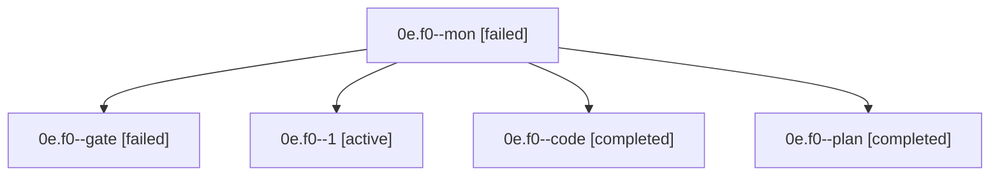

# Family: 0e.f0

[Agent Hoods](../README.md) / [bbugyi200](../users/bbugyi200/README.md) / [apollo](../users/bbugyi200/machines/apollo/README.md) / [0e](../users/bbugyi200/machines/apollo/hoods/0e/README.md) / 0e.f0

Owner: `bbugyi200.apollo` · Hood: `0e` · Members: 5

## Lineage

The diagram is an optional enhancement; the ordered table below contains the same lineage in accessible text.

| Role | Agent | State | Model / provider | Timing | Commits | Prompt | Chat |
|---|---|---|---|---|---:|---|---|
| mon | 0e.f0--mon | failed | gpt-5.5 / codex | 2026-09-18T11:24:09.660672+00:00 → 2026-09-18T14:42:35.310213+00:00 | 0 | — | [Chat](../agents/bbugyi200.apollo.0e.f0--mon/chat.md) |
| gate | 0e.f0--gate | failed | gpt-5.6-sol / codex | 2026-09-18T09:46:46.108832+00:00 → 2026-09-18T09:46:59.321751+00:00 | 0 | — | [Chat](../agents/bbugyi200.apollo.0e.f0--gate/chat.md) |
| 1 | 0e.f0--1 | active | gpt-5.5 / codex | 2026-09-18T14:42:35.207900+00:00 | [1](../agents/bbugyi200.apollo.0e.f0--1/README.md#commits) | [Prompt](../agents/bbugyi200.apollo.0e.f0--1/prompt.md) | — |
| code | 0e.f0--code | completed | gpt-5.5 / codex | 2026-09-18T09:47:02.585120+00:00 → 2026-09-18T11:25:22.042681+00:00 | 0 | [Prompt](../agents/bbugyi200.apollo.0e.f0--code/prompt.md) | [Chat](../agents/bbugyi200.apollo.0e.f0--code/chat.md) |
| plan | 0e.f0--plan | completed | gpt-5.6-sol / codex | 2026-09-18T09:41:03.434014+00:00 → 2026-09-18T09:46:01.068728+00:00 | 0 | [Prompt](../agents/bbugyi200.apollo.0e.f0--plan/prompt.md) | [Chat](../agents/bbugyi200.apollo.0e.f0--plan/chat.md) |

## Commits

| Role | Repo | Commit | Subject | Committed |
|---|---|---|---|---|
| 1 | sase | [`776417d`](https://github.com/sase-org/sase/commit/776417d1b49efb9ee3e9cbd4117b11a076711f66) | feat(ace): support equal agents detail layout | 2026-09-18 12:18:06 EDT |

## Neighbors

| Agent | Relation | State |
|---|---|---|
| [0e](bbugyi200.apollo.0e.md) (family · 3) | ancestor | active 1, completed 1, failed 1 |
| [0e.f0.f0](../agents/bbugyi200.apollo.0e.f0.f0/README.md) | descendant | waiting |
| [0e.f0.f0.w0](../agents/bbugyi200.apollo.0e.f0.f0.w0/README.md) | descendant | waiting |
| [0e.w0](bbugyi200.apollo.0e.w0.md) (family · 3) | 0e hood | active 1, completed 1, failed 1 |
| [0e.w1](../agents/bbugyi200.apollo.0e.w1/README.md) | 0e hood | completed |
| [0e.w1.w1](../agents/bbugyi200.apollo.0e.w1.w1/README.md) | 0e hood | completed |
| [0e.w1.w1.w1](../agents/bbugyi200.apollo.0e.w1.w1.w1/README.md) | 0e hood | completed |
| [0e.w1.w1.w1.f1](../agents/bbugyi200.apollo.0e.w1.w1.w1.f1/README.md) | 0e hood | completed |
