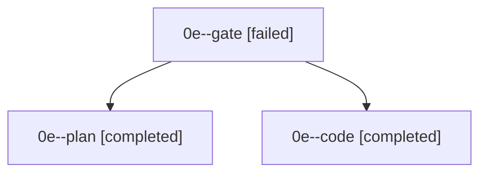

# Family: 0e

[Agent Hoods](../README.md) / [bbugyi200](../users/bbugyi200/README.md) / [apollo](../users/bbugyi200/machines/apollo/README.md) / [0e](../users/bbugyi200/machines/apollo/hoods/0e/README.md) / 0e

Owner: `bbugyi200.apollo` · Hood: `0e` · Members: 3

## Lineage

The diagram is an optional enhancement; the ordered table below contains the same lineage in accessible text.

| Role | Agent | State | Model / provider | Timing | Commits | Prompt | Chat |
|---|---|---|---|---|---:|---|---|
| gate | 0e--gate | failed | gpt-6-astra / codex | 2026-09-17T19:30:11.247814+00:00 → 2026-09-17T19:30:25.211234+00:00 | 0 | — | [Chat](../agents/bbugyi200.apollo.0e--gate/chat.md) |
| plan | 0e--plan | completed | gpt-6-astra / codex | 2026-09-17T19:23:23.528515+00:00 → 2026-09-17T19:29:46.948519+00:00 | 0 | [Prompt](../agents/bbugyi200.apollo.0e--plan/prompt.md) | [Chat](../agents/bbugyi200.apollo.0e--plan/chat.md) |
| code | 0e--code | completed | gpt-5.5 / codex | 2026-09-17T19:30:29.233838+00:00 → 2026-09-17T22:13:13.208443+00:00 | [1](../agents/bbugyi200.apollo.0e--code/README.md#commits) | [Prompt](../agents/bbugyi200.apollo.0e--code/prompt.md) | [Chat](../agents/bbugyi200.apollo.0e--code/chat.md) |

## Commits

| Role | Repo | Commit | Subject | Committed |
|---|---|---|---|---|
| — | sase | [`5924868`](https://github.com/sase-org/sase/commit/5924868b0c5db0b7000e6c80f8f28a398d77050c) | chore: Add SDD prompt and plan for sase\_var\_output\_variables | 2026-06-02 20:19:08 EDT |
| — | sase | [`68716ab`](https://github.com/sase-org/sase/commit/68716ab4c603128d02bfaf79ddd510508aa3584d) | chore: create sase var output variable epic beads | 2026-06-02 20:23:43 EDT |
| — | sase | [`932b6fa`](https://github.com/sase-org/sase/commit/932b6fa3a1657c6db6c7d024b9ff1ee182f73484) | chore: Add SDD prompt and plan for agents\_tab\_auto\_approve\_prefix\_and\_child\_alignment | 2026-07-05 21:37:09 EDT |
| — | sase | [`3e4c53d`](https://github.com/sase-org/sase/commit/3e4c53d359c795a9d80338b5b98fe018688ad99c) | fix(tui): align workflow child approval indicators | 2026-07-05 22:18:56 EDT |
| — | sase | [`c5f48b6`](https://github.com/sase-org/sase/commit/c5f48b6d601915c4fab8b3d7b7870502c2d2f4e3) | chore: Add SDD prompt and plan for popup\_panel\_tab\_switch\_keymaps | 2026-07-07 11:13:39 EDT |
| — | sase | [`904a3e1`](https://github.com/sase-org/sase/commit/904a3e1514308972d27afc79914de6a90a5bedcf) | fix(ace): support tab switching in popup panels | 2026-07-07 11:28:42 EDT |
| code | sase | [`37d1b25`](https://github.com/sase-org/sase/commit/37d1b2592e334933625a63c933bb809d621b71c7) | feat(agents): add detail view picker | 2026-09-17 18:11:32 EDT |

## Neighbors

| Agent | Relation | State |
|---|---|---|
| [0e.w0](bbugyi200.apollo.0e.w0.md) (family · 3) | descendant | active 1, completed 1, failed 1 |
| [0e.w1](../agents/bbugyi200.apollo.0e.w1/README.md) | descendant | completed |
| [0e.w1.w1](../agents/bbugyi200.apollo.0e.w1.w1/README.md) | descendant | completed |
| [0e.w1.w1.w1](../agents/bbugyi200.apollo.0e.w1.w1.w1/README.md) | descendant | completed |
| [0e.w1.w1.w1.f1](../agents/bbugyi200.apollo.0e.w1.w1.w1.f1/README.md) | descendant | completed |
