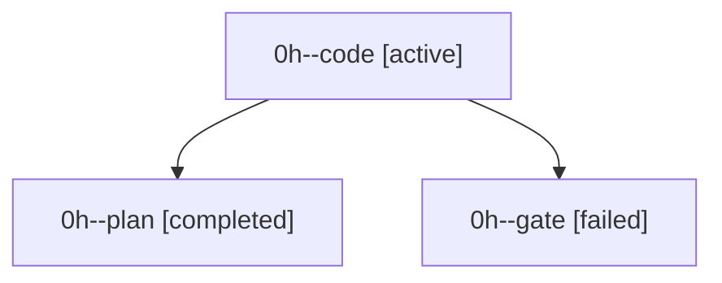

# Family: 0h

[Agent Hoods](../README.md) / [bbugyi200](../users/bbugyi200/README.md) / [apollo](../users/bbugyi200/machines/apollo/README.md) / [0h](../users/bbugyi200/machines/apollo/hoods/0h/README.md) / 0h

Owner: `bbugyi200.apollo` · Hood: `0h` · Members: 3

## Lineage

The diagram is an optional enhancement; the ordered table below contains the same lineage in accessible text.

| Role | Agent | State | Model / provider | Timing | Commits | Prompt | Chat |
|---|---|---|---|---|---:|---|---|
| code | 0h--code | active | gpt-5.5 / codex | 2026-09-18T10:58:34.030443+00:00 | [1](../agents/bbugyi200.apollo.0h--code/README.md#commits) | [Prompt](../agents/bbugyi200.apollo.0h--code/prompt.md) | — |
| plan | 0h--plan | completed | opus / claude | 2026-09-18T10:39:43.373612+00:00 → 2026-09-18T10:57:49.579143+00:00 | 0 | [Prompt](../agents/bbugyi200.apollo.0h--plan/prompt.md) | [Chat](../agents/bbugyi200.apollo.0h--plan/chat.md) |
| gate | 0h--gate | failed | opus / claude | 2026-09-18T10:58:13.620504+00:00 → 2026-09-18T10:58:29.175575+00:00 | 0 | — | [Chat](../agents/bbugyi200.apollo.0h--gate/chat.md) |

## Commits

| Role | Repo | Commit | Subject | Committed |
|---|---|---|---|---|
| — | sase | [`5ed257f`](https://github.com/sase-org/sase/commit/5ed257fd50482571c11934c29414620030c0b68a) | chore: Add SDD prompt and plan for double\_dash\_agent\_family\_separator | 2026-06-02 21:03:09 EDT |
| — | sase | [`d71af00`](https://github.com/sase-org/sase/commit/d71af00c9c1fbc861b3a0a7da9bf5126575e9ef9) | feat: canonicalize plan-family suffixes with double dash | 2026-06-02 21:26:07 EDT |
| code | sase | [`7359446`](https://github.com/sase-org/sase/commit/7359446b94a973f2d94745faddb6c49a1272abd3) | fix(tui): improve prompt search pill contrast | 2026-09-18 08:18:00 EDT |
