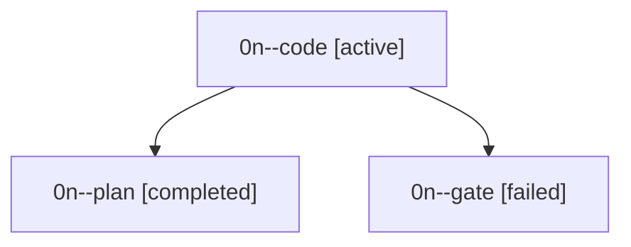

# Family: 0n

[Agent Hoods](../README.md) / [bbugyi200](../users/bbugyi200/README.md) / [apollo](../users/bbugyi200/machines/apollo/README.md) / [0n](../users/bbugyi200/machines/apollo/hoods/0n/README.md) / 0n

Owner: `bbugyi200.apollo` · Hood: `0n` · Members: 3

## Lineage

The diagram is an optional enhancement; the ordered table below contains the same lineage in accessible text.

| Role | Agent | State | Model / provider | Timing | Commits | Prompt | Chat |
|---|---|---|---|---|---:|---|---|
| code | 0n--code | active | grok-4.6 / grok | 2026-09-19T00:53:57.855609+00:00 | 0 | [Prompt](../agents/bbugyi200.apollo.0n--code/prompt.md) | — |
| plan | 0n--plan | completed | gpt-5.6-sol / codex | 2026-09-19T00:40:00.949267+00:00 → 2026-09-19T00:52:33.331576+00:00 | 0 | [Prompt](../agents/bbugyi200.apollo.0n--plan/prompt.md) | [Chat](../agents/bbugyi200.apollo.0n--plan/chat.md) |
| gate | 0n--gate | failed | gpt-5.6-sol / codex | 2026-09-19T00:53:37.957702+00:00 → 2026-09-19T00:53:53.296950+00:00 | 0 | — | [Chat](../agents/bbugyi200.apollo.0n--gate/chat.md) |

## Commits

| Role | Repo | Commit | Subject | Committed |
|---|---|---|---|---|
| — | sase | [`40c594f`](https://github.com/sase-org/sase/commit/40c594fd8f77a9bb23cd732abc0393376262b0e6) | chore: Add SDD prompt and plan for tui\_toasts\_log\_source | 2026-07-07 13:47:10 EDT |
| — | sase | [`de0130a`](https://github.com/sase-org/sase/commit/de0130a8d688eb2ec9d41dd1b8fb2c38ebc9f064) | feat(tui): persist toast notifications in logs pane | 2026-07-07 14:07:29 EDT |
