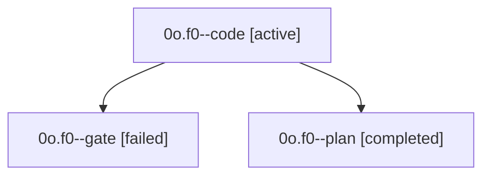

# Family: 0o.f0

[Agent Hoods](../README.md) / [bbugyi200](../users/bbugyi200/README.md) / [apollo](../users/bbugyi200/machines/apollo/README.md) / [0o](../users/bbugyi200/machines/apollo/hoods/0o/README.md) / 0o.f0

Owner: `bbugyi200.apollo` · Hood: `0o` · Members: 3

## Lineage

The diagram is an optional enhancement; the ordered table below contains the same lineage in accessible text.

| Role | Agent | State | Model / provider | Timing | Commits | Prompt | Chat |
|---|---|---|---|---|---:|---|---|
| code | 0o.f0--code | active | sonnet / claude | 2026-09-20T10:32:07.989837+00:00 | [1](../agents/bbugyi200.apollo.0o.f0--code/README.md#commits) | [Prompt](../agents/bbugyi200.apollo.0o.f0--code/prompt.md) | — |
| gate | 0o.f0--gate | failed | opus / claude | 2026-09-20T10:31:45.577878+00:00 → 2026-09-20T10:32:03.371913+00:00 | 0 | — | [Chat](../agents/bbugyi200.apollo.0o.f0--gate/chat.md) |
| plan | 0o.f0--plan | completed | opus / claude | 2026-09-20T10:22:17.272904+00:00 → 2026-09-20T10:28:29.431707+00:00 | 0 | [Prompt](../agents/bbugyi200.apollo.0o.f0--plan/prompt.md) | [Chat](../agents/bbugyi200.apollo.0o.f0--plan/chat.md) |

## Commits

| Role | Repo | Commit | Subject | Committed |
|---|---|---|---|---|
| code | sase | [`65c8169`](https://github.com/sase-org/sase/commit/65c8169f9dd1ce60834dfa9156a8e5c21bfa5bb7) | feat(llm-provider): retune size aliases to the effort ladder | 2026-09-20 06:40:59 EDT |

## Neighbors

| Agent | Relation | State |
|---|---|---|
| [0o](bbugyi200.apollo.0o.md) (family · 13) | ancestor | active 1, completed 5, failed 7 |
