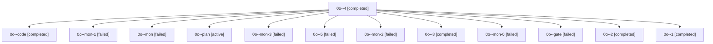

# Family: 0o

[Agent Hoods](../README.md) / [bbugyi200](../users/bbugyi200/README.md) / [apollo](../users/bbugyi200/machines/apollo/README.md) / [0o](../users/bbugyi200/machines/apollo/hoods/0o/README.md) / 0o

Owner: `bbugyi200.apollo` · Hood: `0o` · Members: 13

## Lineage

The diagram is an optional enhancement; the ordered table below contains the same lineage in accessible text.

| Role | Agent | State | Model / provider | Timing | Commits | Prompt | Chat |
|---|---|---|---|---|---:|---|---|
| 4 | 0o--4 | completed | grok-4.6 / grok | 2026-09-19T15:51:32.578513+00:00 → 2026-09-19T16:16:07.228832+00:00 | 0 | [Prompt](../agents/bbugyi200.apollo.0o--4/prompt.md) | [Chat](../agents/bbugyi200.apollo.0o--4/chat.md) |
| code | 0o--code | completed | grok-4.6 / grok | 2026-09-19T13:04:59.791470+00:00 → 2026-09-19T13:19:20.005071+00:00 | 0 | [Prompt](../agents/bbugyi200.apollo.0o--code/prompt.md) | [Chat](../agents/bbugyi200.apollo.0o--code/chat.md) |
| mon-1 | 0o--mon-1 | failed | grok-4.6 / grok | 2026-09-19T14:06:45.142007+00:00 → 2026-09-19T15:37:04.007428+00:00 | 0 | — | [Chat](../agents/bbugyi200.apollo.0o--mon-1/chat.md) |
| mon | 0o--mon | failed | grok-4.6 / grok | 2026-09-19T13:18:26.398547+00:00 → 2026-09-19T13:22:56.847862+00:00 | 0 | — | [Chat](../agents/bbugyi200.apollo.0o--mon/chat.md) |
| plan | 0o--plan | active | grok-4.6 / grok | 2026-09-19T12:48:57.152118+00:00 | 0 | [Prompt](../agents/bbugyi200.apollo.0o--plan/prompt.md) | [Chat](../agents/bbugyi200.apollo.0o--plan/chat.md) |
| mon-3 | 0o--mon-3 | failed | grok-4.6 / grok | 2026-09-19T16:15:13.965846+00:00 → 2026-09-19T16:55:22.675374+00:00 | 0 | — | [Chat](../agents/bbugyi200.apollo.0o--mon-3/chat.md) |
| 5 | 0o--5 | failed | sonnet / claude | 2026-09-19T16:55:22.583880+00:00 → 2026-09-19T17:41:25.696945+00:00 | 0 | [Prompt](../agents/bbugyi200.apollo.0o--5/prompt.md) | — |
| mon-2 | 0o--mon-2 | failed | grok-4.6 / grok | 2026-09-19T15:40:27.841717+00:00 → 2026-09-19T15:51:32.852474+00:00 | 0 | — | [Chat](../agents/bbugyi200.apollo.0o--mon-2/chat.md) |
| 3 | 0o--3 | completed | grok-4.6 / grok | 2026-09-19T15:37:03.699687+00:00 → 2026-09-19T15:41:21.728095+00:00 | 0 | [Prompt](../agents/bbugyi200.apollo.0o--3/prompt.md) | [Chat](../agents/bbugyi200.apollo.0o--3/chat.md) |
| mon-0 | 0o--mon-0 | failed | grok-4.6 / grok | 2026-09-19T13:27:19.807068+00:00 → 2026-09-19T14:03:58.574358+00:00 | 0 | — | [Chat](../agents/bbugyi200.apollo.0o--mon-0/chat.md) |
| gate | 0o--gate | failed | grok-4.6 / grok | 2026-09-19T13:04:41.753727+00:00 → 2026-09-19T13:04:55.335917+00:00 | 0 | — | [Chat](../agents/bbugyi200.apollo.0o--gate/chat.md) |
| 2 | 0o--2 | completed | grok-4.6 / grok | 2026-09-19T14:03:58.160237+00:00 → 2026-09-19T14:07:43.881498+00:00 | 0 | [Prompt](../agents/bbugyi200.apollo.0o--2/prompt.md) | [Chat](../agents/bbugyi200.apollo.0o--2/chat.md) |
| 1 | 0o--1 | completed | grok-4.6 / grok | 2026-09-19T13:22:56.493064+00:00 → 2026-09-19T13:28:15.047436+00:00 | 0 | [Prompt](../agents/bbugyi200.apollo.0o--1/prompt.md) | [Chat](../agents/bbugyi200.apollo.0o--1/chat.md) |

## Commits

| Role | Repo | Commit | Subject | Committed |
|---|---|---|---|---|
| — | sase | [`68cb9a9`](https://github.com/sase-org/sase/commit/68cb9a919ab5fd45b30f20bea8a13593bc43fa8a) | chore: Add SDD prompt and plan for dev\_update\_editable\_overrides | 2026-07-07 13:49:56 EDT |
| — | sase | [`c91a032`](https://github.com/sase-org/sase/commit/c91a032882aaf7fd6c5bd127e1c2bf98edb23bcd) | fix(uv-tool): write editable overrides for tool reinstalls | 2026-07-07 14:03:48 EDT |

## Neighbors

| Agent | Relation | State |
|---|---|---|
| [0o.f0](bbugyi200.apollo.0o.f0.md) (family · 3) | descendant | active 1, completed 1, failed 1 |
