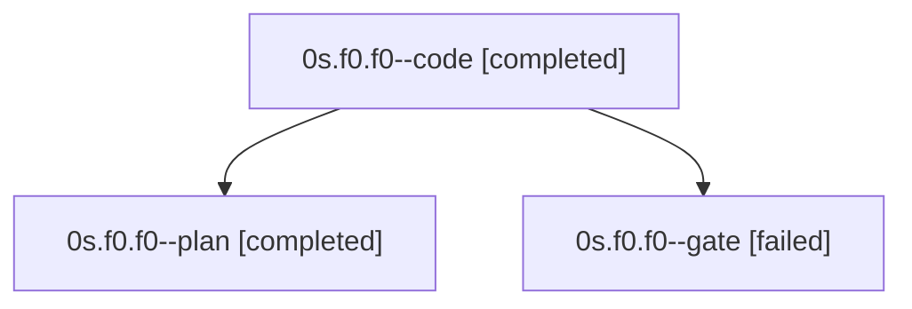

# Family: 0s.f0.f0

[Agent Hoods](../README.md) / [bbugyi200](../users/bbugyi200/README.md) / [apollo](../users/bbugyi200/machines/apollo/README.md) / [0s](../users/bbugyi200/machines/apollo/hoods/0s/README.md) / 0s.f0.f0

Owner: `bbugyi200.apollo` · Hood: `0s` · Members: 3

## Lineage

The diagram is an optional enhancement; the ordered table below contains the same lineage in accessible text.

| Role | Agent | State | Model / provider | Timing | Commits | Prompt | Chat |
|---|---|---|---|---|---:|---|---|
| code | 0s.f0.f0--code | completed | sonnet / claude | 2026-09-20T19:50:35.264754+00:00 → 2026-09-21T02:23:32.038987+00:00 | [1](../agents/bbugyi200.apollo.0s.f0.f0--code/README.md#commits) | [Prompt](../agents/bbugyi200.apollo.0s.f0.f0--code/prompt.md) | [Chat](../agents/bbugyi200.apollo.0s.f0.f0--code/chat.md) |
| plan | 0s.f0.f0--plan | completed | opus / claude | 2026-09-20T19:41:41.281494+00:00 → 2026-09-20T19:49:32.971537+00:00 | 0 | [Prompt](../agents/bbugyi200.apollo.0s.f0.f0--plan/prompt.md) | [Chat](../agents/bbugyi200.apollo.0s.f0.f0--plan/chat.md) |
| gate | 0s.f0.f0--gate | failed | opus / claude | 2026-09-20T19:50:14.052397+00:00 → 2026-09-20T19:50:31.693183+00:00 | 0 | — | [Chat](../agents/bbugyi200.apollo.0s.f0.f0--gate/chat.md) |

## Commits

| Role | Repo | Commit | Subject | Committed |
|---|---|---|---|---|
| code | sase | [`7199e07`](https://github.com/sase-org/sase/commit/7199e074208aa54ad062648c94ba413bd171e058) | feat(tui): tone the launch-default pill with its LLM provider's color | 2026-09-20 22:12:01 EDT |

## Neighbors

| Agent | Relation | State |
|---|---|---|
| [0s.f0](../agents/bbugyi200.apollo.0s.f0/README.md) | ancestor | waiting |
| [0s](bbugyi200.apollo.0s.md) (family · 3) | ancestor | active 1, completed 1, failed 1 |
| [0s.f0.f0.w0](../agents/bbugyi200.apollo.0s.f0.f0.w0/README.md) | descendant | waiting |
| [0s.f0.f0.w1](../agents/bbugyi200.apollo.0s.f0.f0.w1/README.md) | descendant | waiting |
| [0s.f0.f0.w2](bbugyi200.apollo.0s.f0.f0.w2.md) (family · 3) | descendant | failed 3 |
| [0s.f0.f0.w2.w0](bbugyi200.apollo.0s.f0.f0.w2.w0.md) (family · 7) | descendant | active 1, completed 3, failed 3 |
