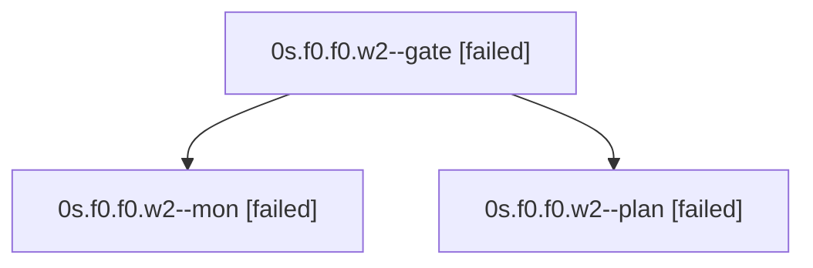

# Family: 0s.f0.f0.w2

[Agent Hoods](../README.md) / [bbugyi200](../users/bbugyi200/README.md) / [apollo](../users/bbugyi200/machines/apollo/README.md) / [0s](../users/bbugyi200/machines/apollo/hoods/0s/README.md) / 0s.f0.f0.w2

Owner: `bbugyi200.apollo` · Hood: `0s` · Members: 3

## Lineage

The diagram is an optional enhancement; the ordered table below contains the same lineage in accessible text.

| Role | Agent | State | Model / provider | Timing | Commits | Prompt | Chat |
|---|---|---|---|---|---:|---|---|
| gate | 0s.f0.f0.w2--gate | failed | opus / claude | 2026-09-21T02:21:17.750687+00:00 → 2026-09-21T02:21:34.845921+00:00 | 0 | — | [Chat](../agents/bbugyi200.apollo.0s.f0.f0.w2--gate/chat.md) |
| mon | 0s.f0.f0.w2--mon | failed | opus / claude | 2026-09-21T02:21:33.799748+00:00 → 2026-09-21T02:23:14.113166+00:00 | 0 | — | [Chat](../agents/bbugyi200.apollo.0s.f0.f0.w2--mon/chat.md) |
| plan | 0s.f0.f0.w2--plan | failed | opus / claude | 2026-09-21T02:15:24.036508+00:00 → 2026-09-21T02:21:58.270657+00:00 | 0 | [Prompt](../agents/bbugyi200.apollo.0s.f0.f0.w2--plan/prompt.md) | [Chat](../agents/bbugyi200.apollo.0s.f0.f0.w2--plan/chat.md) |

## Neighbors

| Agent | Relation | State |
|---|---|---|
| [0s.f0.f0](bbugyi200.apollo.0s.f0.f0.md) (family · 3) | ancestor | completed 2, failed 1 |
| [0s.f0](../agents/bbugyi200.apollo.0s.f0/README.md) | ancestor | waiting |
| [0s](bbugyi200.apollo.0s.md) (family · 3) | ancestor | active 1, completed 1, failed 1 |
| [0s.f0.f0.w2.w0](bbugyi200.apollo.0s.f0.f0.w2.w0.md) (family · 7) | descendant | active 1, completed 3, failed 3 |
| [0s.f0.f0.w0](../agents/bbugyi200.apollo.0s.f0.f0.w0/README.md) | 0s.f0.f0 hood | waiting |
| [0s.f0.f0.w1](../agents/bbugyi200.apollo.0s.f0.f0.w1/README.md) | 0s.f0.f0 hood | waiting |
