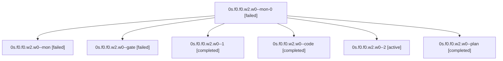

# Family: 0s.f0.f0.w2.w0

[Agent Hoods](../README.md) / [bbugyi200](../users/bbugyi200/README.md) / [apollo](../users/bbugyi200/machines/apollo/README.md) / [0s](../users/bbugyi200/machines/apollo/hoods/0s/README.md) / 0s.f0.f0.w2.w0

Owner: `bbugyi200.apollo` · Hood: `0s` · Members: 7

## Lineage

The diagram is an optional enhancement; the ordered table below contains the same lineage in accessible text.

| Role | Agent | State | Model / provider | Timing | Commits | Prompt | Chat |
|---|---|---|---|---|---:|---|---|
| mon-0 | 0s.f0.f0.w2.w0--mon-0 | failed | muse-spark-1.3-contributor / muse | 2026-09-21T03:53:19.808812+00:00 → 2026-09-21T04:09:48.484773+00:00 | 0 | — | [Chat](../agents/bbugyi200.apollo.0s.f0.f0.w2.w0--mon-0/chat.md) |
| mon | 0s.f0.f0.w2.w0--mon | failed | muse-spark-1.3-contributor / muse | 2026-09-21T03:19:26.338055+00:00 → 2026-09-21T03:45:48.896168+00:00 | 0 | — | [Chat](../agents/bbugyi200.apollo.0s.f0.f0.w2.w0--mon/chat.md) |
| gate | 0s.f0.f0.w2.w0--gate | failed | opus / claude | 2026-09-21T02:26:24.702560+00:00 → 2026-09-21T02:26:37.400528+00:00 | 0 | — | [Chat](../agents/bbugyi200.apollo.0s.f0.f0.w2.w0--gate/chat.md) |
| 1 | 0s.f0.f0.w2.w0--1 | completed | muse-spark-1.3-contributor / muse | 2026-09-21T03:45:48.820962+00:00 → 2026-09-21T03:54:22.953391+00:00 | 0 | [Prompt](../agents/bbugyi200.apollo.0s.f0.f0.w2.w0--1/prompt.md) | [Chat](../agents/bbugyi200.apollo.0s.f0.f0.w2.w0--1/chat.md) |
| code | 0s.f0.f0.w2.w0--code | completed | muse-spark-1.3-contributor / muse | 2026-09-21T02:26:53.295652+00:00 → 2026-09-21T03:20:10.551585+00:00 | 0 | — | [Chat](../agents/bbugyi200.apollo.0s.f0.f0.w2.w0--code/chat.md) |
| 2 | 0s.f0.f0.w2.w0--2 | active | muse-spark-1.3-contributor / muse | 2026-09-21T04:09:48.305480+00:00 | [1](../agents/bbugyi200.apollo.0s.f0.f0.w2.w0--2/README.md#commits) | [Prompt](../agents/bbugyi200.apollo.0s.f0.f0.w2.w0--2/prompt.md) | — |
| plan | 0s.f0.f0.w2.w0--plan | completed | opus / claude | 2026-09-21T02:24:00.101876+00:00 → 2026-09-21T03:20:10.551585+00:00 | 0 | [Prompt](../agents/bbugyi200.apollo.0s.f0.f0.w2.w0--plan/prompt.md) | [Chat](../agents/bbugyi200.apollo.0s.f0.f0.w2.w0--plan/chat.md) |

## Commits

| Role | Repo | Commit | Subject | Committed |
|---|---|---|---|---|
| 2 | sase | [`d6486ae`](https://github.com/sase-org/sase/commit/d6486aed786cb5b2503bb2e72abb4b3a4bd5500b) | feat(muse): butterfly badge and brighter blue palette for visibility | 2026-09-21 00:19:36 EDT |

## Neighbors

| Agent | Relation | State |
|---|---|---|
| [0s.f0.f0.w2](bbugyi200.apollo.0s.f0.f0.w2.md) (family · 3) | ancestor | failed 3 |
| [0s.f0.f0](bbugyi200.apollo.0s.f0.f0.md) (family · 3) | ancestor | completed 2, failed 1 |
| [0s.f0](../agents/bbugyi200.apollo.0s.f0/README.md) | ancestor | waiting |
| [0s](bbugyi200.apollo.0s.md) (family · 3) | ancestor | active 1, completed 1, failed 1 |
| [0s.f0.f0.w0](../agents/bbugyi200.apollo.0s.f0.f0.w0/README.md) | 0s.f0.f0 hood | waiting |
| [0s.f0.f0.w1](../agents/bbugyi200.apollo.0s.f0.f0.w1/README.md) | 0s.f0.f0 hood | waiting |
