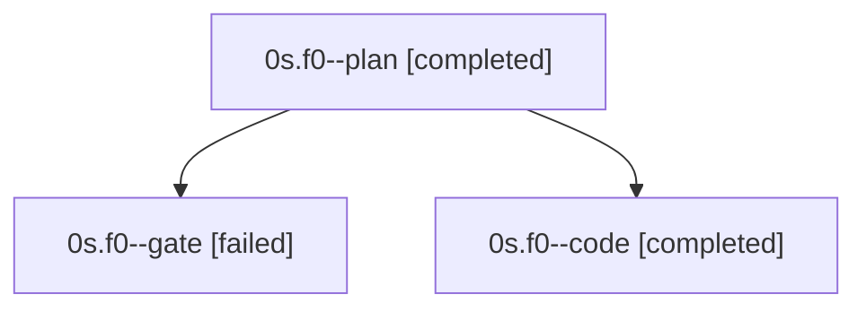

# Family: 0s.f0

[Agent Hoods](../README.md) / [bbugyi200](../users/bbugyi200/README.md) / [apollo](../users/bbugyi200/machines/apollo/README.md) / [0s](../users/bbugyi200/machines/apollo/hoods/0s/README.md) / 0s.f0

Owner: `bbugyi200.apollo` · Hood: `0s` · Members: 3

## Lineage

The diagram is an optional enhancement; the ordered table below contains the same lineage in accessible text.

| Role | Agent | State | Model / provider | Timing | Commits | Prompt | Chat |
|---|---|---|---|---|---:|---|---|
| plan | 0s.f0--plan | completed | opus / claude | 2026-09-20T11:29:15.220687+00:00 → 2026-09-20T11:34:43.108665+00:00 | 0 | [Prompt](../agents/bbugyi200.apollo.0s.f0--plan/prompt.md) | [Chat](../agents/bbugyi200.apollo.0s.f0--plan/chat.md) |
| gate | 0s.f0--gate | failed | opus / claude | 2026-09-20T11:34:50.257566+00:00 → 2026-09-20T11:35:06.928887+00:00 | 0 | — | [Chat](../agents/bbugyi200.apollo.0s.f0--gate/chat.md) |
| code | 0s.f0--code | completed | sonnet / claude | 2026-09-20T11:35:11.883296+00:00 → 2026-09-20T19:48:05.823768+00:00 | [1](../agents/bbugyi200.apollo.0s.f0--code/README.md#commits) | [Prompt](../agents/bbugyi200.apollo.0s.f0--code/prompt.md) | [Chat](../agents/bbugyi200.apollo.0s.f0--code/chat.md) |

## Commits

| Role | Repo | Commit | Subject | Committed |
|---|---|---|---|---|
| code | sase | [`9a99238`](https://github.com/sase-org/sase/commit/9a99238cdf0e9e415575f5b11559cdb2f29c59c2) | feat(notifications): add ace.notification\_rules config and Python delivery facade | 2026-09-20 14:40:33 EDT |
| — | sase | [`8c83b8f`](https://github.com/sase-org/sase/commit/8c83b8f0e5d7c1d12144a921b13320c0914061c5) | feat(tui): render the launch-default pill as its shortest %model spelling | 2026-09-20 15:27:29 EDT |

## Neighbors

| Agent | Relation | State |
|---|---|---|
| [0s](bbugyi200.apollo.0s.md) (family · 3) | ancestor | active 1, completed 1, failed 1 |
| [0s.f0.f0](bbugyi200.apollo.0s.f0.f0.md) (family · 3) | descendant | active 1, completed 1, failed 1 |
| [0s.f0.f0.w0](../agents/bbugyi200.apollo.0s.f0.f0.w0/README.md) | descendant | waiting |
| [0s.f0.f0.w1](../agents/bbugyi200.apollo.0s.f0.f0.w1/README.md) | descendant | waiting |
| [0s.f0.f0.w2](../agents/bbugyi200.apollo.0s.f0.f0.w2/README.md) | descendant | waiting |
| [0s.f0.f0.w2.w0](../agents/bbugyi200.apollo.0s.f0.f0.w2.w0/README.md) | descendant | waiting |
