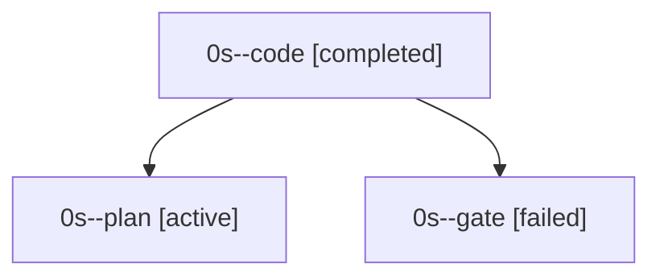

# Family: 0s

[Agent Hoods](../README.md) / [bbugyi200](../users/bbugyi200/README.md) / [apollo](../users/bbugyi200/machines/apollo/README.md) / [0s](../users/bbugyi200/machines/apollo/hoods/0s/README.md) / 0s

Owner: `bbugyi200.apollo` · Hood: `0s` · Members: 3

## Lineage

The diagram is an optional enhancement; the ordered table below contains the same lineage in accessible text.

| Role | Agent | State | Model / provider | Timing | Commits | Prompt | Chat |
|---|---|---|---|---|---:|---|---|
| code | 0s--code | completed | grok-4.6 / grok | 2026-09-19T13:48:06.577808+00:00 → 2026-09-19T15:15:42.697826+00:00 | [1](../agents/bbugyi200.apollo.0s--code/README.md#commits) | [Prompt](../agents/bbugyi200.apollo.0s--code/prompt.md) | [Chat](../agents/bbugyi200.apollo.0s--code/chat.md) |
| plan | 0s--plan | active | grok-4.6 / grok | 2026-09-19T13:31:42.106692+00:00 | 0 | [Prompt](../agents/bbugyi200.apollo.0s--plan/prompt.md) | [Chat](../agents/bbugyi200.apollo.0s--plan/chat.md) |
| gate | 0s--gate | failed | grok-4.6 / grok | 2026-09-19T13:47:45.062389+00:00 → 2026-09-19T13:48:01.425507+00:00 | 0 | — | [Chat](../agents/bbugyi200.apollo.0s--gate/chat.md) |

## Commits

| Role | Repo | Commit | Subject | Committed |
|---|---|---|---|---|
| — | sase | [`d57cf2a`](https://github.com/sase-org/sase/commit/d57cf2ab941b131019a84ed9c06babbb1fdd2b15) | chore: Add SDD prompt and plan for agents\_var\_namespace | 2026-06-03 01:23:03 EDT |
| — | sase | [`0b84b94`](https://github.com/sase-org/sase/commit/0b84b94fca438557844b88154ad5df40c5644c95) | chore: Add SDD prompt and plan for update\_confirm\_commits | 2026-07-07 14:24:34 EDT |
| — | sase | [`9c9caa6`](https://github.com/sase-org/sase/commit/9c9caa6cc99b733f3605799b4ffd38d9c07c18e4) | fix(tui): summarize multi-repo update commits | 2026-07-07 14:33:43 EDT |
| code | sase | [`ea5fc2b`](https://github.com/sase-org/sase/commit/ea5fc2b504b20db3e696d8b6db4a397e54e68c57) | feat(ace): show launch-effective default effort on the TUI launch-default pill | 2026-09-19 11:13:27 EDT |

## Neighbors

| Agent | Relation | State |
|---|---|---|
| [0s.f0](bbugyi200.apollo.0s.f0.md) (family · 3) | descendant | active 1, completed 1, failed 1 |
| [0s.f0](../agents/bbugyi200.apollo.0s.f0/README.md) | descendant | waiting |
| [0s.f0.f0](../agents/bbugyi200.apollo.0s.f0.f0/README.md) | descendant | active |
