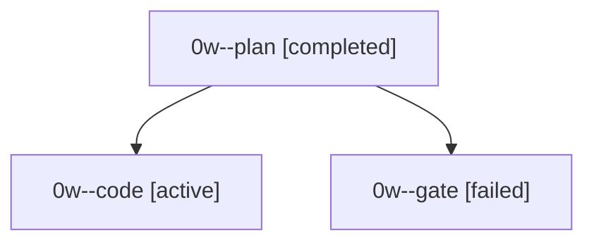

# Family: 0w

[Agent Hoods](../README.md) / [bbugyi200](../users/bbugyi200/README.md) / [apollo](../users/bbugyi200/machines/apollo/README.md) / [0w](../users/bbugyi200/machines/apollo/hoods/0w/README.md) / 0w

Owner: `bbugyi200.apollo` · Hood: `0w` · Members: 3

## Lineage

The diagram is an optional enhancement; the ordered table below contains the same lineage in accessible text.

| Role | Agent | State | Model / provider | Timing | Commits | Prompt | Chat |
|---|---|---|---|---|---:|---|---|
| plan | 0w--plan | completed | grok-4.6 / grok | 2026-09-19T14:26:52.097279+00:00 → 2026-09-19T14:41:33.688722+00:00 | 0 | [Prompt](../agents/bbugyi200.apollo.0w--plan/prompt.md) | [Chat](../agents/bbugyi200.apollo.0w--plan/chat.md) |
| code | 0w--code | active | grok-4.6 / grok | 2026-09-19T14:43:52.486503+00:00 | [1](../agents/bbugyi200.apollo.0w--code/README.md#commits) | [Prompt](../agents/bbugyi200.apollo.0w--code/prompt.md) | — |
| gate | 0w--gate | failed | grok-4.6 / grok | 2026-09-19T14:43:22.008732+00:00 → 2026-09-19T14:43:45.720277+00:00 | 0 | — | [Chat](../agents/bbugyi200.apollo.0w--gate/chat.md) |

## Commits

| Role | Repo | Commit | Subject | Committed |
|---|---|---|---|---|
| — | sase | [`d3c37c5`](https://github.com/sase-org/sase/commit/d3c37c5b11f46381ad94f127a9ec6edbf3ff52e7) | chore: Add SDD prompt and plan for codex\_transient\_retry | 2026-06-03 01:40:52 EDT |
| — | sase | [`0ceb65c`](https://github.com/sase-org/sase/commit/0ceb65c27949090bc57a79f5f1c9e8d24201e855) | feat: Add built-in transient-failure retry coverage for the Codex provider | 2026-06-03 02:24:56 EDT |
| — | sase | [`cd2be5d`](https://github.com/sase-org/sase/commit/cd2be5d63981331fbaaa87e864cd6fe06ab66f0d) | chore: Add SDD prompt and plan for gh\_ref\_tui\_credential\_freeze | 2026-07-07 16:04:43 EDT |
| — | sase | [`77d9330`](https://github.com/sase-org/sase/commit/77d933029cf8d4027fe4eefab6af4219f7b5c784) | fix: avoid credential prompts during ref completion | 2026-07-07 16:25:09 EDT |
| code | sase | [`28d1e87`](https://github.com/sase-org/sase/commit/28d1e87083170aab233f4ae159399d370e8bb1ff) | feat: make just check-full explicit-only for agents | 2026-09-19 12:16:01 EDT |
