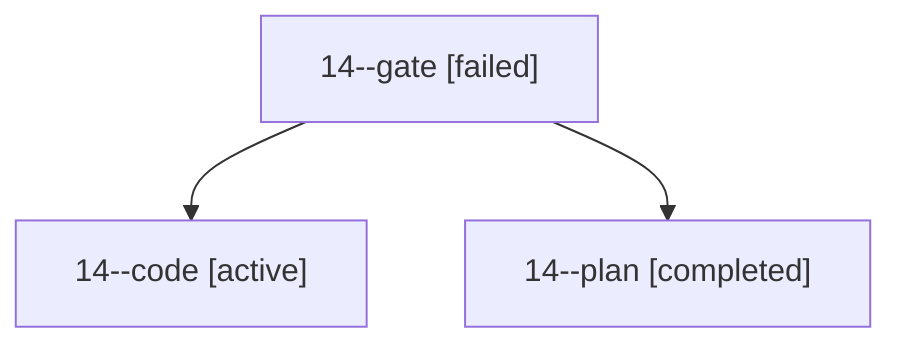

# Family: 14

[Agent Hoods](../README.md) / [bbugyi200](../users/bbugyi200/README.md) / [apollo](../users/bbugyi200/machines/apollo/README.md) / [14](../users/bbugyi200/machines/apollo/hoods/14/README.md) / 14

Owner: `bbugyi200.apollo` · Hood: `14` · Members: 3

## Lineage

The diagram is an optional enhancement; the ordered table below contains the same lineage in accessible text.

| Role | Agent | State | Model / provider | Timing | Commits | Prompt | Chat |
|---|---|---|---|---|---:|---|---|
| gate | 14--gate | failed | opus / claude | 2026-09-20T15:17:04.135853+00:00 → 2026-09-20T15:17:32.261451+00:00 | 0 | — | [Chat](../agents/bbugyi200.apollo.14--gate/chat.md) |
| code | 14--code | active | sonnet / claude | 2026-09-20T15:17:37.321239+00:00 | [1](../agents/bbugyi200.apollo.14--code/README.md#commits) | [Prompt](../agents/bbugyi200.apollo.14--code/prompt.md) | — |
| plan | 14--plan | completed | opus / claude | 2026-09-20T15:07:10.823241+00:00 → 2026-09-20T15:17:02.386915+00:00 | 0 | [Prompt](../agents/bbugyi200.apollo.14--plan/prompt.md) | [Chat](../agents/bbugyi200.apollo.14--plan/chat.md) |

## Commits

| Role | Repo | Commit | Subject | Committed |
|---|---|---|---|---|
| — | sase | [`126a4fc`](https://github.com/sase-org/sase/commit/126a4fc48e1f8d1def7f20334676d856077a1987) | chore: Add SDD prompt and plan for project\_management\_active\_filter\_1 | 2026-06-02 11:51:30 EDT |
| — | sase | [`c38c594`](https://github.com/sase-org/sase/commit/c38c59425bd6377a7d9626c7c9a157d56201244d) | feat: default project management filter to active | 2026-06-02 11:57:42 EDT |
| code | sase | [`8ae9ac1`](https://github.com/sase-org/sase/commit/8ae9ac1eab989fdb28e88d1bd09769cc5fb4ab56) | fix(tui): retire Agents-tab tribe panels when their last node is dismissed | 2026-09-20 13:38:12 EDT |

## Neighbors

| Agent | Relation | State |
|---|---|---|
| [14.f1](../agents/bbugyi200.apollo.14.f1/README.md) | descendant | completed |
| [14.f1.w1](../agents/bbugyi200.apollo.14.f1.w1/README.md) | descendant | completed |
