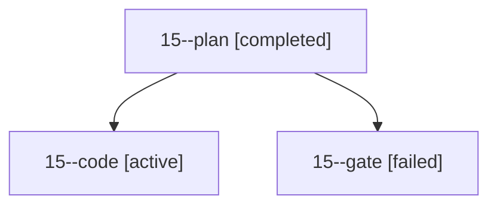

# Family: 15

[Agent Hoods](../README.md) / [bbugyi200](../users/bbugyi200/README.md) / [apollo](../users/bbugyi200/machines/apollo/README.md) / [15](../users/bbugyi200/machines/apollo/hoods/15/README.md) / 15

Owner: `bbugyi200.apollo` · Hood: `15` · Members: 3

## Lineage

The diagram is an optional enhancement; the ordered table below contains the same lineage in accessible text.

| Role | Agent | State | Model / provider | Timing | Commits | Prompt | Chat |
|---|---|---|---|---|---:|---|---|
| plan | 15--plan | completed | opus / claude | 2026-09-20T15:28:05.846499+00:00 → 2026-09-20T15:33:38.598436+00:00 | 0 | [Prompt](../agents/bbugyi200.apollo.15--plan/prompt.md) | [Chat](../agents/bbugyi200.apollo.15--plan/chat.md) |
| code | 15--code | active | sonnet / claude | 2026-09-20T15:34:29.763680+00:00 | [1](../agents/bbugyi200.apollo.15--code/README.md#commits) | [Prompt](../agents/bbugyi200.apollo.15--code/prompt.md) | — |
| gate | 15--gate | failed | opus / claude | 2026-09-20T15:34:00.131496+00:00 → 2026-09-20T15:34:24.580440+00:00 | 0 | — | [Chat](../agents/bbugyi200.apollo.15--gate/chat.md) |

## Commits

| Role | Repo | Commit | Subject | Committed |
|---|---|---|---|---|
| code | sase | [`a0244d7`](https://github.com/sase-org/sase/commit/a0244d75993b74a09f054019be583c38f7f51ef7) | fix(muse): coalesce output deltas into one live-reply chunk per run stream | 2026-09-20 13:25:46 EDT |

## Neighbors

| Agent | Relation | State |
|---|---|---|
| [15.cdx.f1](../agents/bbugyi200.apollo.15.cdx.f1/README.md) | descendant | completed |
| [15.cdx.f1.w1](../agents/bbugyi200.apollo.15.cdx.f1.w1/README.md) | descendant | completed |
| [15.w0](../agents/bbugyi200.apollo.15.w0/README.md) | descendant | waiting |
