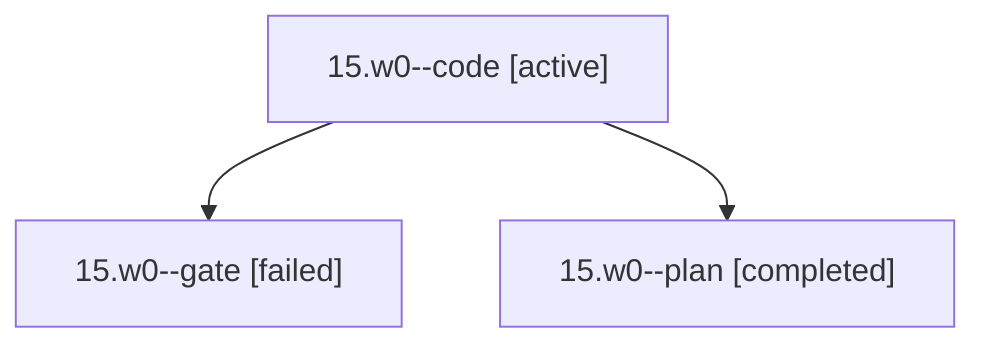

# Family: 15.w0

[Agent Hoods](../README.md) / [bbugyi200](../users/bbugyi200/README.md) / [apollo](../users/bbugyi200/machines/apollo/README.md) / [15](../users/bbugyi200/machines/apollo/hoods/15/README.md) / 15.w0

Owner: `bbugyi200.apollo` · Hood: `15` · Members: 3

## Lineage

The diagram is an optional enhancement; the ordered table below contains the same lineage in accessible text.

| Role | Agent | State | Model / provider | Timing | Commits | Prompt | Chat |
|---|---|---|---|---|---:|---|---|
| code | 15.w0--code | active | sonnet / claude | 2026-09-20T17:33:27.973975+00:00 | [1](../agents/bbugyi200.apollo.15.w0--code/README.md#commits) | [Prompt](../agents/bbugyi200.apollo.15.w0--code/prompt.md) | — |
| gate | 15.w0--gate | failed | opus / claude | 2026-09-20T17:33:07.930963+00:00 → 2026-09-20T17:33:24.691745+00:00 | 0 | — | [Chat](../agents/bbugyi200.apollo.15.w0--gate/chat.md) |
| plan | 15.w0--plan | completed | opus / claude | 2026-09-20T17:27:19.270688+00:00 → 2026-09-20T17:33:08.804801+00:00 | 0 | [Prompt](../agents/bbugyi200.apollo.15.w0--plan/prompt.md) | [Chat](../agents/bbugyi200.apollo.15.w0--plan/chat.md) |

## Commits

| Role | Repo | Commit | Subject | Committed |
|---|---|---|---|---|
| code | sase | [`68d727b`](https://github.com/sase-org/sase/commit/68d727bbfdc89ddb965a1ccd3d682cbfe8943d63) | feat(llm): add muse-spark-1.3-contributor to the @medium and smaller size alias pools | 2026-09-20 15:00:50 EDT |

## Neighbors

| Agent | Relation | State |
|---|---|---|
| [15](bbugyi200.apollo.15.md) (family · 3) | ancestor | completed 2, failed 1 |
| [15.cdx.f1](../agents/bbugyi200.apollo.15.cdx.f1/README.md) | 15 hood | completed |
| [15.cdx.f1.w1](../agents/bbugyi200.apollo.15.cdx.f1.w1/README.md) | 15 hood | completed |
