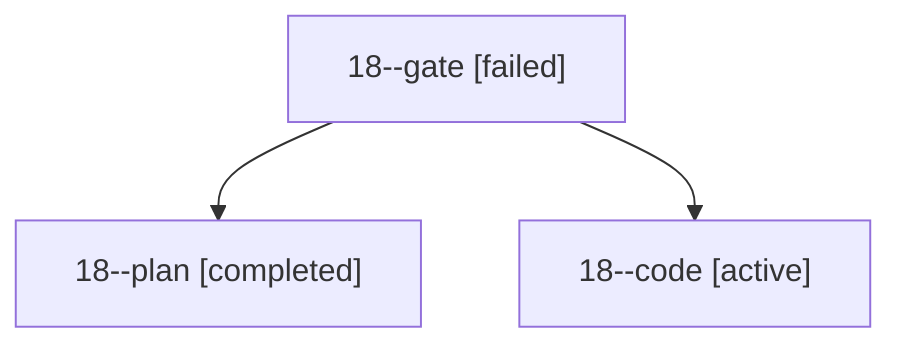

# Family: 18

[Agent Hoods](../README.md) / [bbugyi200](../users/bbugyi200/README.md) / [apollo](../users/bbugyi200/machines/apollo/README.md) / [18](../users/bbugyi200/machines/apollo/hoods/18/README.md) / 18

Owner: `bbugyi200.apollo` · Hood: `18` · Members: 3

## Lineage

The diagram is an optional enhancement; the ordered table below contains the same lineage in accessible text.

| Role | Agent | State | Model / provider | Timing | Commits | Prompt | Chat |
|---|---|---|---|---|---:|---|---|
| gate | 18--gate | failed | opus / claude | 2026-09-20T21:01:43.392145+00:00 → 2026-09-20T21:02:02.951273+00:00 | 0 | — | [Chat](../agents/bbugyi200.apollo.18--gate/chat.md) |
| plan | 18--plan | completed | opus / claude | 2026-09-20T20:55:38.380939+00:00 → 2026-09-20T21:01:41.221921+00:00 | 0 | [Prompt](../agents/bbugyi200.apollo.18--plan/prompt.md) | [Chat](../agents/bbugyi200.apollo.18--plan/chat.md) |
| code | 18--code | active | sonnet / claude | 2026-09-20T21:02:07.764595+00:00 | [1](../agents/bbugyi200.apollo.18--code/README.md#commits) | [Prompt](../agents/bbugyi200.apollo.18--code/prompt.md) | — |

## Commits

| Role | Repo | Commit | Subject | Committed |
|---|---|---|---|---|
| — | sase | [`9945d55`](https://github.com/sase-org/sase/commit/9945d5531000d94050e699c3a450daf13025c945) | chore: Add SDD prompt and plan for project\_select\_filter\_popup | 2026-06-02 13:40:08 EDT |
| — | sase | [`c08af2a`](https://github.com/sase-org/sase/commit/c08af2ad51b782cc667f2f318c46d5b3b00cb0a6) | feat: make @ project picker a compact filterable pop-up | 2026-06-02 13:47:57 EDT |
| code | sase | [`0faa3f5`](https://github.com/sase-org/sase/commit/0faa3f564c729214435eba6a6cb99389e058afec) | feat(tui): show per-provider versions in the ,U panel and completion toast | 2026-09-20 18:57:46 EDT |
