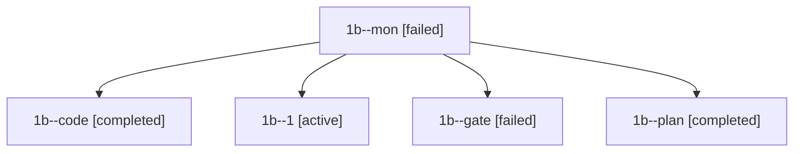

# Family: 1b

[Agent Hoods](../README.md) / [bbugyi200](../users/bbugyi200/README.md) / [apollo](../users/bbugyi200/machines/apollo/README.md) / [1b](../users/bbugyi200/machines/apollo/hoods/1b/README.md) / 1b

Owner: `bbugyi200.apollo` · Hood: `1b` · Members: 5

## Lineage

The diagram is an optional enhancement; the ordered table below contains the same lineage in accessible text.

| Role | Agent | State | Model / provider | Timing | Commits | Prompt | Chat |
|---|---|---|---|---|---:|---|---|
| mon | 1b--mon | failed | muse-spark-1.3-contributor / muse | 2026-09-20T22:28:35.764098+00:00 → 2026-09-20T22:49:22.437953+00:00 | 0 | — | [Chat](../agents/bbugyi200.apollo.1b--mon/chat.md) |
| code | 1b--code | completed | muse-spark-1.3-contributor / muse | 2026-09-20T21:57:31.017428+00:00 → 2026-09-20T22:29:15.640690+00:00 | 0 | [Prompt](../agents/bbugyi200.apollo.1b--code/prompt.md) | [Chat](../agents/bbugyi200.apollo.1b--code/chat.md) |
| 1 | 1b--1 | active | muse-spark-1.3-contributor / muse | 2026-09-20T22:49:21.986049+00:00 | [1](../agents/bbugyi200.apollo.1b--1/README.md#commits) | [Prompt](../agents/bbugyi200.apollo.1b--1/prompt.md) | — |
| gate | 1b--gate | failed | opus / claude | 2026-09-20T21:56:46.685395+00:00 → 2026-09-20T21:57:21.091815+00:00 | 0 | — | [Chat](../agents/bbugyi200.apollo.1b--gate/chat.md) |
| plan | 1b--plan | completed | opus / claude | 2026-09-20T21:49:52.097061+00:00 → 2026-09-20T21:56:30.266532+00:00 | 0 | [Prompt](../agents/bbugyi200.apollo.1b--plan/prompt.md) | [Chat](../agents/bbugyi200.apollo.1b--plan/chat.md) |

## Commits

| Role | Repo | Commit | Subject | Committed |
|---|---|---|---|---|
| 1 | sase | [`c009647`](https://github.com/sase-org/sase/commit/c00964773e200d02b3938687db1aba3adfd986e3) | feat(llm-provider): govern Claude Fable usage indicator by generic threshold | 2026-09-20 18:56:13 EDT |
