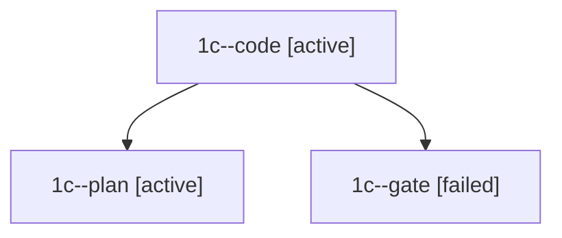

# Family: 1c

[Agent Hoods](../README.md) / [bbugyi200](../users/bbugyi200/README.md) / [apollo](../users/bbugyi200/machines/apollo/README.md) / [1c](../users/bbugyi200/machines/apollo/hoods/1c/README.md) / 1c

Owner: `bbugyi200.apollo` · Hood: `1c` · Members: 3

## Lineage

The diagram is an optional enhancement; the ordered table below contains the same lineage in accessible text.

| Role | Agent | State | Model / provider | Timing | Commits | Prompt | Chat |
|---|---|---|---|---|---:|---|---|
| code | 1c--code | active | muse-spark-1.3-contributor / muse | 2026-09-21T04:57:31.943757+00:00 | [1](../agents/bbugyi200.apollo.1c--code/README.md#commits) | — | — |
| plan | 1c--plan | active | opus / claude | 2026-09-21T04:54:12.371529+00:00 | 0 | [Prompt](../agents/bbugyi200.apollo.1c--plan/prompt.md) | [Chat](../agents/bbugyi200.apollo.1c--plan/chat.md) |
| gate | 1c--gate | failed | opus / claude | 2026-09-21T04:56:59.984424+00:00 → 2026-09-21T04:57:10.675705+00:00 | 0 | — | [Chat](../agents/bbugyi200.apollo.1c--gate/chat.md) |

## Commits

| Role | Repo | Commit | Subject | Committed |
|---|---|---|---|---|
| — | sase | [`16ae081`](https://github.com/sase-org/sase/commit/16ae081a11c7d56784a91de06c5a2b40fe1aa6d4) | chore: Add SDD prompt and plan for ctrl\_e\_xprompt\_select\_1 | 2026-06-03 04:48:17 EDT |
| — | sase | [`046385f`](https://github.com/sase-org/sase/commit/046385f03508284a53c4a2a5dfafe9ab9977bef8) | feat: open selected xprompt definitions from selector | 2026-06-03 04:56:43 EDT |
| code | sase | [`184241f`](https://github.com/sase-org/sase/commit/184241fa6635a1bd3ff2e2e793147ebbb7407099) | feat(ace): remove Agents-tab tilde neighbor keymap | 2026-09-21 05:05:23 EDT |
