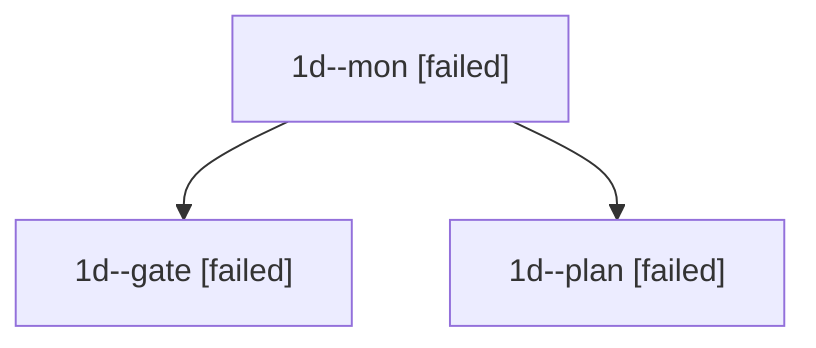

# Family: 1d

[Agent Hoods](../README.md) / [bbugyi200](../users/bbugyi200/README.md) / [apollo](../users/bbugyi200/machines/apollo/README.md) / [1d](../users/bbugyi200/machines/apollo/hoods/1d/README.md) / 1d

Owner: `bbugyi200.apollo` · Hood: `1d` · Members: 3

## Lineage

The diagram is an optional enhancement; the ordered table below contains the same lineage in accessible text.

| Role | Agent | State | Model / provider | Timing | Commits | Prompt | Chat |
|---|---|---|---|---|---:|---|---|
| mon | 1d--mon | failed | opus / claude | 2026-09-21T11:48:58.618433+00:00 → 2026-09-21T11:51:44.342265+00:00 | 0 | — | [Chat](../agents/bbugyi200.apollo.1d--mon/chat.md) |
| gate | 1d--gate | failed | opus / claude | 2026-09-21T11:48:46.711213+00:00 → 2026-09-21T11:49:01.289047+00:00 | 0 | — | [Chat](../agents/bbugyi200.apollo.1d--gate/chat.md) |
| plan | 1d--plan | failed | opus / claude | 2026-09-21T11:44:13.654990+00:00 → 2026-09-21T11:49:27.954608+00:00 | 0 | [Prompt](../agents/bbugyi200.apollo.1d--plan/prompt.md) | [Chat](../agents/bbugyi200.apollo.1d--plan/chat.md) |

## Commits

| Role | Repo | Commit | Subject | Committed |
|---|---|---|---|---|
| — | sase | [`00f59d7`](https://github.com/sase-org/sase/commit/00f59d7fe1a70565df2e2b92bc03983880393eea) | chore: Add SDD prompt and plan for updates\_all\_current\_banner | 2026-07-07 20:40:42 EDT |
| — | sase | [`ddf8496`](https://github.com/sase-org/sase/commit/ddf849668d025f99012b1f681620ca36dd96bf0f) | feat(tui): show all-current updates banner | 2026-07-07 20:58:16 EDT |
