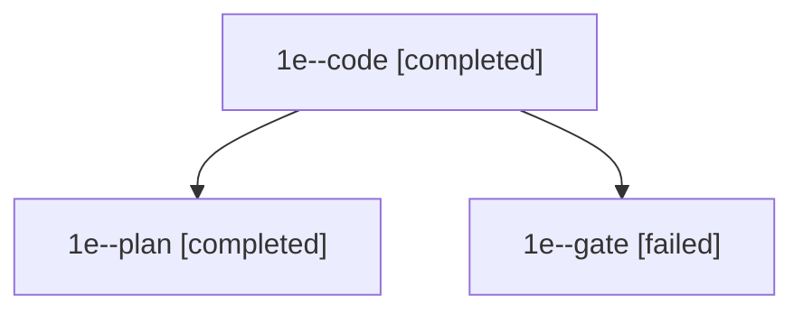

# Family: 1e

[Agent Hoods](../README.md) / [bbugyi200](../users/bbugyi200/README.md) / [apollo](../users/bbugyi200/machines/apollo/README.md) / [1e](../users/bbugyi200/machines/apollo/hoods/1e/README.md) / 1e

Owner: `bbugyi200.apollo` · Hood: `1e` · Members: 3

## Lineage

The diagram is an optional enhancement; the ordered table below contains the same lineage in accessible text.

| Role | Agent | State | Model / provider | Timing | Commits | Prompt | Chat |
|---|---|---|---|---|---:|---|---|
| code | 1e--code | completed | muse-spark-1.3-contributor / muse | 2026-09-21T12:03:16.786115+00:00 → 2026-09-21T12:34:03.772907+00:00 | 0 | [Prompt](../agents/bbugyi200.apollo.1e--code/prompt.md) | [Chat](../agents/bbugyi200.apollo.1e--code/chat.md) |
| plan | 1e--plan | completed | opus / claude | 2026-09-21T11:58:53.738936+00:00 → 2026-09-21T12:02:12.064846+00:00 | 0 | [Prompt](../agents/bbugyi200.apollo.1e--plan/prompt.md) | [Chat](../agents/bbugyi200.apollo.1e--plan/chat.md) |
| gate | 1e--gate | failed | opus / claude | 2026-09-21T12:02:52.532106+00:00 → 2026-09-21T12:03:11.980450+00:00 | 0 | — | [Chat](../agents/bbugyi200.apollo.1e--gate/chat.md) |

## Neighbors

| Agent | Relation | State |
|---|---|---|
| [1e.w0](bbugyi200.apollo.1e.w0.md) (family · 5) | descendant | active 1, completed 2, failed 2 |
