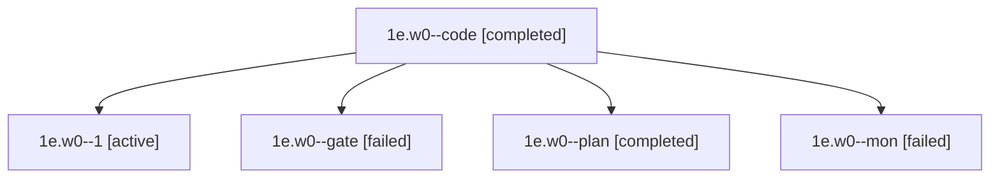

# Family: 1e.w0

[Agent Hoods](../README.md) / [bbugyi200](../users/bbugyi200/README.md) / [apollo](../users/bbugyi200/machines/apollo/README.md) / [1e](../users/bbugyi200/machines/apollo/hoods/1e/README.md) / 1e.w0

Owner: `bbugyi200.apollo` · Hood: `1e` · Members: 5

## Lineage

The diagram is an optional enhancement; the ordered table below contains the same lineage in accessible text.

| Role | Agent | State | Model / provider | Timing | Commits | Prompt | Chat |
|---|---|---|---|---|---:|---|---|
| code | 1e.w0--code | completed | muse-spark-1.3-contributor / muse | 2026-09-21T12:46:03.902570+00:00 → 2026-09-21T12:59:55.970555+00:00 | 0 | [Prompt](../agents/bbugyi200.apollo.1e.w0--code/prompt.md) | [Chat](../agents/bbugyi200.apollo.1e.w0--code/chat.md) |
| 1 | 1e.w0--1 | active | muse-spark-1.3-contributor / muse | 2026-09-21T13:44:19.687477+00:00 | [1](../agents/bbugyi200.apollo.1e.w0--1/README.md#commits) | [Prompt](../agents/bbugyi200.apollo.1e.w0--1/prompt.md) | — |
| gate | 1e.w0--gate | failed | opus / claude | 2026-09-21T12:45:40.986231+00:00 → 2026-09-21T12:45:59.003493+00:00 | 0 | — | [Chat](../agents/bbugyi200.apollo.1e.w0--gate/chat.md) |
| plan | 1e.w0--plan | completed | opus / claude | 2026-09-21T12:42:54.349632+00:00 → 2026-09-21T12:45:44.342869+00:00 | 0 | [Prompt](../agents/bbugyi200.apollo.1e.w0--plan/prompt.md) | [Chat](../agents/bbugyi200.apollo.1e.w0--plan/chat.md) |
| mon | 1e.w0--mon | failed | muse-spark-1.3-contributor / muse | 2026-09-21T12:59:16.944047+00:00 → 2026-09-21T13:44:20.251909+00:00 | 0 | — | [Chat](../agents/bbugyi200.apollo.1e.w0--mon/chat.md) |

## Commits

| Role | Repo | Commit | Subject | Committed |
|---|---|---|---|---|
| 1 | sase | [`a5ba3f1`](https://github.com/sase-org/sase/commit/a5ba3f1eb0c764e2c4fd307340c38ded0b518437) | docs(xprompt): recommend provider\_enabled("hard") gating for pinned-model segments | 2026-09-21 10:16:02 EDT |

## Neighbors

| Agent | Relation | State |
|---|---|---|
| [1e](bbugyi200.apollo.1e.md) (family · 3) | ancestor | completed 2, failed 1 |
