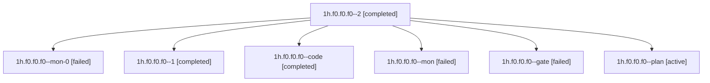

# Family: 1h.f0.f0.f0

[Agent Hoods](../README.md) / [bbugyi200](../users/bbugyi200/README.md) / [apollo](../users/bbugyi200/machines/apollo/README.md) / [1h](../users/bbugyi200/machines/apollo/hoods/1h/README.md) / 1h.f0.f0.f0

Owner: `bbugyi200.apollo` · Hood: `1h` · Members: 7

## Lineage

The diagram is an optional enhancement; the ordered table below contains the same lineage in accessible text.

| Role | Agent | State | Model / provider | Timing | Commits | Prompt | Chat |
|---|---|---|---|---|---:|---|---|
| 2 | 1h.f0.f0.f0--2 | completed | muse-spark-1.3-contributor / muse | 2026-09-22T13:44:01.777173+00:00 → 2026-09-22T13:51:11.800297+00:00 | [1](../agents/bbugyi200.apollo.1h.f0.f0.f0--2/README.md#commits) | [Prompt](../agents/bbugyi200.apollo.1h.f0.f0.f0--2/prompt.md) | [Chat](../agents/bbugyi200.apollo.1h.f0.f0.f0--2/chat.md) |
| mon-0 | 1h.f0.f0.f0--mon-0 | failed | muse-spark-1.3-contributor / muse | 2026-09-22T13:31:30.227773+00:00 → 2026-09-22T13:44:02.259979+00:00 | 0 | — | [Chat](../agents/bbugyi200.apollo.1h.f0.f0.f0--mon-0/chat.md) |
| 1 | 1h.f0.f0.f0--1 | completed | muse-spark-1.3-contributor / muse | 2026-09-22T13:06:07.754339+00:00 → 2026-09-22T13:31:56.955916+00:00 | 0 | [Prompt](../agents/bbugyi200.apollo.1h.f0.f0.f0--1/prompt.md) | [Chat](../agents/bbugyi200.apollo.1h.f0.f0.f0--1/chat.md) |
| code | 1h.f0.f0.f0--code | completed | muse-spark-1.3-contributor / muse | 2026-09-22T12:25:09.844543+00:00 → 2026-09-22T12:38:53.462551+00:00 | 0 | — | [Chat](../agents/bbugyi200.apollo.1h.f0.f0.f0--code/chat.md) |
| mon | 1h.f0.f0.f0--mon | failed | muse-spark-1.3-contributor / muse | 2026-09-22T12:38:28.806436+00:00 → 2026-09-22T13:06:07.986670+00:00 | 0 | — | [Chat](../agents/bbugyi200.apollo.1h.f0.f0.f0--mon/chat.md) |
| gate | 1h.f0.f0.f0--gate | failed | opus / claude | 2026-09-22T12:24:48.341728+00:00 → 2026-09-22T12:24:57.882899+00:00 | 0 | — | [Chat](../agents/bbugyi200.apollo.1h.f0.f0.f0--gate/chat.md) |
| plan | 1h.f0.f0.f0--plan | active | opus / claude | 2026-09-22T12:22:46.490683+00:00 | 0 | [Prompt](../agents/bbugyi200.apollo.1h.f0.f0.f0--plan/prompt.md) | [Chat](../agents/bbugyi200.apollo.1h.f0.f0.f0--plan/chat.md) |

## Commits

| Role | Repo | Commit | Subject | Committed |
|---|---|---|---|---|
| 2 | sase | [`c77feeb`](https://github.com/sase-org/sase/commit/c77feebaa1152ad59e96c6efbbaef883c53769bf) | feat(ace): show Agents fleet header row only for actionable problems | 2026-09-22 09:49:34 EDT |

## Neighbors

| Agent | Relation | State |
|---|---|---|
| [1h.f0.f0](bbugyi200.apollo.1h.f0.f0.md) (family · 3) | ancestor | active 1, completed 1, failed 1 |
| [1h.f0](bbugyi200.apollo.1h.f0.md) (family · 5) | ancestor | active 1, completed 2, failed 2 |
| [1h](bbugyi200.apollo.1h.md) (family · 3) | ancestor | active 1, completed 1, failed 1 |
| [1h.f0.f0.f0.w0](../agents/bbugyi200.apollo.1h.f0.f0.f0.w0/README.md) | descendant | waiting |
| [1h.f0.f0.f0.w1](../agents/bbugyi200.apollo.1h.f0.f0.f0.w1/README.md) | descendant | waiting |
| [1h.f0.f0.f0.w2](bbugyi200.apollo.1h.f0.f0.f0.w2.md) (family · 5) | descendant | completed 3, failed 2 |
| [1h.f0.f0.f0.w2.w0](bbugyi200.apollo.1h.f0.f0.f0.w2.w0.md) (family · 3) | descendant | active 2, failed 1 |
| [1h.f0.f0.f0.w2.w0](../agents/bbugyi200.apollo.1h.f0.f0.f0.w2.w0/README.md) | descendant | waiting |
| [1h.f0.f0.f0.w2.w0.w0](bbugyi200.apollo.1h.f0.f0.f0.w2.w0.w0.md) (family · 3) | descendant | active 2, failed 1 |
| [1h.f0.f0.f0.w2.w0.w0.w0](../agents/bbugyi200.apollo.1h.f0.f0.f0.w2.w0.w0.w0/README.md) | descendant | waiting |
