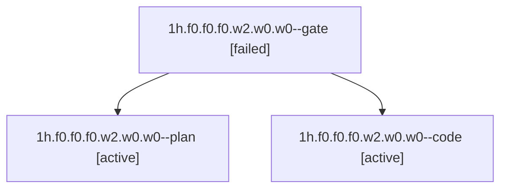

# Family: 1h.f0.f0.f0.w2.w0.w0

[Agent Hoods](../README.md) / [bbugyi200](../users/bbugyi200/README.md) / [apollo](../users/bbugyi200/machines/apollo/README.md) / [1h](../users/bbugyi200/machines/apollo/hoods/1h/README.md) / 1h.f0.f0.f0.w2.w0.w0

Owner: `bbugyi200.apollo` · Hood: `1h` · Members: 3

## Lineage

The diagram is an optional enhancement; the ordered table below contains the same lineage in accessible text.

| Role | Agent | State | Model / provider | Timing | Commits | Prompt | Chat |
|---|---|---|---|---|---:|---|---|
| gate | 1h.f0.f0.f0.w2.w0.w0--gate | failed | opus / claude | 2026-09-22T19:18:04.423960+00:00 → 2026-09-22T19:18:17.047026+00:00 | 0 | — | [Chat](../agents/bbugyi200.apollo.1h.f0.f0.f0.w2.w0.w0--gate/chat.md) |
| plan | 1h.f0.f0.f0.w2.w0.w0--plan | active | opus / claude | 2026-09-22T19:16:10.388781+00:00 | 0 | [Prompt](../agents/bbugyi200.apollo.1h.f0.f0.f0.w2.w0.w0--plan/prompt.md) | [Chat](../agents/bbugyi200.apollo.1h.f0.f0.f0.w2.w0.w0--plan/chat.md) |
| code | 1h.f0.f0.f0.w2.w0.w0--code | active | muse-spark-1.3-contributor / muse | 2026-09-22T19:18:35.213403+00:00 | 0 | — | — |

## Neighbors

| Agent | Relation | State |
|---|---|---|
| [1h.f0.f0.f0.w2.w0](../agents/bbugyi200.apollo.1h.f0.f0.f0.w2.w0/README.md) | ancestor | waiting |
| [1h.f0.f0.f0.w2](bbugyi200.apollo.1h.f0.f0.f0.w2.md) (family · 5) | ancestor | completed 3, failed 2 |
| [1h.f0.f0.f0](bbugyi200.apollo.1h.f0.f0.f0.md) (family · 7) | ancestor | active 1, completed 3, failed 3 |
| [1h.f0.f0](bbugyi200.apollo.1h.f0.f0.md) (family · 3) | ancestor | active 1, completed 1, failed 1 |
| [1h.f0](bbugyi200.apollo.1h.f0.md) (family · 5) | ancestor | active 1, completed 2, failed 2 |
| [1h](bbugyi200.apollo.1h.md) (family · 3) | ancestor | active 1, completed 1, failed 1 |
| [1h.f0.f0.f0.w2.w0.w0.w0](../agents/bbugyi200.apollo.1h.f0.f0.f0.w2.w0.w0.w0/README.md) | descendant | waiting |
| [1h.f0.f0.f0.w0](../agents/bbugyi200.apollo.1h.f0.f0.f0.w0/README.md) | 1h.f0.f0.f0 hood | waiting |
| [1h.f0.f0.f0.w1](../agents/bbugyi200.apollo.1h.f0.f0.f0.w1/README.md) | 1h.f0.f0.f0 hood | waiting |
