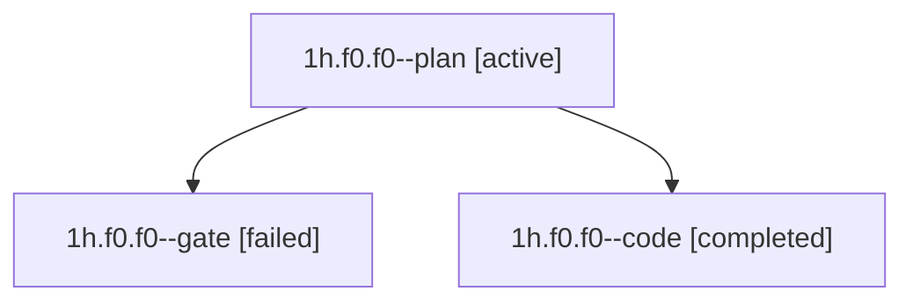

# Family: 1h.f0.f0

[Agent Hoods](../README.md) / [bbugyi200](../users/bbugyi200/README.md) / [apollo](../users/bbugyi200/machines/apollo/README.md) / [1h](../users/bbugyi200/machines/apollo/hoods/1h/README.md) / 1h.f0.f0

Owner: `bbugyi200.apollo` · Hood: `1h` · Members: 3

## Lineage

The diagram is an optional enhancement; the ordered table below contains the same lineage in accessible text.

| Role | Agent | State | Model / provider | Timing | Commits | Prompt | Chat |
|---|---|---|---|---|---:|---|---|
| plan | 1h.f0.f0--plan | active | opus / claude | 2026-09-22T11:47:27.715740+00:00 | 0 | [Prompt](../agents/bbugyi200.apollo.1h.f0.f0--plan/prompt.md) | [Chat](../agents/bbugyi200.apollo.1h.f0.f0--plan/chat.md) |
| gate | 1h.f0.f0--gate | failed | opus / claude | 2026-09-22T11:48:31.990932+00:00 → 2026-09-22T11:48:42.176668+00:00 | 0 | — | [Chat](../agents/bbugyi200.apollo.1h.f0.f0--gate/chat.md) |
| code | 1h.f0.f0--code | completed | muse-spark-1.3-contributor / muse | 2026-09-22T11:49:00.378950+00:00 → 2026-09-22T12:22:34.876299+00:00 | [1](../agents/bbugyi200.apollo.1h.f0.f0--code/README.md#commits) | — | [Chat](../agents/bbugyi200.apollo.1h.f0.f0--code/chat.md) |

## Commits

| Role | Repo | Commit | Subject | Committed |
|---|---|---|---|---|
| code | sase | [`215f1cd`](https://github.com/sase-org/sase/commit/215f1cd26774e2d70e6234c9d7fb2dc03b6c3241) | feat(ace): lowercase launch-context labels to model:/project: | 2026-09-22 08:20:47 EDT |

## Neighbors

| Agent | Relation | State |
|---|---|---|
| [1h.f0](bbugyi200.apollo.1h.f0.md) (family · 5) | ancestor | active 1, completed 2, failed 2 |
| [1h](bbugyi200.apollo.1h.md) (family · 3) | ancestor | active 1, completed 1, failed 1 |
| [1h.f0.f0.f0](bbugyi200.apollo.1h.f0.f0.f0.md) (family · 7) | descendant | active 1, completed 3, failed 3 |
| [1h.f0.f0.f0.w0](../agents/bbugyi200.apollo.1h.f0.f0.f0.w0/README.md) | descendant | waiting |
| [1h.f0.f0.f0.w1](../agents/bbugyi200.apollo.1h.f0.f0.f0.w1/README.md) | descendant | waiting |
| [1h.f0.f0.f0.w2](bbugyi200.apollo.1h.f0.f0.f0.w2.md) (family · 5) | descendant | active 1, completed 2, failed 2 |
| [1h.f0.f0.f0.w2.w0](../agents/bbugyi200.apollo.1h.f0.f0.f0.w2.w0/README.md) | descendant | waiting |
| [1h.f0.f0.f0.w2.w0.w0](../agents/bbugyi200.apollo.1h.f0.f0.f0.w2.w0.w0/README.md) | descendant | waiting |
