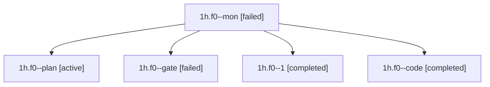

# Family: 1h.f0

[Agent Hoods](../README.md) / [bbugyi200](../users/bbugyi200/README.md) / [apollo](../users/bbugyi200/machines/apollo/README.md) / [1h](../users/bbugyi200/machines/apollo/hoods/1h/README.md) / 1h.f0

Owner: `bbugyi200.apollo` · Hood: `1h` · Members: 5

## Lineage

The diagram is an optional enhancement; the ordered table below contains the same lineage in accessible text.

| Role | Agent | State | Model / provider | Timing | Commits | Prompt | Chat |
|---|---|---|---|---|---:|---|---|
| mon | 1h.f0--mon | failed | muse-spark-1.3-contributor / muse | 2026-09-22T10:54:48.098353+00:00 → 2026-09-22T11:20:50.782554+00:00 | 0 | — | [Chat](../agents/bbugyi200.apollo.1h.f0--mon/chat.md) |
| plan | 1h.f0--plan | active | opus / claude | 2026-09-22T10:34:37.863289+00:00 | 0 | [Prompt](../agents/bbugyi200.apollo.1h.f0--plan/prompt.md) | [Chat](../agents/bbugyi200.apollo.1h.f0--plan/chat.md) |
| gate | 1h.f0--gate | failed | opus / claude | 2026-09-22T10:36:06.458348+00:00 → 2026-09-22T10:36:22.293752+00:00 | 0 | — | [Chat](../agents/bbugyi200.apollo.1h.f0--gate/chat.md) |
| 1 | 1h.f0--1 | completed | muse-spark-1.3-contributor / muse | 2026-09-22T11:20:50.371096+00:00 → 2026-09-22T11:41:50.452383+00:00 | [1](../agents/bbugyi200.apollo.1h.f0--1/README.md#commits) | [Prompt](../agents/bbugyi200.apollo.1h.f0--1/prompt.md) | [Chat](../agents/bbugyi200.apollo.1h.f0--1/chat.md) |
| code | 1h.f0--code | completed | muse-spark-1.3-contributor / muse | 2026-09-22T10:36:39.481090+00:00 → 2026-09-22T10:55:11.218567+00:00 | 0 | — | [Chat](../agents/bbugyi200.apollo.1h.f0--code/chat.md) |

## Commits

| Role | Repo | Commit | Subject | Committed |
|---|---|---|---|---|
| 1 | sase | [`2c59bd9`](https://github.com/sase-org/sase/commit/2c59bd9b75dd599a28496a6cb9f6376d0eb6a67e) | feat(ace): rename launch-context labels default/current to MODEL:/PROJECT: | 2026-09-22 07:40:25 EDT |

## Neighbors

| Agent | Relation | State |
|---|---|---|
| [1h](bbugyi200.apollo.1h.md) (family · 3) | ancestor | active 1, completed 1, failed 1 |
| [1h.f0.f0](bbugyi200.apollo.1h.f0.f0.md) (family · 3) | descendant | active 1, completed 1, failed 1 |
| [1h.f0.f0.f0](bbugyi200.apollo.1h.f0.f0.f0.md) (family · 7) | descendant | active 1, completed 3, failed 3 |
| [1h.f0.f0.f0.w0](../agents/bbugyi200.apollo.1h.f0.f0.f0.w0/README.md) | descendant | waiting |
| [1h.f0.f0.f0.w1](../agents/bbugyi200.apollo.1h.f0.f0.f0.w1/README.md) | descendant | waiting |
| [1h.f0.f0.f0.w2](bbugyi200.apollo.1h.f0.f0.f0.w2.md) (family · 5) | descendant | completed 3, failed 2 |
| [1h.f0.f0.f0.w2.w0](bbugyi200.apollo.1h.f0.f0.f0.w2.w0.md) (family · 3) | descendant | active 2, failed 1 |
| [1h.f0.f0.f0.w2.w0](../agents/bbugyi200.apollo.1h.f0.f0.f0.w2.w0/README.md) | descendant | waiting |
| [1h.f0.f0.f0.w2.w0.w0](bbugyi200.apollo.1h.f0.f0.f0.w2.w0.w0.md) (family · 3) | descendant | active 2, failed 1 |
| [1h.f0.f0.f0.w2.w0.w0.w0](../agents/bbugyi200.apollo.1h.f0.f0.f0.w2.w0.w0.w0/README.md) | descendant | waiting |
