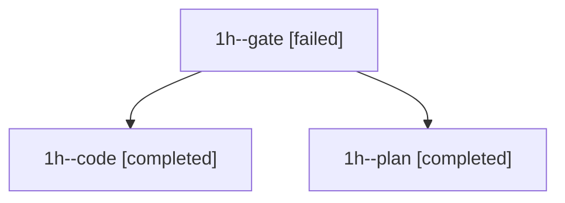

# Family: 1h

[Agent Hoods](../README.md) / [bbugyi200](../users/bbugyi200/README.md) / [apollo](../users/bbugyi200/machines/apollo/README.md) / [1h](../users/bbugyi200/machines/apollo/hoods/1h/README.md) / 1h

Owner: `bbugyi200.apollo` · Hood: `1h` · Members: 3

## Lineage

The diagram is an optional enhancement; the ordered table below contains the same lineage in accessible text.

| Role | Agent | State | Model / provider | Timing | Commits | Prompt | Chat |
|---|---|---|---|---|---:|---|---|
| gate | 1h--gate | failed | opus / claude | 2026-09-21T20:55:11.890460+00:00 → 2026-09-21T20:55:27.747739+00:00 | 0 | — | [Chat](../agents/bbugyi200.apollo.1h--gate/chat.md) |
| code | 1h--code | completed | muse-spark-1.3-contributor / muse | 2026-09-21T20:55:32.045355+00:00 → 2026-09-21T23:53:23.121332+00:00 | [1](../agents/bbugyi200.apollo.1h--code/README.md#commits) | [Prompt](../agents/bbugyi200.apollo.1h--code/prompt.md) | [Chat](../agents/bbugyi200.apollo.1h--code/chat.md) |
| plan | 1h--plan | completed | opus / claude | 2026-09-21T20:47:59.261363+00:00 → 2026-09-21T20:55:12.226689+00:00 | 0 | [Prompt](../agents/bbugyi200.apollo.1h--plan/prompt.md) | [Chat](../agents/bbugyi200.apollo.1h--plan/chat.md) |

## Commits

| Role | Repo | Commit | Subject | Committed |
|---|---|---|---|---|
| — | sase | [`1f75a19`](https://github.com/sase-org/sase/commit/1f75a191ed847ea91e42bebddad831103fe63a86) | chore: Add SDD prompt and plan for subagent\_tool\_output | 2026-07-07 21:09:39 EDT |
| — | sase | [`1b33529`](https://github.com/sase-org/sase/commit/1b33529649deeabcd53adf0896507e53ad0a7cd1) | fix: surface subagent final output | 2026-07-07 21:22:40 EDT |
| code | sase | [`dd1d49b`](https://github.com/sase-org/sase/commit/dd1d49bf5021aa2274e33add9d94348f44b2755a) | feat(ace): labeled launch-context cluster on every tab's status row | 2026-09-21 19:42:05 EDT |

## Neighbors

| Agent | Relation | State |
|---|---|---|
| [1h.f0](bbugyi200.apollo.1h.f0.md) (family · 5) | descendant | completed 3, failed 2 |
| [1h.f0.f0](bbugyi200.apollo.1h.f0.f0.md) (family · 3) | descendant | completed 2, failed 1 |
| [1h.f0.f0.f0](bbugyi200.apollo.1h.f0.f0.f0.md) (family · 7) | descendant | active 1, completed 3, failed 3 |
| [1h.f0.f0.f0.w0](../agents/bbugyi200.apollo.1h.f0.f0.f0.w0/README.md) | descendant | waiting |
| [1h.f0.f0.f0.w1](../agents/bbugyi200.apollo.1h.f0.f0.f0.w1/README.md) | descendant | waiting |
| [1h.f0.f0.f0.w2](../agents/bbugyi200.apollo.1h.f0.f0.f0.w2/README.md) | descendant | waiting |
