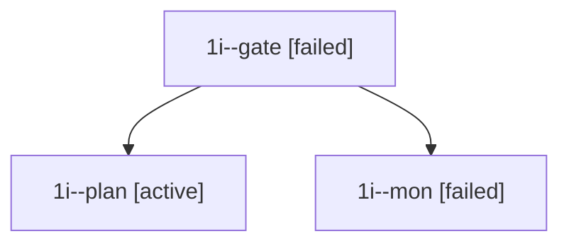

# Family: 1i

[Agent Hoods](../README.md) / [bbugyi200](../users/bbugyi200/README.md) / [apollo](../users/bbugyi200/machines/apollo/README.md) / [1i](../users/bbugyi200/machines/apollo/hoods/1i/README.md) / 1i

Owner: `bbugyi200.apollo` · Hood: `1i` · Members: 3

## Lineage

The diagram is an optional enhancement; the ordered table below contains the same lineage in accessible text.

| Role | Agent | State | Model / provider | Timing | Commits | Prompt | Chat |
|---|---|---|---|---|---:|---|---|
| gate | 1i--gate | failed | opus / claude | 2026-09-22T14:17:40.252377+00:00 → 2026-09-22T14:17:47.327605+00:00 | 0 | — | [Chat](../agents/bbugyi200.apollo.1i--gate/chat.md) |
| plan | 1i--plan | active | opus / claude | 2026-09-22T13:53:08.191704+00:00 | 0 | [Prompt](../agents/bbugyi200.apollo.1i--plan/prompt.md) | [Chat](../agents/bbugyi200.apollo.1i--plan/chat.md) |
| mon | 1i--mon | failed | opus / claude | 2026-09-22T14:17:46.639737+00:00 → 2026-09-22T14:19:48.704295+00:00 | 0 | — | [Chat](../agents/bbugyi200.apollo.1i--mon/chat.md) |

## Commits

| Role | Repo | Commit | Subject | Committed |
|---|---|---|---|---|
| — | sase | [`31f8436`](https://github.com/sase-org/sase/commit/31f8436d101f62c344dc4f30376dd9dd5569731d) | chore: Add SDD prompt and plan for configurable\_slow\_tool\_threshold | 2026-07-07 21:12:38 EDT |
| — | sase | [`2f3a04c`](https://github.com/sase-org/sase/commit/2f3a04c0508143c3ab29a6bfa07b757742582ae0) | feat(ace): make slow tool threshold configurable | 2026-07-07 21:38:57 EDT |
