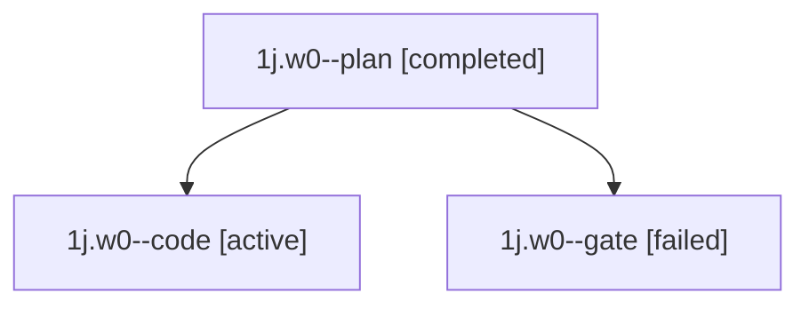

# Family: 1j.w0

[Agent Hoods](../README.md) / [bbugyi200](../users/bbugyi200/README.md) / [apollo](../users/bbugyi200/machines/apollo/README.md) / [1j](../users/bbugyi200/machines/apollo/hoods/1j/README.md) / 1j.w0

Owner: `bbugyi200.apollo` · Hood: `1j` · Members: 3

## Lineage

The diagram is an optional enhancement; the ordered table below contains the same lineage in accessible text.

| Role | Agent | State | Model / provider | Timing | Commits | Prompt | Chat |
|---|---|---|---|---|---:|---|---|
| plan | 1j.w0--plan | completed | opus / claude | 2026-09-22T19:49:46.239207+00:00 → 2026-09-22T19:52:48.434643+00:00 | 0 | [Prompt](../agents/bbugyi200.apollo.1j.w0--plan/prompt.md) | [Chat](../agents/bbugyi200.apollo.1j.w0--plan/chat.md) |
| code | 1j.w0--code | active | muse-spark-1.3-contributor / muse | 2026-09-22T19:57:00.728764+00:00 | [1](../agents/bbugyi200.apollo.1j.w0--code/README.md#commits) | [Prompt](../agents/bbugyi200.apollo.1j.w0--code/prompt.md) | — |
| gate | 1j.w0--gate | failed | opus / claude | 2026-09-22T19:56:36.054877+00:00 → 2026-09-22T19:56:55.440142+00:00 | 0 | — | [Chat](../agents/bbugyi200.apollo.1j.w0--gate/chat.md) |

## Commits

| Role | Repo | Commit | Subject | Committed |
|---|---|---|---|---|
| code | sase | [`6561928`](https://github.com/sase-org/sase/commit/6561928db8a2c512890d29d3711f688b48e5e298) | feat(ace): drop redundant rejection marker from exact-0% usage badges | 2026-09-22 16:25:40 EDT |

## Neighbors

| Agent | Relation | State |
|---|---|---|
| [1j](../agents/bbugyi200.apollo.1j/README.md) | ancestor | completed |
