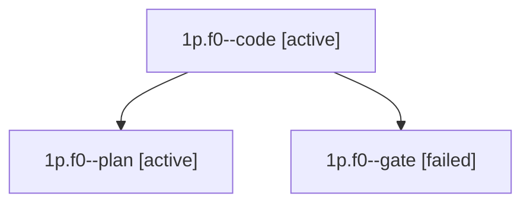

# Family: 1p.f0

[Agent Hoods](../README.md) / [bbugyi200](../users/bbugyi200/README.md) / [apollo](../users/bbugyi200/machines/apollo/README.md) / [1p](../users/bbugyi200/machines/apollo/hoods/1p/README.md) / 1p.f0

Owner: `bbugyi200.apollo` · Hood: `1p` · Members: 3

## Lineage

The diagram is an optional enhancement; the ordered table below contains the same lineage in accessible text.

| Role | Agent | State | Model / provider | Timing | Commits | Prompt | Chat |
|---|---|---|---|---|---:|---|---|
| code | 1p.f0--code | active | sonnet / claude | 2026-09-25T15:48:05.631982+00:00 | [1](../agents/bbugyi200.apollo.1p.f0--code/README.md#commits) | — | — |
| plan | 1p.f0--plan | active | opus / claude | 2026-09-25T15:39:44.804830+00:00 | 0 | [Prompt](../agents/bbugyi200.apollo.1p.f0--plan/prompt.md) | [Chat](../agents/bbugyi200.apollo.1p.f0--plan/chat.md) |
| gate | 1p.f0--gate | failed | opus / claude | 2026-09-25T15:47:30.777708+00:00 → 2026-09-25T15:47:40.471026+00:00 | 0 | — | [Chat](../agents/bbugyi200.apollo.1p.f0--gate/chat.md) |

## Commits

| Role | Repo | Commit | Subject | Committed |
|---|---|---|---|---|
| code | sase | [`31a37bd`](https://github.com/sase-org/sase/commit/31a37bd7b9b8e83dca71e29a04a84910ada6d866) | feat(ace-tui): show a deck in the other panel from the deck picker capitals | 2026-09-25 14:55:13 EDT |

## Neighbors

| Agent | Relation | State |
|---|---|---|
| [1p](bbugyi200.apollo.1p.md) (family · 3) | ancestor | completed 2, failed 1 |
