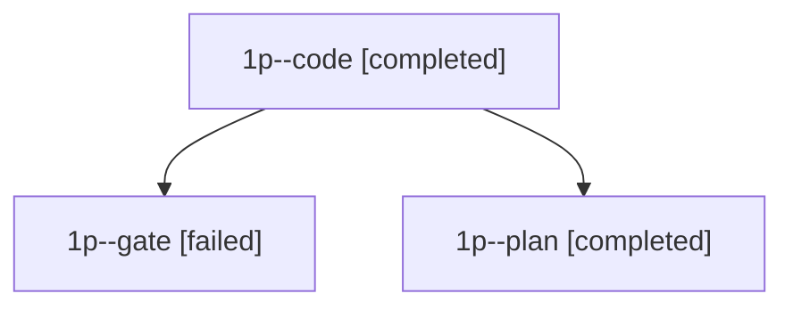

# Family: 1p

[Agent Hoods](../README.md) / [bbugyi200](../users/bbugyi200/README.md) / [apollo](../users/bbugyi200/machines/apollo/README.md) / [1p](../users/bbugyi200/machines/apollo/hoods/1p/README.md) / 1p

Owner: `bbugyi200.apollo` · Hood: `1p` · Members: 3

## Lineage

The diagram is an optional enhancement; the ordered table below contains the same lineage in accessible text.

| Role | Agent | State | Model / provider | Timing | Commits | Prompt | Chat |
|---|---|---|---|---|---:|---|---|
| code | 1p--code | completed | muse-spark-1.3-contributor / muse | 2026-09-25T14:12:54.929489+00:00 → 2026-09-25T15:39:18.329862+00:00 | [1](../agents/bbugyi200.apollo.1p--code/README.md#commits) | [Prompt](../agents/bbugyi200.apollo.1p--code/prompt.md) | [Chat](../agents/bbugyi200.apollo.1p--code/chat.md) |
| gate | 1p--gate | failed | opus / claude | 2026-09-25T14:12:34.813389+00:00 → 2026-09-25T14:12:50.297919+00:00 | 0 | — | [Chat](../agents/bbugyi200.apollo.1p--gate/chat.md) |
| plan | 1p--plan | completed | opus / claude | 2026-09-25T14:00:52.300367+00:00 → 2026-09-25T14:11:08.205629+00:00 | 0 | [Prompt](../agents/bbugyi200.apollo.1p--plan/prompt.md) | [Chat](../agents/bbugyi200.apollo.1p--plan/chat.md) |

## Commits

| Role | Repo | Commit | Subject | Committed |
|---|---|---|---|---|
| — | sase | [`24c7cf6`](https://github.com/sase-org/sase/commit/24c7cf6691b88f30f6b00ded45a0ecd750a12d84) | chore: Add SDD prompt and plan for phase\_bead\_epic\_plan | 2026-07-08 00:10:12 EDT |
| — | sase | [`36f89b7`](https://github.com/sase-org/sase/commit/36f89b7724fd2b67920769b4c452dd4e9f72dfe5) | feat(bead): show parent epic plans for phase beads | 2026-07-08 00:21:56 EDT |
| code | sase | [`ce1336e`](https://github.com/sase-org/sase/commit/ce1336eec711d7db93878d75e38afcd32ce19af8) | feat(ace): add Agents deck picker modal on pick\_deck key | 2026-09-25 11:36:52 EDT |

## Neighbors

| Agent | Relation | State |
|---|---|---|
| [1p.f0](bbugyi200.apollo.1p.f0.md) (family · 3) | descendant | active 2, failed 1 |
