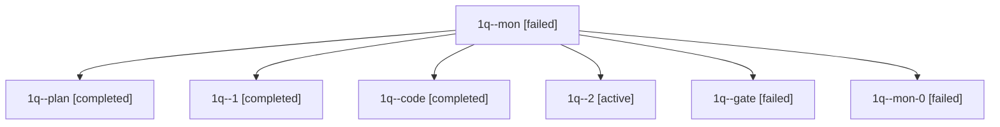

# Family: 1q

[Agent Hoods](../README.md) / [bbugyi200](../users/bbugyi200/README.md) / [apollo](../users/bbugyi200/machines/apollo/README.md) / [1q](../users/bbugyi200/machines/apollo/hoods/1q/README.md) / 1q

Owner: `bbugyi200.apollo` · Hood: `1q` · Members: 7

## Lineage

The diagram is an optional enhancement; the ordered table below contains the same lineage in accessible text.

| Role | Agent | State | Model / provider | Timing | Commits | Prompt | Chat |
|---|---|---|---|---|---:|---|---|
| mon | 1q--mon | failed | gpt-5.6-terra / codex | 2026-09-25T15:21:21.940077+00:00 → 2026-09-25T15:32:46.989476+00:00 | 0 | — | [Chat](../agents/bbugyi200.apollo.1q--mon/chat.md) |
| plan | 1q--plan | completed | grok-4.6 / grok | 2026-09-25T15:09:34.055339+00:00 → 2026-09-25T15:22:00.908375+00:00 | 0 | [Prompt](../agents/bbugyi200.apollo.1q--plan/prompt.md) | [Chat](../agents/bbugyi200.apollo.1q--plan/chat.md) |
| 1 | 1q--1 | completed | gpt-5.6-terra / codex | 2026-09-25T15:32:46.542397+00:00 → 2026-09-25T15:35:36.918630+00:00 | 0 | [Prompt](../agents/bbugyi200.apollo.1q--1/prompt.md) | [Chat](../agents/bbugyi200.apollo.1q--1/chat.md) |
| code | 1q--code | completed | gpt-5.6-terra / codex | 2026-09-25T15:16:26.485959+00:00 → 2026-09-25T15:22:00.908375+00:00 | 0 | — | [Chat](../agents/bbugyi200.apollo.1q--code/chat.md) |
| 2 | 1q--2 | active | grok-4.6 / grok | 2026-09-25T15:36:05.881314+00:00 | 0 | [Prompt](../agents/bbugyi200.apollo.1q--2/prompt.md) | — |
| gate | 1q--gate | failed | grok-4.6 / grok | 2026-09-25T15:15:51.068897+00:00 → 2026-09-25T15:16:03.013019+00:00 | 0 | — | [Chat](../agents/bbugyi200.apollo.1q--gate/chat.md) |
| mon-0 | 1q--mon-0 | failed | gpt-5.6-terra / codex | 2026-09-25T15:35:06.646559+00:00 → 2026-09-25T15:36:06.212544+00:00 | 0 | — | [Chat](../agents/bbugyi200.apollo.1q--mon-0/chat.md) |
