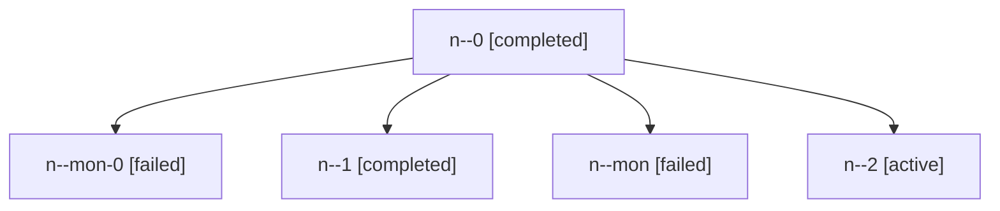

# Family: n

[Agent Hoods](../README.md) / [bbugyi200](../users/bbugyi200/README.md) / [apollo](../users/bbugyi200/machines/apollo/README.md) / [n](../users/bbugyi200/machines/apollo/hoods/n/README.md) / n

Owner: `bbugyi200.apollo` · Hood: `n` · Members: 5

## Lineage

The diagram is an optional enhancement; the ordered table below contains the same lineage in accessible text.

| Role | Agent | State | Model / provider | Timing | Commits | Prompt | Chat |
|---|---|---|---|---|---:|---|---|
| 0 | n--0 | completed | sonnet / claude | 2026-09-05T11:41:15.080909+00:00 → 2026-09-05T13:09:53.219136+00:00 | 0 | [Prompt](../agents/bbugyi200.apollo.n--0/prompt.md) | [Chat](../agents/bbugyi200.apollo.n--0/chat.md) |
| mon-0 | n--mon-0 | failed | sonnet / claude | 2026-09-05T14:05:56.977233+00:00 → 2026-09-05T15:36:16.829961+00:00 | 0 | — | [Chat](../agents/bbugyi200.apollo.n--mon-0/chat.md) |
| 1 | n--1 | completed | sonnet / claude | 2026-09-05T14:03:37.116004+00:00 → 2026-09-05T14:06:23.861961+00:00 | 0 | [Prompt](../agents/bbugyi200.apollo.n--1/prompt.md) | [Chat](../agents/bbugyi200.apollo.n--1/chat.md) |
| mon | n--mon | failed | sonnet / claude | 2026-09-05T13:09:24.741407+00:00 → 2026-09-05T13:59:03.144022+00:00 | 0 | — | [Chat](../agents/bbugyi200.apollo.n--mon/chat.md) |
| 2 | n--2 | active | sonnet / claude | 2026-09-05T15:41:40.976526+00:00 | [1](../agents/bbugyi200.apollo.n--2/README.md#commits) | [Prompt](../agents/bbugyi200.apollo.n--2/prompt.md) | — |

## Commits

| Role | Repo | Commit | Subject | Committed |
|---|---|---|---|---|
| — | sase | [`9595caa`](https://github.com/sase-org/sase/commit/9595caae0c5ec91d741f76d04cf7c6d91e09c2d2) | chore: Add SDD prompt and plan for telegram\_stale\_launch\_feedback | 2026-07-06 16:19:33 EDT |
| 2 | sase | [`28b9ac3`](https://github.com/sase-org/sase/commit/28b9ac3888a9af29c2c965d38f17a3c4b4f2f185) | feat(llm\_provider): add GPT-6 Astra model support to codex provider | 2026-09-05 11:47:57 EDT |
