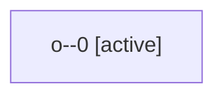

# Family: o

[Agent Hoods](../README.md) / [bbugyi200](../users/bbugyi200/README.md) / [apollo](../users/bbugyi200/machines/apollo/README.md) / [o](../users/bbugyi200/machines/apollo/hoods/o/README.md) / o

Owner: `bbugyi200.apollo` · Hood: `o` · Members: 1

## Lineage

The diagram is an optional enhancement; the ordered table below contains the same lineage in accessible text.

| Role | Agent | State | Model / provider | Timing | Commits | Prompt | Chat |
|---|---|---|---|---|---:|---|---|
| 0 | o--0 | active | sonnet / claude | 2026-09-05T12:09:33.896079+00:00 | [1](../agents/bbugyi200.apollo.o--0/README.md#commits) | [Prompt](../agents/bbugyi200.apollo.o--0/prompt.md) | — |

## Commits

| Role | Repo | Commit | Subject | Committed |
|---|---|---|---|---|
| 0 | sase | [`a998ea0`](https://github.com/sase-org/sase/commit/a998ea0d47f9c771e109ed0e22afae0fd90389ca) | feat(ace): gate pending-review meta enrichment on a done-snapshot pregate window | 2026-09-05 08:48:02 EDT |
