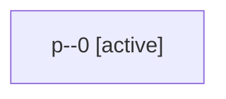

# Family: p

[Agent Hoods](../README.md) / [bbugyi200](../users/bbugyi200/README.md) / [apollo](../users/bbugyi200/machines/apollo/README.md) / [p](../users/bbugyi200/machines/apollo/hoods/p/README.md) / p

Owner: `bbugyi200.apollo` · Hood: `p` · Members: 1

## Lineage

The diagram is an optional enhancement; the ordered table below contains the same lineage in accessible text.

| Role | Agent | State | Model / provider | Timing | Commits | Prompt | Chat |
|---|---|---|---|---|---:|---|---|
| 0 | p--0 | active | gpt-5.5 / codex | 2026-09-05T12:13:12.950733+00:00 | [1](../agents/bbugyi200.apollo.p--0/README.md#commits) | [Prompt](../agents/bbugyi200.apollo.p--0/prompt.md) | — |

## Commits

| Role | Repo | Commit | Subject | Committed |
|---|---|---|---|---|
| 0 | sase | [`a2ea042`](https://github.com/sase-org/sase/commit/a2ea0421956518b25aec9c296f5f195e9beda390) | fix: repair generated gate command header | 2026-09-05 09:51:03 EDT |
