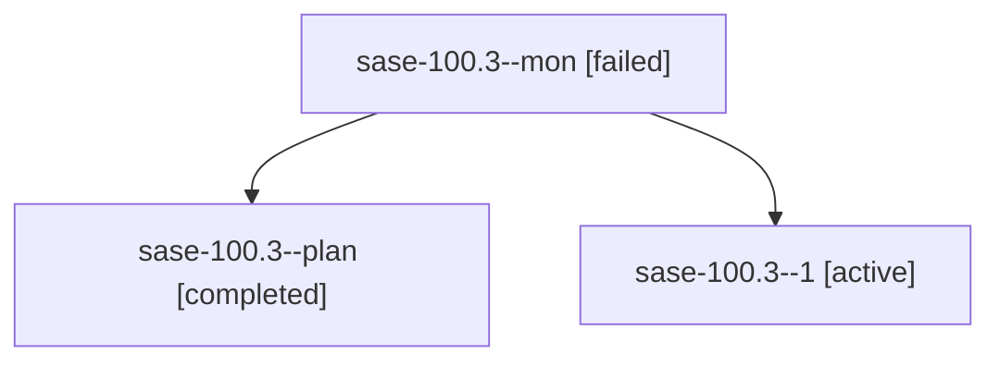

# Family: sase-100.3

[Agent Hoods](../README.md) / [bbugyi200](../users/bbugyi200/README.md) / [apollo](../users/bbugyi200/machines/apollo/README.md) / [sase-100](../users/bbugyi200/machines/apollo/hoods/sase-100/README.md) / sase-100.3

Owner: `bbugyi200.apollo` · Hood: `sase-100` · Members: 3 · Bead: [sase-100.3](https://github.com/sase-org/sase--beads/blob/main/pages/sase-100/sase-100.3.md)

## Lineage

The diagram is an optional enhancement; the ordered table below contains the same lineage in accessible text.

| Role | Agent | State | Model / provider | Timing | Commits | Prompt | Chat |
|---|---|---|---|---|---:|---|---|
| mon | sase-100.3--mon | failed | grok-4.6 / grok | 2026-09-13T10:15:20.179426+00:00 → 2026-09-13T10:38:39.815803+00:00 | 0 | — | [Chat](../agents/bbugyi200.apollo.sase-100.3--mon/chat.md) |
| plan | sase-100.3--plan | completed | grok-4.6 / grok | 2026-09-13T09:48:21.146437+00:00 → 2026-09-13T10:15:32.011593+00:00 | 0 | [Prompt](../agents/bbugyi200.apollo.sase-100.3--plan/prompt.md) | [Chat](../agents/bbugyi200.apollo.sase-100.3--plan/chat.md) |
| 1 | sase-100.3--1 | active | grok-4.6 / grok | 2026-09-13T10:38:39.340033+00:00 | [1](../agents/bbugyi200.apollo.sase-100.3--1/README.md#commits) | [Prompt](../agents/bbugyi200.apollo.sase-100.3--1/prompt.md) | — |

## Commits

| Role | Repo | Commit | Subject | Committed |
|---|---|---|---|---|
| 1 | sase | [`a12a1ab`](https://github.com/sase-org/sase/commit/a12a1abdf6b4183b2e1cdef66afe656cb5889258) | feat(ace): wire R and ,y through the Refresh panel | 2026-09-13 06:51:33 EDT |

## Neighbors

| Agent | Relation | State |
|---|---|---|
| [sase-100.1](../agents/bbugyi200.apollo.sase-100.1/README.md) | sase-100 hood | completed |
| [sase-100.2](../agents/bbugyi200.apollo.sase-100.2/README.md) | sase-100 hood | completed |
| [sase-100.4](../agents/bbugyi200.apollo.sase-100.4/README.md) | sase-100 hood | waiting |
| [sase-100.land](../agents/bbugyi200.apollo.sase-100.land/README.md) | sase-100 hood | waiting |
