# Family: sase-100.4

[Agent Hoods](../README.md) / [bbugyi200](../users/bbugyi200/README.md) / [apollo](../users/bbugyi200/machines/apollo/README.md) / [sase-100](../users/bbugyi200/machines/apollo/hoods/sase-100/README.md) / sase-100.4

Owner: `bbugyi200.apollo` · Hood: `sase-100` · Members: 17 · Bead: [sase-100.4](https://github.com/sase-org/sase--beads/blob/main/pages/sase-100/sase-100.4.md)

## Lineage

```mermaid
flowchart TD
  n0["sase-100.4--7 [completed]"]
  n1["sase-100.4--mon-3 [failed]"]
  n0 --> n1
  n2["sase-100.4--8 [completed]"]
  n0 --> n2
  n3["sase-100.4--mon-0 [failed]"]
  n0 --> n3
  n4["sase-100.4--mon-1 [failed]"]
  n0 --> n4
  n5["sase-100.4--1 [completed]"]
  n0 --> n5
  n6["sase-100.4--plan [completed]"]
  n0 --> n6
  n7["sase-100.4--mon-2 [failed]"]
  n0 --> n7
  n8["sase-100.4--2 [completed]"]
  n0 --> n8
  n9["sase-100.4--mon-4 [failed]"]
  n0 --> n9
  n10["sase-100.4--3 [completed]"]
  n0 --> n10
  n11["sase-100.4--4 [completed]"]
  n0 --> n11
  n12["sase-100.4--5 [completed]"]
  n0 --> n12
  n13["sase-100.4--mon-6 [failed]"]
  n0 --> n13
  n14["sase-100.4--6 [completed]"]
  n0 --> n14
  n15["sase-100.4--mon-5 [failed]"]
  n0 --> n15
  n16["sase-100.4--mon [failed]"]
  n0 --> n16
```

The diagram is an optional enhancement; the ordered table below contains the same lineage in accessible text.

| Role | Agent | State | Model / provider | Timing | Commits | Prompt | Chat |
|---|---|---|---|---|---:|---|---|
| 7 | sase-100.4--7 | completed | grok-4.6 / grok | 2026-09-13T18:01:01.914980+00:00 → 2026-09-13T18:27:54.765269+00:00 | 0 | [Prompt](../agents/bbugyi200.apollo.sase-100.4--7/prompt.md) | [Chat](../agents/bbugyi200.apollo.sase-100.4--7/chat.md) |
| mon-3 | sase-100.4--mon-3 | failed | grok-4.6 / grok | 2026-09-13T16:58:40.216974+00:00 → 2026-09-13T17:09:38.892472+00:00 | 0 | — | [Chat](../agents/bbugyi200.apollo.sase-100.4--mon-3/chat.md) |
| 8 | sase-100.4--8 | completed | grok-4.6 / grok | 2026-09-13T18:31:08.940982+00:00 → 2026-09-13T19:32:54.637859+00:00 | [1](../agents/bbugyi200.apollo.sase-100.4--8/README.md#commits) | [Prompt](../agents/bbugyi200.apollo.sase-100.4--8/prompt.md) | [Chat](../agents/bbugyi200.apollo.sase-100.4--8/chat.md) |
| mon-0 | sase-100.4--mon-0 | failed | grok-4.6 / grok | 2026-09-13T12:41:07.922840+00:00 → 2026-09-13T14:24:57.645566+00:00 | 0 | — | [Chat](../agents/bbugyi200.apollo.sase-100.4--mon-0/chat.md) |
| mon-1 | sase-100.4--mon-1 | failed | grok-4.6 / grok | 2026-09-13T14:32:14.255662+00:00 → 2026-09-13T16:19:04.729027+00:00 | 0 | — | [Chat](../agents/bbugyi200.apollo.sase-100.4--mon-1/chat.md) |
| 1 | sase-100.4--1 | completed | grok-4.6 / grok | 2026-09-13T12:33:35.545198+00:00 → 2026-09-13T12:41:25.679008+00:00 | 0 | [Prompt](../agents/bbugyi200.apollo.sase-100.4--1/prompt.md) | [Chat](../agents/bbugyi200.apollo.sase-100.4--1/chat.md) |
| plan | sase-100.4--plan | completed | grok-4.6 / grok | 2026-09-13T10:52:55.502672+00:00 → 2026-09-13T11:03:41.219768+00:00 | 0 | [Prompt](../agents/bbugyi200.apollo.sase-100.4--plan/prompt.md) | [Chat](../agents/bbugyi200.apollo.sase-100.4--plan/chat.md) |
| mon-2 | sase-100.4--mon-2 | failed | grok-4.6 / grok | 2026-09-13T16:28:05.156460+00:00 → 2026-09-13T16:52:29.456536+00:00 | 0 | — | [Chat](../agents/bbugyi200.apollo.sase-100.4--mon-2/chat.md) |
| 2 | sase-100.4--2 | completed | grok-4.6 / grok | 2026-09-13T14:24:57.448574+00:00 → 2026-09-13T14:32:37.472408+00:00 | 0 | [Prompt](../agents/bbugyi200.apollo.sase-100.4--2/prompt.md) | [Chat](../agents/bbugyi200.apollo.sase-100.4--2/chat.md) |
| mon-4 | sase-100.4--mon-4 | failed | grok-4.6 / grok | 2026-09-13T17:24:26.933206+00:00 → 2026-09-13T17:35:15.245180+00:00 | 0 | — | [Chat](../agents/bbugyi200.apollo.sase-100.4--mon-4/chat.md) |
| 3 | sase-100.4--3 | completed | grok-4.6 / grok | 2026-09-13T16:19:04.693630+00:00 → 2026-09-13T16:28:28.471043+00:00 | 0 | [Prompt](../agents/bbugyi200.apollo.sase-100.4--3/prompt.md) | [Chat](../agents/bbugyi200.apollo.sase-100.4--3/chat.md) |
| 4 | sase-100.4--4 | completed | grok-4.6 / grok | 2026-09-13T16:52:28.988452+00:00 → 2026-09-13T16:59:04.876458+00:00 | 0 | [Prompt](../agents/bbugyi200.apollo.sase-100.4--4/prompt.md) | [Chat](../agents/bbugyi200.apollo.sase-100.4--4/chat.md) |
| 5 | sase-100.4--5 | completed | grok-4.6 / grok | 2026-09-13T17:09:38.733650+00:00 → 2026-09-13T17:24:50.183723+00:00 | 0 | [Prompt](../agents/bbugyi200.apollo.sase-100.4--5/prompt.md) | [Chat](../agents/bbugyi200.apollo.sase-100.4--5/chat.md) |
| mon-6 | sase-100.4--mon-6 | failed | grok-4.6 / grok | 2026-09-13T18:19:47.920453+00:00 → 2026-09-13T18:31:09.273380+00:00 | 0 | — | [Chat](../agents/bbugyi200.apollo.sase-100.4--mon-6/chat.md) |
| 6 | sase-100.4--6 | completed | grok-4.6 / grok | 2026-09-13T17:35:14.766425+00:00 → 2026-09-13T17:57:44.094182+00:00 | 0 | [Prompt](../agents/bbugyi200.apollo.sase-100.4--6/prompt.md) | [Chat](../agents/bbugyi200.apollo.sase-100.4--6/chat.md) |
| mon-5 | sase-100.4--mon-5 | failed | grok-4.6 / grok | 2026-09-13T17:49:18.044030+00:00 → 2026-09-13T18:01:02.054773+00:00 | 0 | — | [Chat](../agents/bbugyi200.apollo.sase-100.4--mon-5/chat.md) |
| mon | sase-100.4--mon | failed | grok-4.6 / grok | 2026-09-13T11:03:23.208250+00:00 → 2026-09-13T12:33:35.870752+00:00 | 0 | — | [Chat](../agents/bbugyi200.apollo.sase-100.4--mon/chat.md) |

## Commits

| Role | Repo | Commit | Subject | Committed |
|---|---|---|---|---|
| 8 | sase | [`ecfde91`](https://github.com/sase-org/sase/commit/ecfde919c5ba2a751c3d2a6c4f5c717cdda09c85) | docs(ace): document Refresh panel and refresh visual goldens | 2026-09-13 15:24:14 EDT |

## Neighbors

| Agent | Relation | State |
|---|---|---|
| [sase-100.1](../agents/bbugyi200.apollo.sase-100.1/README.md) | sase-100 hood | completed |
| [sase-100.2](../agents/bbugyi200.apollo.sase-100.2/README.md) | sase-100 hood | completed |
| [sase-100.3](bbugyi200.apollo.sase-100.3.md) (family · 3) | sase-100 hood | completed 2, failed 1 |
| [sase-100.land](../agents/bbugyi200.apollo.sase-100.land/README.md) | sase-100 hood | active |
