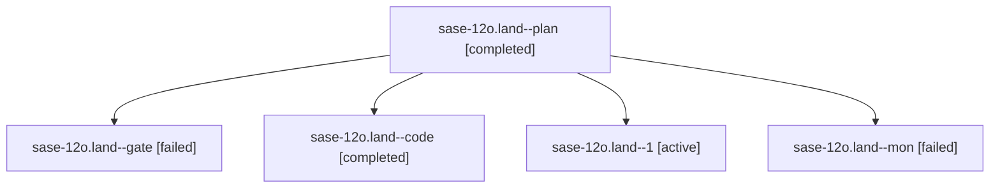

# Family: sase-12o.land

[Agent Hoods](../README.md) / [bbugyi200](../users/bbugyi200/README.md) / [apollo](../users/bbugyi200/machines/apollo/README.md) / [sase-12o](../users/bbugyi200/machines/apollo/hoods/sase-12o/README.md) / sase-12o.land

Owner: `bbugyi200.apollo` · Hood: `sase-12o` · Members: 5 · Bead: [sase-12o](https://github.com/sase-org/sase--beads/blob/main/pages/sase-12o/README.md)

## Lineage

The diagram is an optional enhancement; the ordered table below contains the same lineage in accessible text.

| Role | Agent | State | Model / provider | Timing | Commits | Prompt | Chat |
|---|---|---|---|---|---:|---|---|
| plan | sase-12o.land--plan | completed | gpt-5.6-sol / codex | 2026-09-18T19:10:21.297616+00:00 → 2026-09-18T20:03:02.985445+00:00 | 0 | [Prompt](../agents/bbugyi200.apollo.sase-12o.land--plan/prompt.md) | [Chat](../agents/bbugyi200.apollo.sase-12o.land--plan/chat.md) |
| gate | sase-12o.land--gate | failed | gpt-5.6-sol / codex | 2026-09-18T19:20:10.478790+00:00 → 2026-09-18T19:20:24.037200+00:00 | 0 | — | [Chat](../agents/bbugyi200.apollo.sase-12o.land--gate/chat.md) |
| code | sase-12o.land--code | completed | grok-4.6 / grok | 2026-09-18T19:20:46.416591+00:00 → 2026-09-18T20:03:02.985445+00:00 | 0 | — | [Chat](../agents/bbugyi200.apollo.sase-12o.land--code/chat.md) |
| 1 | sase-12o.land--1 | active | grok-4.6 / grok | 2026-09-18T20:05:41.398707+00:00 | [1](../agents/bbugyi200.apollo.sase-12o.land--1/README.md#commits) | [Prompt](../agents/bbugyi200.apollo.sase-12o.land--1/prompt.md) | — |
| mon | sase-12o.land--mon | failed | grok-4.6 / grok | 2026-09-18T20:02:27.874273+00:00 → 2026-09-18T20:05:41.628270+00:00 | 0 | — | [Chat](../agents/bbugyi200.apollo.sase-12o.land--mon/chat.md) |

## Commits

| Role | Repo | Commit | Subject | Committed |
|---|---|---|---|---|
| 1 | sase | [`b6183a1`](https://github.com/sase-org/sase/commit/b6183a14cd26f0910ff1570f264d20f10aa62aaa) | fix(completion): publish grammar cache as one recoverable generation | 2026-09-18 16:16:53 EDT |

## Neighbors

| Agent | Relation | State |
|---|---|---|
| [sase-12o.1](../agents/bbugyi200.apollo.sase-12o.1/README.md) | sase-12o hood | completed |
| [sase-12o.2](../agents/bbugyi200.apollo.sase-12o.2/README.md) | sase-12o hood | completed |
| [sase-12o.3](../agents/bbugyi200.apollo.sase-12o.3/README.md) | sase-12o hood | completed |
