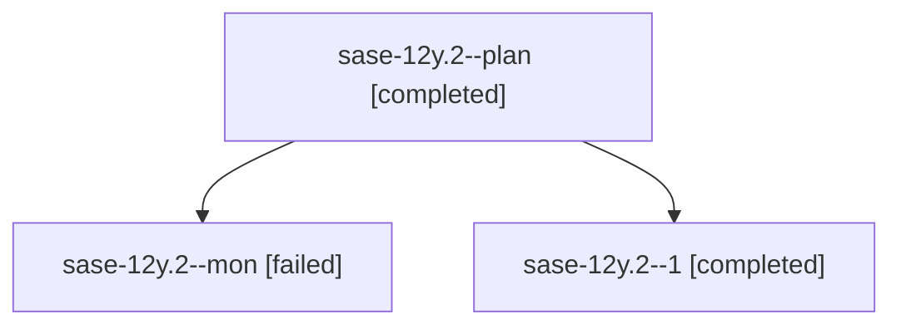

# Family: sase-12y.2

[Agent Hoods](../README.md) / [bbugyi200](../users/bbugyi200/README.md) / [apollo](../users/bbugyi200/machines/apollo/README.md) / [sase-12y](../users/bbugyi200/machines/apollo/hoods/sase-12y/README.md) / sase-12y.2

Owner: `bbugyi200.apollo` · Hood: `sase-12y` · Members: 3 · Bead: [sase-12y.2](https://github.com/sase-org/sase--beads/blob/main/pages/sase-12y/sase-12y.2.md)

## Lineage

The diagram is an optional enhancement; the ordered table below contains the same lineage in accessible text.

| Role | Agent | State | Model / provider | Timing | Commits | Prompt | Chat |
|---|---|---|---|---|---:|---|---|
| plan | sase-12y.2--plan | completed | grok-4.6 / grok | 2026-09-18T14:33:15.832588+00:00 → 2026-09-18T17:20:25.909565+00:00 | 0 | [Prompt](../agents/bbugyi200.apollo.sase-12y.2--plan/prompt.md) | [Chat](../agents/bbugyi200.apollo.sase-12y.2--plan/chat.md) |
| mon | sase-12y.2--mon | failed | grok-4.6 / grok | 2026-09-18T17:19:50.231225+00:00 → 2026-09-18T18:27:28.541551+00:00 | 0 | — | [Chat](../agents/bbugyi200.apollo.sase-12y.2--mon/chat.md) |
| 1 | sase-12y.2--1 | completed | grok-4.6 / grok | 2026-09-18T18:27:28.075287+00:00 → 2026-09-18T18:38:07.888362+00:00 | [1](../agents/bbugyi200.apollo.sase-12y.2--1/README.md#commits) | [Prompt](../agents/bbugyi200.apollo.sase-12y.2--1/prompt.md) | [Chat](../agents/bbugyi200.apollo.sase-12y.2--1/chat.md) |

## Commits

| Role | Repo | Commit | Subject | Committed |
|---|---|---|---|---|
| 1 | sase | [`2d46e2c`](https://github.com/sase-org/sase/commit/2d46e2cf40344859990dab39b094cad78b24640d) | feat(sdd): bound artifact-link projection with deadline-aware batches | 2026-09-18 14:35:31 EDT |

## Neighbors

| Agent | Relation | State |
|---|---|---|
| [sase-12y.1](../agents/bbugyi200.apollo.sase-12y.1/README.md) | sase-12y hood | completed |
| [sase-12y.3](bbugyi200.apollo.sase-12y.3.md) (family · 9) | sase-12y hood | active 1, completed 4, failed 4 |
| [sase-12y.land](../agents/bbugyi200.apollo.sase-12y.land/README.md) | sase-12y hood | waiting |
