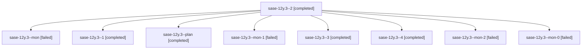

# Family: sase-12y.3

[Agent Hoods](../README.md) / [bbugyi200](../users/bbugyi200/README.md) / [apollo](../users/bbugyi200/machines/apollo/README.md) / [sase-12y](../users/bbugyi200/machines/apollo/hoods/sase-12y/README.md) / sase-12y.3

Owner: `bbugyi200.apollo` · Hood: `sase-12y` · Members: 9 · Bead: [sase-12y.3](https://github.com/sase-org/sase--beads/blob/main/pages/sase-12y/sase-12y.3.md)

## Lineage

The diagram is an optional enhancement; the ordered table below contains the same lineage in accessible text.

| Role | Agent | State | Model / provider | Timing | Commits | Prompt | Chat |
|---|---|---|---|---|---:|---|---|
| 2 | sase-12y.3--2 | completed | grok-4.6 / grok | 2026-09-18T20:21:27.738527+00:00 → 2026-09-18T20:31:45.271541+00:00 | 0 | [Prompt](../agents/bbugyi200.apollo.sase-12y.3--2/prompt.md) | [Chat](../agents/bbugyi200.apollo.sase-12y.3--2/chat.md) |
| mon | sase-12y.3--mon | failed | grok-4.6 / grok | 2026-09-18T19:16:26.535714+00:00 → 2026-09-18T19:41:11.316546+00:00 | 0 | — | [Chat](../agents/bbugyi200.apollo.sase-12y.3--mon/chat.md) |
| 1 | sase-12y.3--1 | completed | grok-4.6 / grok | 2026-09-18T19:41:11.184284+00:00 → 2026-09-18T19:47:01.433417+00:00 | 0 | [Prompt](../agents/bbugyi200.apollo.sase-12y.3--1/prompt.md) | [Chat](../agents/bbugyi200.apollo.sase-12y.3--1/chat.md) |
| plan | sase-12y.3--plan | completed | grok-4.6 / grok | 2026-09-18T18:37:52.023727+00:00 → 2026-09-18T19:17:52.147880+00:00 | 0 | [Prompt](../agents/bbugyi200.apollo.sase-12y.3--plan/prompt.md) | [Chat](../agents/bbugyi200.apollo.sase-12y.3--plan/chat.md) |
| mon-1 | sase-12y.3--mon-1 | failed | grok-4.6 / grok | 2026-09-18T20:31:14.838032+00:00 → 2026-09-18T21:16:32.909498+00:00 | 0 | — | [Chat](../agents/bbugyi200.apollo.sase-12y.3--mon-1/chat.md) |
| 3 | sase-12y.3--3 | completed | grok-4.6 / grok | 2026-09-18T21:16:32.636575+00:00 → 2026-09-18T21:27:12.375729+00:00 | 0 | [Prompt](../agents/bbugyi200.apollo.sase-12y.3--3/prompt.md) | [Chat](../agents/bbugyi200.apollo.sase-12y.3--3/chat.md) |
| 4 | sase-12y.3--4 | completed | grok-4.6 / grok | 2026-09-18T22:06:31.033633+00:00 → 2026-09-18T22:13:01.338031+00:00 | [1](../agents/bbugyi200.apollo.sase-12y.3--4/README.md#commits) | [Prompt](../agents/bbugyi200.apollo.sase-12y.3--4/prompt.md) | [Chat](../agents/bbugyi200.apollo.sase-12y.3--4/chat.md) |
| mon-2 | sase-12y.3--mon-2 | failed | grok-4.6 / grok | 2026-09-18T21:26:40.338247+00:00 → 2026-09-18T22:06:31.484026+00:00 | 0 | — | [Chat](../agents/bbugyi200.apollo.sase-12y.3--mon-2/chat.md) |
| mon-0 | sase-12y.3--mon-0 | failed | grok-4.6 / grok | 2026-09-18T19:46:30.315473+00:00 → 2026-09-18T20:21:27.785141+00:00 | 0 | — | [Chat](../agents/bbugyi200.apollo.sase-12y.3--mon-0/chat.md) |

## Commits

| Role | Repo | Commit | Subject | Committed |
|---|---|---|---|---|
| 4 | sase | [`01f5cb9`](https://github.com/sase-org/sase/commit/01f5cb9e3e0f231cd29440dc10fa1017fac2c04c) | fix(sdd): accept unborn clones of empty remotes | 2026-09-18 18:11:07 EDT |

## Neighbors

| Agent | Relation | State |
|---|---|---|
| [sase-12y.1](../agents/bbugyi200.apollo.sase-12y.1/README.md) | sase-12y hood | completed |
| [sase-12y.2](bbugyi200.apollo.sase-12y.2.md) (family · 3) | sase-12y hood | completed 2, failed 1 |
| [sase-12y.4.1](../agents/bbugyi200.apollo.sase-12y.4.1/README.md) | sase-12y hood | active |
| [sase-12y.4.land](../agents/bbugyi200.apollo.sase-12y.4.land/README.md) | sase-12y hood | waiting |
| [sase-12y.land](bbugyi200.apollo.sase-12y.land.md) (family · 3) | sase-12y hood | failed 3 |
